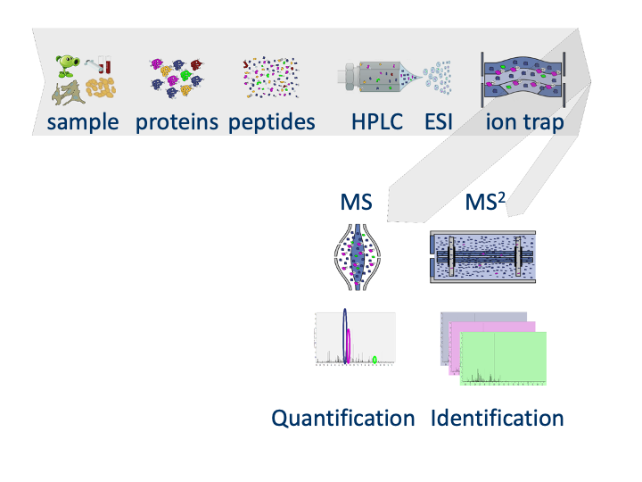
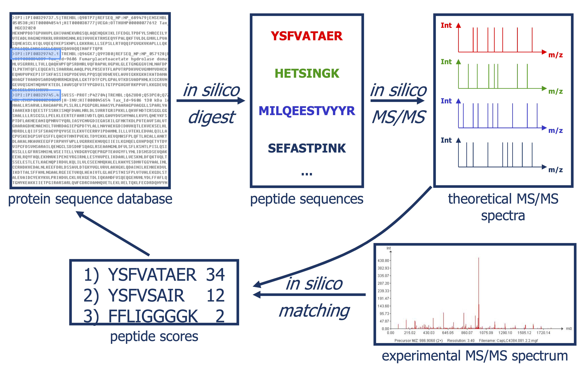

```{r setup, include=FALSE}
library(knitr)
opts_chunk$set(
    collapse = TRUE,
    comment = "#>",
    crop = NULL,
    fig.width = 6,
    dpi = 72
)
```

```{r "libraries", message=FALSE, warning=FALSE}
library(TargetDecoy)
library(ggplot2)
```

# Introduction




Slide courtesy to Lennart Martens 

## Why did Lennart mention that "statistics were out of the window"

```{r}
library(TargetDecoy)
library(tidyverse)
data("ModSwissXT")
hlp <- TargetDecoy:::.getDF(ModSwissXT) 
names(hlp) <- names(hlp) %>%
    str_replace(pattern=":",replacement="_")
hlp <- hlp %>% 
mutate(omssa_evalue=as.double(omssa_evalue))
```


- E-values: Probability that a random candidate peptide produces a higher score than the observed PSM score.


- Probability that a random candidate peptide produces a higher score that the observed PSM score for a real search with OMSSA.

```{r}
library(TargetDecoy)
library(tidyverse)
data("ModSwissXT")
hlp <- TargetDecoy:::.getDF(ModSwissXT) 
names(hlp) <- names(hlp) %>%
    str_replace(pattern=":",replacement="_")
hlp <- hlp %>% 
mutate(omssa_evalue=as.double(omssa_evalue))
hlp %>% 
    filter(!is.na(omssa_evalue)) %>% 
    ggplot(aes(omssa_evalue)) +
    geom_histogram(breaks=seq(0,100,5)) +
    xlab("E-value (%)") + 
    ylab("frequency")
```

- E-value we expect for an observed spectrum and a random candidate peptide.

```{r}
data.frame(evalue=runif(20000,0,100)) %>%
    ggplot(aes(evalue)) +
    geom_histogram(breaks=seq(0,100,5)) +
    xlab("E-value (%)") + 
    ylab("frequency")
```

- Probability that a random candidate peptide produces a higher score than the observed PSM score for decoys in a real search with OMSSA.

```{r}
hlp %>% 
    filter(isdecoy & !is.na(omssa_evalue)) %>% 
    ggplot(aes(omssa_evalue)) +
    geom_histogram(breaks=seq(0,100,5)) +
    xlab("E-value (%)") + 
    ylab("frequency")
```

- A bad hit is the random hit with the best score so it is also bound to have a low E-value.

- If we look at E-values for all PSMs they are only useful as a score.

- We should know the distribution of the maximum score of
random candidate peptides when we want to do the statistics.

```{r warning=FALSE}
hlp %>% 
    filter(!is.na(omssa_evalue)) %>% 
    ggplot(aes(-log10(omssa_evalue))) +
    geom_histogram(breaks=seq(0,1000,.5)) +
    xlab("-log10(E-value)") + 
    ylab("frequency") +
    xlim(0,20) 
```

# Concepts

## Basic Statistical Concepts

```{r}
names(hlp) <- names(hlp) %>% str_replace(pattern="-",replacement = "_")
hlp <- hlp %>% mutate(ms_gf_specevalue=as.double(ms_gf_specevalue))
```

```{r}
library(mgcv)
dec <- -log10(hlp$ms_gf_specevalue[hlp$isdecoy]) %>% na.exclude()
tar <- -log10(hlp$ms_gf_specevalue[!hlp$isdecoy]) %>% na.exclude()

breaks <- seq(0,30,.5)
#binWidth <-2
#breaks <- seq(floor(min(c(dec,tar))/binWidth)*binWidth,ceiling(max(c(dec,tar))/binWidth)*binWidth,binWidth)
#code if we register the modes by substracting the mode from the target scores and  the decoy scores.
#breaks=seq(-(ceiling(abs(min(c(dec,tar))/binWidth))+.5)*binWidth,(ceiling(max(c(dec,tar))/binWidth)+.5)*binWidth,binWidth)
histDec <- hist(dec,breaks=breaks,plot = FALSE)
histTar <- hist(tar,breaks=breaks,plot=FALSE)
histSam <- hist(c(dec,tar),breaks=breaks, plot = FALSE)

grid<-seq(0,30,.1)
countsTarG<-data.frame(y=histTar$counts-histDec$counts,x=histTar$mids)
countsTarG$y[countsTarG$y<0]<-0
fitTarG<-gam(y~s(x),data=countsTarG,family=poisson)
fitTarGrid<-exp(predict(fitTarG,newdata=data.frame(x=grid)))

countsDec<-data.frame(y=histDec$counts,x=histDec$mids)
fitDec<-gam(y~s(x),data=countsDec,family=poisson)
fitSamBad<-exp(predict(fitDec,newdata=data.frame(x=grid)))*2

plot(histSam,xlab="MS-GF+ Score",ylab="# PSMs",main="Pyrococcus Search",border="white",col="grey",cex.axis=1.5,cex.main=1.5,cex.lab=1.5,ylim=c(0,1500), axes =FALSE)
axis(side=2,at=c(0,750,1500))
axis(side=1,at=c(0,10,20,30))
lines(grid,fitSamBad+fitTarGrid,col="black",lwd=2)
lines(grid,fitSamBad,col="#FF9900",lwd=2)
lines(grid,fitTarGrid,col="#009900",lwd=2)
```

Let $x$ be the PSM score 

The scores will follow a mixture distribution:

$$f(x) = \pi_b \mathbin{\color{orange}{ f_b(x)}}+(1-\pi_b)\mathbin{\color{green}{ f_g(x)}},$$
The local fdr is also referred to as the posterior error probability (PEP), and is the probability that a PSM with a score $x$ is a bad hit. 

$$
\begin{array}{lcl}
\text{lfdr}(x) &=&\text{PEP(x)}\\
&=& \text{P}[\text{bad hit} \vert X=x]\\
&=& \frac{\pi_b f_b(x)}{f(x)}
\end{array}
$$


We will return a list of PSMs by using the FDR:

$$FDR = E\left[\frac{FP}{TP + FP}\right]$$

- FP: number of false positives, bad hits
- TP: number of true positives, good hits

$$
\begin{array}{lcl}
\text{FDR}(x\geq t) &=&
\text{P}[\text{bad hit }\vert X \geq t]\\\\
&=&\frac{\pi_b\int\limits_{x=t}^{+\infty}f_b(x)}{\int\limits_{x=t}^{+\infty}f(x)}\\\\
&=&\frac{\pi_b[1-F_b(t)]}{1-F(t)}
\end{array}
$$


- So the FDR is a set property, it measure the probability on a bad hit in the set of PSMs with scores $X\geq t$.

Our list, thus consists of all PSMs with a score $x$ above a threshold t. 

```{r warning=FALSE}
plot(histSam,xlab="MS-GF+ Score",ylab="# PSMs",main="Pyrococcus Search",border="white",col="grey",cex.axis=1.5,cex.main=1.5,cex.lab=1.5,ylim=c(0,1500), axes =FALSE)
axis(side=2,at=c(0,750,1500))
axis(side=1,at=c(0,10,20,30))
lines(grid,fitSamBad+fitTarGrid,col="black",lwd=2)
lines(grid,fitSamBad,col="#FF9900",lwd=2)
lines(grid,fitTarGrid,col="#009900",lwd=2)
text(pos=4,5,1430,label=expression(x >= t),col="darkorchid4",cex=2)
rect(5,-10,30,1500,lwd=2,border="darkorchid4")
```


- So we know how many PSMs we return, i.e. TP + FP: 
$$\text{#PSMs with } x \geq t$$ 

and we can also estimate the probability on a PSM above the threshold empirically:

$$1-\hat{\text{F}}(t) = \frac{\text{#PSMs with } x \geq t}{\text{#PSMs}}$$ 


- So to estimate the FDR we only have to estimate the expected number of PSMs that are bad hits with a score $x$ above the threshold $t$.

$$\widehat{\text{FDR}}(t) = \frac{E\left[\#\text{Bad PSM hits with } X \geq t\right]}{\text{#PSMs with } x \geq t}$$


## Competitive target decoy approach

- Search against decoy database to generate representative bad hits
- Reverse database is popular
- Concatenated search is most popular
- Advantage, a number of bad hits already matches with decoys

$\rightarrow$ we know that these are bad hits

$\rightarrow$ we have to infer on less target PSMs.

```{r warning=FALSE}
hlp %>% 
    filter(!is.na(ms_gf_specevalue)) %>% 
    ggplot(aes(-log10(ms_gf_specevalue))) +
    geom_histogram(breaks=seq(0,1000,.5)) +
    xlab("-log10(E-value)") + 
    ylab("frequency") +
    xlim(0,40) +
    facet_grid(isdecoy~.)
```

We estimate that by using the decoys: 
$$\text{# Decoys with x} \geq t$$
So our estimated FDR becomes 

$$\widehat{\text{FDR}}(x\geq t) = \frac{\text{# Decoys} \geq t}{\text{# Targets} \geq t}$$
If we rewrite the FDR we can see the TDA assumptions:

$$
\begin{array}{lcl}
\widehat{\text{FDR}}(x\geq t)&=&\frac{\text{# Decoys} \geq t}{\text{# Targets} \geq t}\\\\
&=&\frac{\frac{\text{# Decoys}}{\text{# Targets}}\frac{\text{# Decoys with }x \geq t}{\text{# Decoys}}}{\frac{\text{# Targets with } x \geq t}{\text{# Targets}}}\\\\
&=&\frac{\frac{\hat{\text{E}}\left[\text{# Bad Targets}\right]}{\text{# Targets}}\frac{\hat{\text{E}}\left[\text{# Bad Targets with }X \geq t\right]}{\hat{\text{E}}\left[\text{# Bad targets}\right]}}{\frac{\text{# Targets with } x \geq t}{\text{# Targets}}} \\\\
&=&\frac{\hat{\text{P}}\left[\text{Bad  Target} \right]\times\hat{\text{P}}\left[\text{Bad  Target}\vert X \geq t \right]}{\hat{\text{P}}\left[\text{Target}\vert X \geq t\right]}\\\\
&=&\frac{\hat\pi_b [1-\hat{F}_b(t)]}{1-\hat{F}(t)}
\end{array}
$$


So the TDA has the following assumptions: 

1. A bad hit is equally likely to match to a decoy as to a target sequence. $\rightarrow$ we can thus estimate the fraction of bad hits or the probability on a bad hit as $$\hat{\pi}_b = \frac{\# \text{Decoys}}{\# \text{Targets}}$$

2. Bad target PSM scores and decoy PSM scores are equaly distributed.

# Diagnostic plots for the TDA

We will evaluate the TDA assumptions using diagnostic plots that compares the empirical distribution of decoy and target PSM scores. 

- Histograms
- P-P plots


With P-P plots will plot for each observed PSM score $t$ the empirical probability to observe a decoy with score $x \leq t$ to the empirical probability to observe a target with score $x \leq t$: 

$$\hat{\text{P}}\left[\text{decoy with score } x \leq t\right] = \frac{\# \text{decoys with score } x \leq t}{\# \text{decoys}}$$

$$
\hat{\text{P}}\left[\text{target with score } x \leq t\right] = \frac{\# \text{target with score } x \leq t}{\# \text{targets}}
$$

If the two distributions are the same the dots of the P-P plot should follow the 1-1 line. 

This will not be the case. We expect the distribution of the target PSMs: 

- to be similarly distributed as the decoys for low scores
- and enriched with many high scores corresponding to target PSMs which are matching to the proper peptide sequence in the data base.


```{r}
hlp <- hlp %>% 
  mutate(score=-log10(hlp$ms_gf_specevalue))

y1<-hlp$score[hlp$isdecoy] %>% na.exclude
y2<-hlp$score[!hlp$isdecoy] %>% na.exclude
F1<-ecdf(y1)
F2<-ecdf(y2)
breaks<-seq(floor(min(c(y1,y2))),ceiling(max(c(y1,y2))),length.out=50)
pi0<-length(y1)/length(y2)
for (x in quantile(c(y1,y2),c(0,.01,.02,seq(0.1,1,.1))))
{
par(mfrow=c(1,2))
hist(y2,breaks=breaks,main="Pyrococcus MSGF+",cex.axis=1.5,cex.lab=1.5,cex.main=1.5,col="grey")
decHist<-hist(y1,breaks=breaks,plot=FALSE)
points(decHist$mids,decHist$counts,col="#FF9900",type="h",lwd=2)
abline(v=x,col="blue",lwd=2)
plot(F1(y2),F2(y2),xlab="ECDF Targets",ylab="ECDF Decoys",cex=.4,main="P-P plot",cex.axis=1.5,cex.lab=1.5,cex.main=1.5,col="grey",pch=19)
abline(a=0,b=pi0)
abline(v=F1(x),col="blue")
abline(h=F2(x),col="blue")
points(F1(x),F2(x),col="blue",cex=2,pch=19)
}
```

Note, that 

- the points corresponding to low score values follow a straight line indicating that targets and decoys scores are similarly distributed 
- this line has an angle equal to fraction of bad hits, which is estimated as $\hat\pi_b=\frac{\# \text{decoys}}{\#\text{targets}}$ and is indicated by the black line in the plot. 
- This line can be used to assess the assumption that bad hits are equally likely matching to targets sequences as to decoy sequences. 