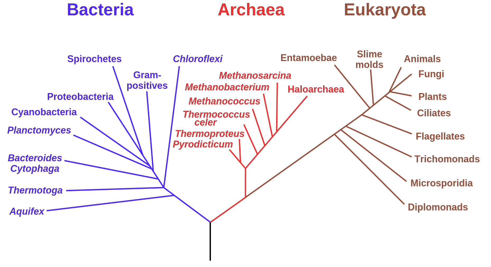
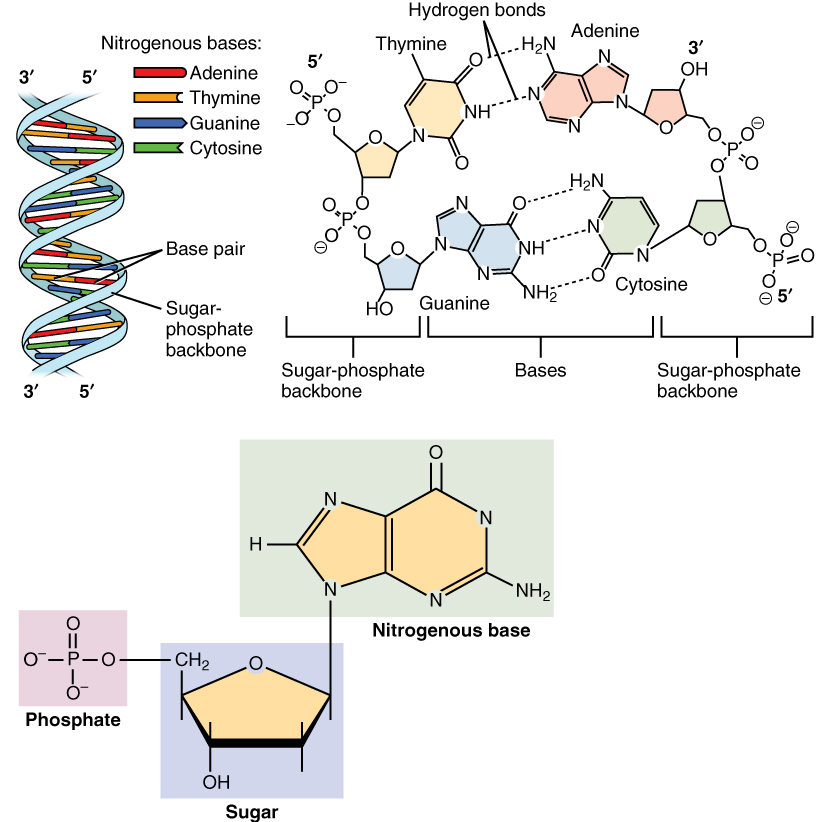
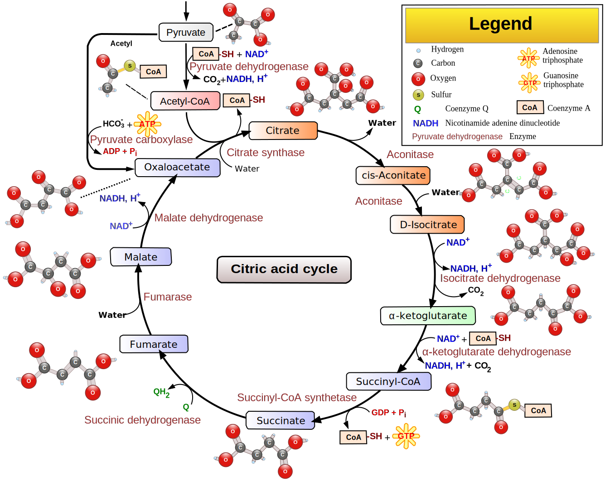
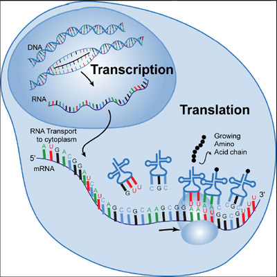
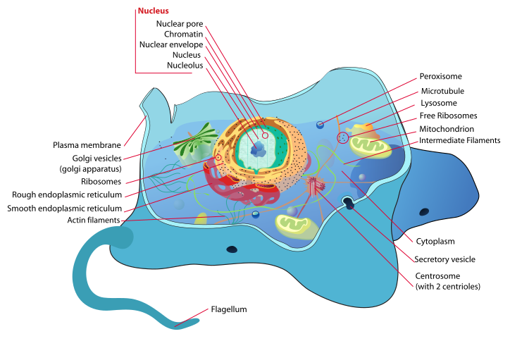
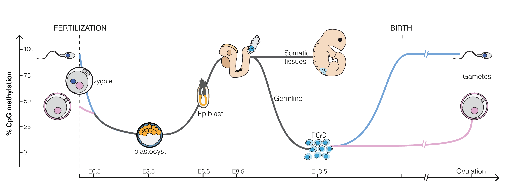

# Setting the scene

Bioinformatics is an interdisciplinary field of science that develops methods and software tools for understanding biological data, especially when the data sets are large and complex. 
However, before we focus on methods to build knowledge on biological processes, it is important to ask ourselves the question what life is. 

When thinking about science it is crucial, as @bohm1980 nicely formulates, to acknowledge that scientific theories are not "true knowledge" corresponding to "the reality as is", but rather ever-changing insights that are giving shape and form to how we view and experience the world. 

# What is life? 

We will start this introduction with Bohm's example of a sunflower seed from which an entire plant is growing. 
<div><div style="position:relative; padding-top: 56.25%">
<iframe src="https://www.youtube.com/embed/_owPRdbaMdY?si=Hpee5spcKofhWsEo" frameborder="0" allowfullscreen
      style="position:absolute;top:0;left:0;width:100%;height:100%;"></iframe>
</div></div>
*Timelapse of a growing sunflower (Source: https://www.youtube.com/watch?v=_owPRdbaMdY)*

Remarkably, each plant cell contains all information from the seed, i.e. all its DNA as well as its cellular structure. However, as @bohm1980 points out the seed contains little to nothing from the actual biomass of the plant that it has developed. The seed merely contains the information that is required to transform its environment to grow the plant from solar energy and the chaos of simple molecules CO$_2$, nitrogen, phosphorous, etc. The plant will eventually produce new seeds, which will spread its information further throughout the environment and will transform it over and over again to grow plants. It thus becomes obvious that we do not need to make the distinction between "inanimated" and "animated" matter. Indeed, if we would stick to this old Cartesian way of thinking we are confronted with confusing questions like when would a so-called "inanimated" carbon atom become animated? As soon as it enters the leaf stomata or when it is assimilated into an organic compound? Does the carbon atom becomes inanimated again when it is released from the plant as it burns the sugars it has assimilated into CO$_2$ during the night? 

Indeed, we can consider that the environment is augmented with the information of the seed, which somehow seems to direct its environment to grow a corresponding plant. So life itself can be regarded as belonging to a totality including plant and the environment. So @bohm1980 concludes that "we do not need to fragment the whole into life and inanimated matter, nor do we have to try to reduce life completely to nothing but an outcome of the latter". 


The remaining of this chapter builds on the work of five scientists: 

- Erwin Schrödinger who explicitly defined life as structuring "order-from-disorder", 
- Ilia Prigogine who developed the theory for this and coined the term "Dissipative Structures",
- Christian de Duve one of the founding fathers of biochemistry, and 
- Humberto Maturana and Francisco Varela with their concept of autopoiesis and emerging properties.

\newpage 

## Schrödinger and Prigogine: a Thermodynamic View of Life
 
In his seminal lecture series: "What Is Life? The Physical Aspect of the Living Cell" @schrodinger1944  defined life as 

1. an open system that can generate order from chaos by exploiting external energy sources,

2. with the capacity to transmit its own specific blueprint from generation to generation.

Note, that in his seminal lecture series @schrodinger1944 also laid out key functions of the molecule that was involved in this specific blueprint and this while DNA was not even discovered.

At first, the property that life can generate order or structure seems to contradict the second law of thermodynamics that states that: a system is always gearing towards maximal entropy.

Entropy can be loosely defined as a physical quantity for the level of how energy is spread out. It is thus the tendency of a system to evolve from a concentrated energy state to an energy state that is more spread out. This can be easily understood from a simple example known to each of us: if you put a hot pot in a large room, the pot will cool down and the temperature in the room will slightly rise until the pot and the room have the same temperature. As a result the concentrated heat energy from the pot is nicely spread out over the entire room. 

Schrödinger understood that life was not violating this second law. Indeed, by being an *open* system, it can interact with the environment, and by eating and breathing there has to be a way of "concentrating order" or maintaining a higher more concentrated energy state. 

Prigogine was the first one who provided the theoretical framework for a type of chemistry that is key for life [@prigogineStengers1984]. He realized that the chemistry of life is totally different from most chemical systems that were studied up to then. Indeed, the chemistry and processes of life are highly non-linear with many feedback loops and are operated far from equilibrium by continuously pushing matter and energy through it.

We intuitively know the latter: our body is typically at a higher energy state than the corresponding material in a non-living state. We can simply acknowledge that as we are hotter than the room, and a crude way to estimate how long we are death is by measuring the temperature of a corpse. To maintain our higher energy state, to concentrate chemicals in our cells, and, to build complex molecules, cells and tissues from it, we have to keep on eating and breathing.  

\pagebreak 

### Dissipative structures

Prigogine discovered that complex self-organising systems can spontaneously arise if they are open and can exchange lots of energy and matter with their surroundings. 
Key for it is a chaos of matter and a flow of energy through the system.

Convection currents are for instance an example of a simple physical process generating massive structures. They can be observed when simply heating a shallow layer of fluid or gas from below, which establishes a temperature gradient that lets the fluids rest state to become unstable. Indeed, the warmer fluid at the bottom is lighter and starts to float to the top where it cools down again, whereas the colder fluid at the top is more heavy and sinks to the bottom, where it is heated. Large ensembles of molecules therefore start to exhibit coherent patterns of motion (see Figure \@ref(fig:convectionCells)).

```{r convectionCells, fig.cap='Convection cells in a gravitational field. A fluid layer is heated from the bottom. The warmer fluid at the bottom becomes lighter and floats to the top where it cools down again, whereas the more heavy colder liquid sinks to the bottom where it is heated. This organizes the fluid layer in hexagonal convection cells (Source: Wikipedia - users Eyrian and Con-struct)', out.width='80%', fig.asp=.8, fig.align='center', echo=FALSE}
knitr::include_graphics("./figs/convection_cells.png")
```

The convection motion leads to a spontaneous complex spatial organisation, almost a dance, of billions of molecules moving coherently and forming hexagonal convection cells. Such convection cells can be observed in a small dish of a fluid in a lab, up to the level of the earth's atmosphere and the solar photosphere (see movie below). 


<div><div style="position:relative; padding-top: 56.25%">
<iframe src="figs/granulation_sun.mp4" frameborder="0" allowfullscreen
      style="position:absolute;top:0;left:0;width:100%;height:100%;"></iframe>
</div></div>
*Movie of the solar photosphere observed with the Swedish 1-m Solar Telescope (SST) on La Palma, Spain. The movie shows solar granulation which is a result of convective motions of bubbles of hot gas that rise from the solar interior. When these bubbles reach the surface, the gas cools and flows down again in the darker lanes between the bright cells. In these so-called intergranular lanes, we can also see small bright points and more extended bright elongated structures. These are regions with strong magnetic fields. (Source: Wikipedia, user Luc.rouppe, link: https://en.wikipedia.org/wiki/File:Granulation_Quiet_Sun_SST_25May2017.webm)*

Prigogine showed that spontaneous self-organisation also occurs in chemical systems that are operated far from equilibrium by continuously pushing matter and energy through it. These self-organising processes are largely unpredictable and spontaneously arise in our universe.
@prigogineStengers1984 further argue that such chemical and physical processes are the basis of the complex self-organisation that we observe in living systems. 

In chemical systems the influx of energy allows the generation of structure while producing lots of entropy by dissipation. Dissipation means that energy has been converted from one energy form to another and that it can no longer be converted back in its original form. So dissipation is irreversible, which adds the arrow of time to life.   Indeed conversion of energy to heat inherently takes place in all underlying chemical reactions and these cannot be reversed without the addition of new energy. Hence, a large part of the concentrated energy that enters cells through sunlight or chemical energy in food, is spread out in a less concentrated energy form: heat. 

The structure that spontaneously emerges in living organisms is thus not violating the second law because of the rise in entropy by the dissipation of heat. 
Prigogine therefore coined the novel term dissipative structures for such systems. 

### Attractors 

Dissipative structures typically have multiple attractors, i.e. states, regimes, forms, shapes or structures to which they spontaneously evolve. The specific attractor to which the system is organising itself highly depends on the initial environmental conditions. 
Note, that dissipative structures are also characterized by feedback loops. 
These feedback loops allow the system to remain at its current attractor upon changes in the environment, e.g. a kind of homeostasis.
However, some environmental stimuli are amplified by the feedback loops and can switch the dissipative structure towards another attractor and thus induce a regime switch. 

Prigogine argued that chemistry in cells, cells itself, tissues, organs, organisms, populations of organisms, ecosystems and our globe can be seen as dissipative structures [@prigogineStengers1984].
The fruiting body of slime molds are a compelling example of a living system that often changes from attractor, see Figure \@ref(fig:Dictyostelium). Dictyostelium slime molds, spend most of their lives as separate single-celled amoeba. But, upon stress one of the amoebas releases a chemical signal cAMP. Others detect this signal, and respond in two ways: the amoeba moves towards the signal and secretes more cAMP effectively boosting the signal. So the signal gets amplified by a feedback loop which eventually triggers the system to switch from their current attractor - a state of free living amoebas - towards a novel attractor - their fruiting body - that will release spores and will spread the slime molds towards novel environments (see e.g. youtube movie https://youtu.be/bkVhLJLG7ug).

<div><div style="position:relative; padding-top: 56.25%">
<iframe src="https://www.youtube.com/embed/bkVhLJLG7ug?si=hZ3ynS2XX6UcySuu" frameborder="0" allowfullscreen
      style="position:absolute;top:0;left:0;width:100%;height:100%;"></iframe>
</div></div>

```{r Dictyostelium, fig.cap='Stages of Dictyostelium lifecycle. (A - B) Dictyostelium cells chemotaxing toward cAMP released from a micropipette. Cells that have not yet sensed cAMP are shown in (A). Within 1 or 2 min the cells polarize and migrate toward the source of chemoattractant (B). (C - D) Scanning electron micrograph of streaming Dictyostelium cells (C) and the formation of aggregates (D). (E) Formation of aggregation centers on an agar plate. (F) Slugs moving on an agar plate. (G) Culmination stage. (H) Fruiting body. Figure from Müller-Taubergen et al. 2012', out.width='60%', fig.asp=.8, fig.align='center', echo=FALSE}

```

\pagebreak 

### Dissipative zones 

Our whole globe can be seen as a large dissipative structure located in our solar system, which is a dissipative zone. 

1. There is an energy source, the sun that is radiating concentrated energy in photons.

2. Life forms are organising structure from the chaos of molecules on Earth by dissipating energy from the solar photons, light and UV, to heat through their organic pigments, e.g. chlorophyll. 

3. Animals, bacteria and fungi are secondary dissipative structures that are feeding on the concentrated chemical energy in the form of sugar, starch, proteins and fats that are produced by plants and cyanobacteria. They again dissipate energy in the form of heat through respiration. 

4. The heat produced by life is dissipated to water and air and this  induces tertiary dissipative processes like the water cycle, wind and sea currents etc. 

5. Eventually heat is radiated to space, which acts as an energy sink. 

Because the temperature of Earth remains roughly stable, more or less a similar amount of energy is radiated to space under the form of heat as what comes in under the form of photons from the sun. As the energy content of heat is lower and more disperse it has a higher entropy than that of the incoming sunlight.
Because almost no mass is exchanged between Earth and space, mass has to be recycled and life is inherently cyclic. 

\newpage 

## de Duve: a Biochemical View of Life

In his Book "Life Evolving - Molecules, Mind and Meaning", @deDuve2002 gave a very simple but brilliant definition of life: 

Life is 

1. One,
2. Chemistry, and 
3. Information 

In the following sections we will explore what de Duve meant with each component in his definition. 

### Life is One {#lifeOne}

Life is one because all living organisms on earth

- are built of cells
- evolved from the same species, LUCA, our last universal common ancestor 
- use the same molecule for storing, converting and using energy
- use the same biological building blocks: lipids, sugars, amino acids for proteins and nucleic acids (DNA and RNA).


#### All Living Organisms are Built of Cells

"Life is One" because all organisms are composed of cells. 
Green algae that can perform photosynthesis are a beautiful example of unicellular organisms. They were key for the development of life on our planet by releasing oxygen in our atmosphere (Figure \@ref(fig:greenAlgae)). 

```{r greenAlgae, fig.cap='Cyanobacteria, unicellullar organisms that can perform photosynthesis. They were key in the development of life and radically changed Earth by releasing oxygen to our atmosphere (Source: Chisholm Lab, Wikipedia)', out.width='30%', fig.asp=.8, fig.align='center', echo=FALSE}
knitr::include_graphics("./figs/Prochlorococcus_marinus.jpg")
```

A vital component of a cell is its membrane (the outer layer of the cell) that is separating them from their environment while enabling them to interact with it and to concentrate chemicals inside the cell.


Multicellular organisms are composed of multiple cells. The cells are organised in 
tissues, e.g. spongy tissue in our bones or epithelium cells of our stomach; organs, e.g. bones or our stomach; organ systems, e.g. skeleton or digestive system; upto the organism. Figure \@ref(fig:multiCellular) also shows how organisms are further organised in populations of organisms, ecosystems, and eventually our entire Biosphere. So "Life is One" because all living organisms consist of cells that are organised in large networks that work together. 

```{r multiCellular, fig.cap='Multicellular organisms and biological organisation (Source: mrssmithsbiology)', out.width='30%', fig.asp=.8, fig.align='center', echo=FALSE}
#knitr::include_graphics("https://mrssmithsbiology.files.wordpress.com/2019/10/picture4.jpg")
knitr::include_graphics("./figs/organisationMulticellular.jpeg")
```

\pagebreak 

#### Last Universal Common Ancestor

"Life is One" because all species evolved from the same ancestral population of cells. 
This is also referred to as the Last Universal Common Ancestor (LUCA). It is nicely indicated by the tree of life in Figure \@ref(fig:treeOfLife), which is one of the most important organising principles in biology. It shows the evolutionary relationships among different organisms and that all living beings eventually can be traced back to LUCA who is located at the root of the tree.  Note, that the animal kingdom to which we belong is only a small branch in the tree.   

```{r treeOfLife, fig.cap='The tree of life is one of the most important organising principles in biology. It shows the evolutionary relationships among different organisms and also that all living beings eventually can be traced back to the last universal common ancestor (LUCA), who is located at the root of the tree (Source: Wikipedia)', out.width='80%', fig.asp=.8, fig.align='center', echo=FALSE}

```

#### Energy coin {#sectionEnergyCoin}

"Life is One" because all living organisms use the same "energy coin", the ATP-ADP system, to store and reuse energy. 
Adinosine-triphosphate (ATP) consists of a ribose sugar with 3 phosphate groups and a base adinine. 
Splitting a phosphate group from adinosine-triphosphate (ATP) results in adinosine-diphosphate (ADP), a free phosphate group and energy. 
The other way around, energy can be stored as chemical energy by binding a phosphate group to ADP (see Figure \@ref(fig:atp-adp)).

Note, that ATP is also used to build RNA, an important molecule involved in storing, passing and expressing our genetic information. Indeed, ATP is incorporated in RNA upon splitting two phosphate groups. The resulting AMP (adinosine monophosphate) is one of the building blocks of RNA. See Section \@ref(sectionNucleicAcids) for more details on RNA.  So there is a close link between energy and genetic information!


(ref:atp-adp-cap) Our energy coin ATP-ADP. Adinosine-triphosphate (ATP) consists of a base adinine, a ribose sugar and 3 phosphate groups. Splitting a phosphate group from adinosine-triphosphate (ATP) by a reaction with water (H$_2$O) results in adinosine-diphosphate (ADP), a free phosphate group and releases energy. The other way around, energy can be stored as chemical energy by binding a phosphate group to ADP (Source: Adapted from Wikipedia)

```{r atp-adp, fig.cap='(ref:atp-adp-cap)', out.width='70%', fig.asp=.8, fig.align='center', echo=FALSE}
knitr::include_graphics("./figs/ATP-ADP.png")
```

\pagebreak 

###3 Building Blocks of Life 

"Life is One" because all living organisms are composed of the same basic bio-molecules and we all know more than we think about them because we are what we eat!  

Almost all molecules of living organisms are composed of

1. Lipids, oil and fats, for storage and as building blocks for membranes,
2. Carbohydrates, sugars, for storing energy and as a backbone of large bio-molecules,
3. Amino acids, the building blocks of proteins, which are the workhorses of a cell and facilitate the majority of its chemical reactions, and
4. Nucleic Acids, building blocks of RNA and DNA, which are used to store and use the genetic information we inherit from our parents.


##### Lipids 


```{r lipids, fig.cap='Phospho-lipids have a very important role in life as they form membranes. Phospholipids have a hydrophilic head that likes to mix with water and long hydrophobic tails that do not mix with water. They sponteneously gives rise to bilayers in aqueous solutions similar to the structure seen in membranes. Membranes are the boundaries of the cell and they allow passivie diffusion of small molecules through their bilayer. Larger molecules can be actively exchanged with the environment through membrane proteins (Source: Doug Hatfield, Wikipedia)', out.width='80%', fig.asp=.8, fig.align='center', echo=FALSE}

```

Lipids, fats and oils, are used for storage. However, an important class of lipids, the phospholipids, make up membranes of cells and unicellular compartments called organelles see Figure \@ref(fig:lipids). Indeed phospholipids have a polar head that likes to be in water and a long apolar tail that does not mix with water. Therefore bilayers of phospholipid molecules are spontaneously formed in aqueous solutions. 

\pagebreak 

Membranes provide the basis for concentrating specific molecules in (compartments of) living cells. This enable cells to build up a disequilibrium of chemical molecules that  can perform  work as a concentration gradient spontaneously dissipates toward its equilibrium value. So phospholipids are key for creating the boundary conditions necessary for cellular organization.

##### Carbohydrates 

Carbohydrates are important bio-molecules that are used for storage, energy and structure (Figure \@ref(fig:carbohydrates)).

```{r carbohydrates, fig.cap='Carbohydrates perform the important functions of storage, energy source and structure. They can be organised in biopolymers, long chains of carbohydrate molecules that are bound together. The polysaccharides starch and glycogen for instance are used to store energy by plant and animal cells, respectively. Cellulose, on the other hand, is a polysaccharide that gives plants structure. Deoxyribose and ribose are important carbohydrates that form the backbone of the biopolymers DNA and RNA, respectively. (Source: thebiologynotes.com)', out.width='100%', fig.asp=.8, fig.align='center', echo=FALSE}
#knitr::include_graphics("https://thebiologynotes.com/wp-content/uploads/2020/11/Carbohydrates-definition-classification-with-structure-and-functions.jpeg")
knitr::include_graphics("./figs/Carbohydrates-definition-classification-with-structure-and-functions.jpeg")
```

- Storage: glucose is stored inside animal cells using glycogen, a polymer of thousands of glucose molecules that are bound to each-other. Plants use a similar molecule, starch. 
- Energy source: specific proteins can split glycogen and starch into glucose that is subsequently metabolized for energy. 
- Structure: carbohydrates form the backbone of many bio-molecules, e.g. long chains of desoxyribose and ribose act as the backbone of the bio-polymers DNA and RNA, respectively; and glucose is the backbone of cellulose, which give plants structure. 


</br>  

\pagebreak 

##### Amino Acids {#sectionAminoAcids}

Amino acids by themselves are simple molecules (Figure \@ref(fig:aminoAcids)).
Although hundreds of amino acids exist in nature, life is using only 20 of them and it is combining them in long molecules, polymers, which are referred to as proteins.
Proteins are hetero-polymers, consisting of the 20 amino acids that are arranged in long sequences that differ from protein to protein. 
So unlike starch, that only consists of glucose molecules that are all identical, proteins are capable of carrying information.

(ref:aminoAcidsCap) Amino acids are simple molecules. They can be combined  in long molecules, polymers, also known as proteins. Their long chain of amino acids spontaneously folds into a complex 3D structure from which their biological function emerges (Source: thebiologynotes.com)

```{r aminoAcids, fig.cap='(ref:aminoAcidsCap)', out.width='100%', fig.asp=.8, fig.align='center', echo=FALSE}
#knitr::include_graphics("https://thebiologynotes.com/wp-content/uploads/2020/12/Amino-acids-and-Proteins.jpeg")
knitr::include_graphics("./figs/Amino-acids-and-Proteins.jpeg")
```

The crux of proteins is that their long chain of amino acids spontaneously folds into a complex 3D structure, which is determined by the properties and the specific sequence of its amino acids. From their complex and specific 3D structure their biological function emerges. 

Indeed, many proteins work as a "lock" in which specific (bio)molecules fit as a "key". This enables proteins to bring molecules close together and to promote chemical reactions without being consumed.  This process is also referred to as catalysis and proteins that perform catalysis are called enzymes, see Figure \@ref(fig:enzyme).

```{r enzyme, fig.cap='Diagram of a protein performing an enzyme action (Source: Wikipedia)', out.width='50%', fig.asp=.8, fig.align='center', echo=FALSE}
knitr::include_graphics("./figs/EnzymePadlockKey.png")
```

Proteins are the main workhorses of the cell and they are important for moving food, digesting food, copying DNA, for giving the cell structure, affecting the rates at which other proteins work, etc... 

##### Nucleic Acids {#sectionNucleicAcids}

Nucleic acids are build of nucleotides. 
Each nucleotide is composed of one of four nitrogen-containing nucleobases, which carry the information

1. cytosine [C], 
2. guanine [G], 
3. adenine [A] or 
4. thymine [T] (DNA) or uracil [U] (RNA) , 

a phosphate group and a sugar, i.e. ribose in ribonucleic acid (RNA, Figure \@ref(fig:RNA)) and deoxyribose in deoxyribonucleic acid (DNA, Figure \@ref(fig:DNA)).

These nucleotides are the building blocks that are combined in long polymers: RNA and DNA. 
DNA and RNA are hetero-polymers and the nucleotides conceptually can be combined in any order.
So they can contain information. 
Indeed, they are key to store and use the genetic information we inherit from our parents. 

DNA typically occurs as a double strand, where C and G, and, A and T hybridize to each other using respectively three and two hydrogen bridges to form the iconic double stranded helix structure, see Figure \@ref(fig:DNA). 

There is a general consensus that life probably began by using RNA as information carrier. 
DNA, however, is much more stable and lasts longer in water than RNA. Therefore, DNA probably emerged later and is now used to store the genetic information in most organisms. 

Life is also one because we share the same genetic code, but we refer to Section \@ref(lifeInformation) "Life is Information" for more details.

```{r RNAvsDNA, fig.cap='Nucleic acid: RNA (left) and DNA (right). RNA appears typically in a single strand and DNA as a double stranded molecule (Source: Wikipedia)', out.width='50%', fig.align='center', echo=FALSE}
knitr::include_graphics("./figs/Difference_DNA_RNA-EN.svg")
```

```{r RNA, fig.cap='RNA is a polymeric molecule with various biological roles in coding, decoding, regulation and expression of genes. RNA consists of a chain of nucleotides. Each nucleotide is build from a ribose sugar that forms the backbone of the RNA  polymer, a phosphate group that is used to connect the ribose sugar molecules and a base adenine (A), cytosine (C), guanine (G) or uracil (U) that are the carriers of information. The bases can form hydrogen bonds between cytosine and guanine, between adenine and uracil, and, between adenine and thymine (a base from DNA) (Source: Adapted from Wikipedia)', out.width='50%', fig.align='center', echo=FALSE}
knitr::include_graphics("./figs/RNA-Nucleobases.png")
```
```{r DNA, fig.cap='DNA is a polymer composed of two polynucleotide chains that coil around each other to form a double helix carrying genetic instructions for the development, functioning, growth and reproduction of all known organisms and many viruses. Each DNA single strand consists of a chain of nucleotides. Each nucleotide is build from a deoxyribose sugar that forms the backbone of the DNA  polymer, a phosphate group that is used to connect the deoxyribose sugar molecules and a base adenine (A), cytosine (C), guanine (G) or thymine (T) that are the carriers of information. The bases form hydrogen bonds between cytosine and guanine, and, adenine and thymine to assemble single stranded DNA in double stranded DNA. (Source: Wikipedia)', out.width='50%', fig.align='center', echo=FALSE}

```


\newpage

### Life is Chemistry {#lifeChemistry}

"Life is Chemistry" because a cell consists of a complex network of chemical reactions that are connected to each other. Many feedback loops exist in this chemistry making it largely nonlinear. The feedback loops enables a cell to maintain in its regime or to switch from regime or attractor upon external and/or internal stimuli. An overview of most reactions in a living cell is given in Figure \@ref(fig:chemicalReactionsCell). You can zoom in on this map on http://biochemical-pathways.com/#/map/1.

```{r chemicalReactionsCell, fig.cap='Network of the most important reactions in a living cell (Source: Dr. Gerhard Michal, Roche)', out.width='100%', fig.asp=.8, fig.align='center', echo=FALSE}
knitr::include_graphics("./figs/roche_pathways.jpg")
```

In the remainder of this section we will introduce energy and catalysis in more detail, and we also give an intriguing example of how proteins play a role in the self-organisation of a cell. 

#### Energy 

"Life is Chemistry" because it uses chemical reactions to store and use energy. See the ATP-ADP system in Section \@ref(sectionEnergyCoin)

#### Catalysis

"Life is Chemistry" because most chemical reactions are catalyzed, i.e. initiated, promoted and made faster by proteins. The proteins facilitate the reaction without being used. The reactions would never take place if we would only mix the molecules at the concentrations that are typically occurring in a cell.  

A catalyst is a chemical substance that helps a reaction to take place without being consumed. Proteins that are catalysts are also referred to as enzymes.

Enzymes are proteins that  

- initiate the reaction
- speed up the reaction and
- make sure that the outcome is always the same.
    
Loosely speaking they are

- "fishing" certain molecules from the complex mixture in a cell, 
- which consists of thousands of chemical compounds generally at low concentrations, 
- through binding sites they can facilitate that these molecules (substrates) are getting close so that they can react and form a new compound. 

These binding sites emerged from to the unique 3D structure of the protein. In Figure \@ref(fig:enzyme) a schematic overview is given of the enzyme action of a protein. 

In most cases enzymes work together in pathways, which consist of multiple chemical reactions for which (part of the) molecules produced in the previous reaction are used by another enzyme to facilitate the next reaction. 

The Krebs cycle is a well known example. This pathway is the main source of energy for a cell through metabolising carbohydrates, lipids and/or proteins. The Krebs cycle is a cyclic pathway of multiple chemical reactions each catalyzed by another enzyme (see Figure \@ref(fig:krebsCycle) or the you tube movie  https://www.youtube.com/embed/yk14dOOvwMk).

The Krebs cycle is also used to generate building blocks for constructing certain nucleotides and amino acids. 

```{r krebsCycle, fig.cap='Krebs cycle, a cyclic pathway connecting multiple reactions that provide the main source of energy for our cells by metabolising carbohydrates, proteins and lipids. Each reaction is catalised by an enzyme  (Source: Narayanese, Wikipedia)', out.width='70%', fig.asp=.8, fig.align='center', echo=FALSE}

```

We can end this section with a quote of @deDuve2002: "Any living organism is a reflection of its enzyme arsenal".
 
\pagebreak 

#### Self-Organisation

Life is also characterized by its ability for self-organisation. Some proteins are also important to give structure to a cell and they can spontaneously form structure. 
An intriguing illustration of self-organisation is provided by @Cheng2019 who 
homogenized Xenopus laevis egg cell cytoplasma extracts, i.e. the liquid with structures from the cell, and showed that the homogeneous extract spontaneously reorganized itself in cell like structures in a matter of minutes (see Figure \@ref(fig:selforganisation) and you tube movie https://www.youtube.com/embed/prq1Occu22s). 

(ref:selforganisationCaption) Homogenized Xenopus laevis egg cytoplasmic extracts spontaneously organized into cell-like compartments [@Cheng2019]

```{r selforganisation, fig.cap='(ref:selforganisationCaption)', out.width='100%', fig.asp=.8, fig.align='center', echo=FALSE}
knitr::include_graphics("./figs/selforganisation.jpg")
```


</br> 
@Cheng2019 found that ATP, the energy currency of a cell; microtubuli, a kind of filamentous proteins; and dynein, a kind of motor protein, were required and driving this process of self-organisation.

```{r dynein, fig.cap='Microtubulus (long filamentous protein) with Dynein "motor" protein attached (Source:  Wikipedia)', out.width='30%', fig.asp=.8, fig.align='center', echo=FALSE}
knitr::include_graphics("./figs/DyneinHeavyChainOnMT.png")
```

Note, that proteins thus play a central role in life. They are key for catalysis and giving structure. Hence, a cell thus not only inherits genetic information, but, also its spatial organisation from a mother cell! 

\newpage 

### Life is Information {#lifeInformation}

Our genetic information to build all our bio-molecules, which we inherit from our parents, is stored in our DNA. DNA is a hetero-polymer  or a long chain of  4 different building blocks,  nucleotides.  So the genetic information is stored in an alphabet of 4 letters. This is 
adenine (A), cytosine (C), guanine (G) and thymine (T) for DNA. 

  It makes no physical or chemical difference what the identity of the next nucleotide is in the DNA chain. So our DNA can be seen as a coding system to store and pass genetic information from one generation to the next. Life is therefore also information and not only chemistry. It is absolutely mind blowing how variation in the sequence of this "four letter code" can lead to such a wealth of distinct characteristics and functions that can be observed between different specimens of the same species, and, even more so between different life forms.  

In the reminder of this section we will focus on the flow of information in a cell in more detail.

#### The central paradigm" of molecular biology

The "central paradigm" of molecular biology states that the sequence of nucleotides in DNA are first *transcribed* into RNA and then *translated* into proteins, see Figure  \@ref(fig:centralParadigm). 

Note, that some RNA molecules are also end products. Indeed RNA can also have a catalytic function, i.e. initiate and promote chemical reactions without being consumed. 

A *gene* is the unit of genetic material, a DNA sequence that is encoding for the synthesis of a gene product, either a protein or a functional RNA. 

```{r centralParadigm, fig.cap='Central paradigm of biology: a gene, a specific region in the DNA, is first transcribed into RNA and then into proteins. Note, that for RNA-genes the RNA molecule is the end product itself, which is referred to as non-coding RNA (ncRNA) (Source: Thomas Shafee, Wikipedia)', out.width='50%', fig.asp=.8, fig.align='center', echo=FALSE}
knitr::include_graphics("./figs/gene.svg")
```


</br>

Figure \@ref(fig:transcriptionTranslation) shows the process of transcription of a gene from DNA to RNA and the translation of RNA to proteins. 

1. The transcription of DNA to RNA is initiated by opening the 
DNA double strand. Then a complementary RNA strand is synthesized by exploiting that A hybridizes to U (or T) and G to C through hydrogen bounds. 

2. Once that the complementary RNA strand is made, it is further processed in the nucleus into messenger RNA (mRNA). The mRNA travels from the cell nucleus to the cell cytosol (cell liquid) where it is translated into proteins, and, where the majority of the reactions take place. 

3. There mRNA is translated into proteins by ribosomes.
In the ribosomes the mRNA is bound to transfer RNA (tRNA). tRNA can bind to the mRNA molecule if it has 3 consecutive nucleotides that are complementary to the triplet of the 3 consecutive nucleotides on the mRNA template that is lying in the ribosome. 

4. The transfer RNA transports one specific amino-acid that is then incorporated in the protein that is being formed, which is the growing amino acid chain in Figure \@ref(fig:transcriptionTranslation). The sequence of 3 consecutive nucleotides of DNA of a gene is therefore also called a *codon* because it encodes for a specific amino acid. 

5. Upon incorporation, the ribosome shifts to the next triplet of the mRNA and the next transfer RNA is bound to it, and so on until a stop codon is reached and the protein is finished.  

(ref:transcriptionTranslationCaption) In the cell nucleus the DNA strand opens up and is transcribed into an RNA molecule. Upon processing, the messenger RNA (mRNA) travels from the nucleus to the cytosol where it is translated into proteins. The mRNA is the template that fits into a ribosome that has the function to bind transfer RNA molecules to the mRNA template. It does that by hybridising to a tRNA, which has a triplet of three nucleotides that are complementary to those of the mRNA template. The tRNAs have a amino acid on their tail, which is incorporated into a long chain of amino acids, the protein that is produced. If the amino acid is incorporated, the ribosome moves to the next triplet and the process happens all over with a new tRNA  (Source: [tokresources.org](http://www.tokresource.org/tok_classes/biobiobio/biomenu/transcription_translation/))

```{r transcriptionTranslation, fig.cap='(ref:transcriptionTranslationCaption)', out.width='50%', fig.asp=.8, fig.align='center', echo=FALSE}
#knitr::include_graphics("https://aholdencirm.files.wordpress.com/2016/06/transcription_2.jpg")

```


There are in total 64=4$^3$ codons encoding for each of the 20 amino acids, and, for a start and a stop codon to initiate and stop the protein translation,  respectively. Hence, there is a redundancy in the code, see \@ref(fig:codonTable). 

```{r codonTable, fig.cap='Codon table connecting triplets of nucleotids to amino acids (Source: Wikipedia)', out.width='50%', fig.asp=.8, fig.align='center', echo=FALSE}
knitr::include_graphics("./figs/Aminoacids_table.svg")
```


We can learn an important message from the codon table: 

- There is no chemical necessity that explicitly connects the three nucleotides "CGG" to the amino acid arginine rather than to glutamine.

- Nucleotides themselves do not seem to a have chemical connection to the amino acids they encode

- Therefore we call it a code or information rather than just "genetic chemistry"

The code apparently evolved so that many mutations give rise to 

  - synonymous codons (same amino acid) or
  - to incorporate amino acids that are similar  

so that protein function is conserved.

</br>  

DNA is thus the carrier of genetic information. However, RNA plays a more central role: 

- Messenger RNA brings the genetic information from the cell nucleus to the cell cytosol where they are translated into proteins and where most of the chemical reactions take place. 
- Ribozymes, i.e. catalytic RNA molecules, initiate and speed up particular reactions
- Transfer RNA plays an crucial role in the translation of proteins
- An RNA primer, i.e. a small RNA molecule, is essential to copy DNA
- RNA also acts as carrier of genetic information, e.g. corona virus.

\newpage 

## Maturana and Varela: a Systems View of Life {#maturanaVarela}

@capraLuisi2014 write in their book "The Systems View of Life", that the "term **autopoeisis** was coined by Varela and Maturana in the 1970s. *Auto*, of course, means *self* and refers to the autonomy of self-organising systems; and *poiesis* (which shares the same Greek root as the word poetry) means *making*. So, *autopoiesis* means self-making". 

They continue stating that "the main characteristic of life is self-maintenance due to internal networking of a chemical system that continuously reproduces itself within the boundary of its own making".

Indeed, a living cell is the smallest autopoietic unit. 
The cell consists of a complex internal network of chemical reactions and this within the boundary of its outer membrane. 
It can organize itself, maintain itself, can make copies of itself and this with the enzymatic machinery that is present in the cell itself.

**Networks of cells** are then combined in larger autopoietic units, e.g. 

- our gut microbiome that consists of a network of billions of unicellular bacteria and yeasts from which unique metabolic functions emerge that are essential for digesting our food, or,
- our tissues, networks of our own cells from which novel functions emerge, e.g. our thinking that emerges from the complex network of neurons in our brain. 

An organism or a biological system can therefore not be broken down or reduced to its parts to provide a complete understanding of it. A complete understanding is only possible when it is viewed as a whole.
Indeed, new functions emerge at a higher level from the network that has been formed between its lower-level parts. Varela refers to these properties with the term *emergent properties*. 

### Emergent properties 

Emergent properties can be found at each level. At the chemical level, where the protein hemoglobin for instance has the unique property that it can transport oxygen. This property emerges from its unique 3D structure (see Figure \@ref(fig:hemoglobin)). We could never have derived its biological function at the protein-level by breaking it down to its constituting amino acids and only studying the individual properties of each of these amino acids (see section \@ref(sectionAminoAcids) for more details on amino acids). 

```{r hemoglobin, fig.cap='Structure of hemoglobin that consists of 4 subunits, each having a heme group with an iron molecule that can bind oxygen. This function emerges from its unique 3D structure (Source: Wikipedia)', out.width='100%', fig.asp=.8, fig.align='center', echo=FALSE}
knitr::include_graphics("./figs/hemoglobin.jpeg")
```

So hemoglobins' property to transport oxygen naturally emerges at the protein level upon combining many simple amino acid molecules in the appropriate sequence. Indeed, this specific long chain of amino acid spontaneously folds into a unique 3D structure that gives the hemoglobin protein its unique function. 

\pagebreak 

Lichens are another compelling example of emergent properties (Figure \@ref(fig:lichen)). Lichens are true colonists. They were among the first organisms that colonized the earth surface. 
Indeed, when glaciers pull back lichens appear on the bare hostile rocks and in the course of thousands of years they can convert these rocks into soil, an environment that is fertile for other species. However, their unique and important properties for life on earth could never have been expected when only studying a lichen's components. 


```{r lichen, fig.cap='Lichens. Left: Lichens, a unique organism that can colonize rocks (Source: Shyamal, Wikipedia). Right: Lichens are a symbiosis of a green alga and a fungus. 1. Thick layers of fungal hyphae protecting the green alga 2. Green algae 3. Loosely packed fungal hyphae 4. Anchoring fungal hyphae that act as a kind of roots (Jdurant, Wikipedia).', out.width='45%', fig.asp=.8, fig.align='center', echo=FALSE ,fig.show='hold'}
knitr::include_graphics(c("./figs/lichen.jpeg","./figs/LichenDiagram.png"))
```

Although lichens macroscopically look like one being, they are effectively two beings: a green algae with the precious gift of photosynthesis that turns sunlight and air into sugars, and, a fungus that provides shelter and is gifted with the art to mine the rocks for minerals, but which cannot make sugars. They are joined in a symbiosis that is so close that their union becomes an entirely new organism. When biologists tried to unravel this unique algal-fungal marriage, they started to grow them in the lab in ideal conditions for both algae and fungus. However, under these conditions they both happily lived next to each other. So the unique properties of lichens could not be delineated from studying both species apart. Only when the scientists exposed them to ecofactors that became so harsh, they teamed up in reciprocity and gained their unique transformative power of turning rocks into fertile environments [@Kimmerer2013].

### Life as an emergent property 

@capraLuisi2014 convincingly argue that the same holds at any level and for life itself. Indeed the autopoietic property of a cell originates by properly combining all its molecules in the large networks of chemical reactions from which its structure and organisation, self maintenance, and self replication emerge. We cannot localize life. Life is simply a global property that emerges from the collective interactions of all kind of molecules in a cell, of the collection of cells in a tissue, of the collection of tissues in a organ system, of the collection of organ systems for an organism, of the collection of organisms in a population etc.
At each level we have a network of lower level components from which new properties naturally emerge. 

So life itself is an emergent property, it is not present in the parts it originates from, and only emerges when its parts are assembled together correctly. 

### Life as a gestalt of autopoetic unit, cognition and  environment

For Maturana and Varela cognition is also inseparable from autopoiesis [@capraLuisi2014]. Each living organism is an open system that interacts with its environment through its sensory arsenal. It senses its environment, it feeds on its environment, releases  products in it, it changes its environment, and, actualizes itself to its environment. The fact that an organism is changing its environment is often overlooked. However, life has dramatically transformed Earth. Indeed, think of photosynthesis for instance that radically changed Earth by the release of the highly reactive molecule oxygen.

An organism at any time in its development is a record of its previous interactions with its environment and that determines its future interactions.
Hence, cognition is a natural product of its evolution.

Varela sees life as a gestalt of three domains [@capraLuisi2014]: 

- Environment, 
- Cognition and 
- The autopoietic unit. 

Life is the synergy of these three domains. 

\pagebreak 

### Our social system as an emergent property

The insights of Maturana and Varela have the compelling implication that we no longer need the duality of matter and mind when trying to understand human life. Life naturally arises as an emerging property of the large networks of matter or molecules at the level of each individual cell, the basic autopoietic unit, and then new properties emerge at a higher level when combining autopoietic units into tissues, organs, organ systems, organisms, populations, etc. 

As such, we can also view our cognitive awareness as an emerging property of the network of our neurons in our brain in response to the history of our interactions with our environment. 
Similar to other species, the unique novel functions and processes that do arise when human entities are forming networks are astounding. 

Indeed, at the next level, the network of people, our rich psycho-socio-emotional realm emerges. As human beings, our lives do not only take place in the physical domain, but also in the symbolic social domain, which is also very important for our development [@capraLuisi2014]. 

Similar to the biochemical system of a cell, the social system is an open system with social feedback loops. Indeed, each social system needs to sustain itself in a stable but dynamic way, by letting new members, materials and ideas to enter the system, which will in turn be transformed by the internal rules or organisation of the system [@capraLuisi2014], leading to a kind of "social homeostasis".  Sometimes, these novel ideas can be so powerful that they transform the social system by itself, i.e. switching it towards a novel attractor. At the individual level, however, the transformation implied by the social system sometimes are a bliss, but they also can cause trauma. The observation that the "bio-logic" or pattern of organisation of a simple cell is similar to that of an entire social structure has large implications. 

Indeed, as @Kimmerer2013 points out so convincingly in her book Braiding Sweetgrass, these insights also invites us to learn from all forms of life that are surrounding us. 
The lichen example can teach us on our relationships and society. Indeed, in the lab environment when resources were plentiful both the fungus and green algae did not interact, only when the environment became harsh for both of them, they join forces and take their unique lichen form where there are intimately intertwined. A similar disruption of our social function can be seen in our modern western society that is flooded by resources, which cultivates individualism and loneliness. 

So this shared bio-logic from cells up to our symbolic realm, suggests a fundamental unity of life [@capraLuisi2014] and has large implications for our weltanschauung. 

# Genesis of life, phylogenesis and evolution?

## Genesis of Universe

An overview of the evolution of our universe is given in Figure \@ref(fig:evolutionUniverse).

```{r evolutionUniverse, fig.cap='Genesis and Evolution of our Universe (Source: NASA/WMAP Science Team, Wikipedia)', out.width='100%', fig.asp=.8, fig.align='center', echo=FALSE}
knitr::include_graphics("./figs/originKosmos.jpg")
```

The most common theory is that our cosmos started with the Big Bang. 
A very energy-rich state.  

By expanding the universe quickly cooled down enough for energy to be converted into mass, i.e. the majority in hydrogen and a fraction in more heavy helium nuclei. 


### Genesis of Stars

Under the influence of the gravitational force, matter then started to cluster in nebula, gaseous clouds essentially consisting of hydrogen (H) and helium (He). 

Due to concentration difference in these first nebula, these clouds further contracted and eventually imploded (See Figure \@ref(fig:genesisStar)). 

```{r genesisStar, fig.cap='Genesis of the first stars (Source: universe-review.ca)', out.width='100%', fig.asp=.8, fig.align='center', echo=FALSE}
#knitr::include_graphics("https://universe-review.ca/I08-13-firststars6.jpg")
knitr::include_graphics("./figs/I08-13-firststars6.jpeg")
```


Extreme heating in the nebula that imploded by gravity gave rise to a condition in which all matter was in the form of a super hot plasma.
In such a plasma nuclear fusion spontaneously takes place. In this process light atoms are combined into more heavy atoms and much energy is released.

First all hydrogen atoms are converted into helium (see Figure \@ref(fig:nuclearFusion)). The mass of the resulting Helium nuclei is slightly lower than that of the original helium nuclei and the mass difference has been converted again into energy. 

```{r nuclearFusion, fig.cap='Nuclear Fusion of hydrogen to the more heavy helium (Source: Sarang, Wikipedia)', out.width='50%', fig.asp=.8, fig.align='center', echo=FALSE}
knitr::include_graphics("./figs/fusion.svg")
```

If all hydrogen in a star is used, the fusion stops because the activation energy to convert helium to lithium is too high (Figure \@ref(fig:fusionEnergy)).

```{r fusionEnergy, fig.cap='Energy liberated by nuclear fusion. In a star nuclear fusion happens until Iron (Source: Wikipedia)', out.width='50%', fig.asp=.8, fig.align='center', echo=FALSE}
knitr::include_graphics("./figs/fusionEnergy.png")
```

Therefore, the star cools down, implodes and subsequently explodes into a supernova (see Figure \@ref(fig:supernova)). During the supernova nuclear fusion further occurs towards more heavy elements up to iron (Figure \@ref(fig:fusionEnergy)) and these elements are projected in the universe.

```{r supernova, fig.cap='Supernova of a star (Source:  www.universetoday.com)', out.width='50%', fig.asp=.8, fig.align='center', echo=FALSE}
#knitr::include_graphics("https://www.universetoday.com/wp-content/uploads/2020/04/hires.jpg")
knitr::include_graphics("./figs/hires.jpeg")
```

A supernova gives rise to new nebula and these will eventually lead to new stars and the whole process begins all over. 

Hence, through nuclear fusion in the stars the more heavy atoms have been generated of which the bio-molecules of life are eventually built. So as often mentioned in a catchphrase: we are built out of cosmic dust. 

### Carbohydrates in Interstellar Space

Upon nuclear fusion in the stars many different elements are formed. For life, hydrogen, carbon, oxygen, sulfur, phosphorous and nitrogen atoms, among others, are key to compose organic matter. 

In interstellar space, carbon reacts spontaneously with other elements to form poly-aromatic carbohydrates  (PAHs). This is for instance visible in a photograph of the Cat's paw nebula (Figure \@ref(fig:catPawNebula)). In the green regions radiation of hot stars induces fluorescence of PAHs. 

```{r catPawNebula, fig.cap='Cat\'s Paw nebula, in the green regions radiation of hot stars induces fluorescence of PAHs (Source: NASA/JPL-Caltech, Wikipedia)', out.width='50%', fig.asp=.8, fig.align='center', echo=FALSE}
knitr::include_graphics("./figs/orionWithPAH.jpeg")
```    

PAHs were already be generated shortly after the Big Bang.  Once they are produced, they are further transformed in interstellar space upon reaction with hydrogen and oxygen <!-- via hydrogenation (reaction with hydrogen), oxygenation (reaction with oxygen) --> among others to form precursor molecules ("forerunners") for amino acids and nucleotides, which are the building blocks of proteins, and, of RNA and DNA, respectively. So these simple building blocks that are essential for the chemistry of life are already omnipresent in space. 


## Genesis of Life 

In a remote corner of our milky way, which is an average galaxy, an average planet was formed, which we know as our planet Earth. 
After the Earth cooled down liquid water was formed. The unique features of liquid water are essential for life as we know it.
Indeed, once liquid water was available, life emerged in less than 300 million years, which is very short time interval on the geological timescale. 

<!-- Water is a peculiar molecule and it has the unique feature to form hydrogen bounds between the hydrogen and oxygen atoms of different molecules (see Figure \@ref(fig:water)). 

```{r water, fig.cap='Structure of water. A unique feature of water is that it forms hydrogen bounds indicated by (1) (Source: Wikipedia)', out.width='25%', fig.asp=.8, fig.align='center', echo=FALSE}
knitr::include_graphics("./figs/3D_model_hydrogen_bonds_in_water.svg")
```    

These hydrogen bounds cause water to be liquid at higher temperatures than what we would expect based on the small size of the molecule. It also makes water to freeze with volume increase! Water has its lowest volume while it is liquid at 4°C. -->


So on earth conditions emerged that made the *"genesis of life"* as we know it, possible. The exact process that led to the life forms on earth is unknown and will probably remain so. 
However, a general rationale is displayed in Figure \@ref(fig:originOfLife).

```{r originOfLife, fig.cap='Stages in the origin of life range from well-understood, such as the abiotic synthesis of simple organic molecules, to largely unknown, like the origin of the last universal common ancestor (LUCA) with its complex molecular functionalities. (Source: Chiswick Chap, Wikipedia)', out.width='100%', fig.asp=.8, fig.align='center', echo=FALSE}
knitr::include_graphics("./figs/origin_of_life_stages.svg")
```  

First, a chemical evolutionary process gave rise to organic molecules with increasing complexity. It is a general consensus that RNA molecules emerged first from free nucleotides. RNA molecules are known to be catalytic and are carriers of genetic information. They can also replicate themselves under anoxic conditions (in the absence of oxygen) and in the presence of iron, conditions that occurred at young planet Earth (e.g. @Williams2013). These RNA molecules evolved either alone, the RNA-world hypothesis, or already in conjunction with proteins.  

Next, it is assumed that prebiotic molecules, which could self-replicate, were encapsulated by phospholipids, which spontaneously form membrane like structures. This resulted in a protocell with a membrane (see Figure \@ref(fig:originOfLife)).
In these protocells a further chemical evolution was possible, separated from the environment, which ultimately led to a self-replicating and self-organizing cell that was built from the four essential type of bio-molecules of life: lipids, carbohydrates, proteins and nucleic acids. 

Further biological evolution of these first living cells eventually gave rise to our last universal common ancestor (LUCA).
LUCA must have had at least 355 genes, which all living organisms have in common.
LUCA was anaerobic, living without oxygen, and maintained its hereditary material using DNA, the genetic code, and produced proteins from RNA templates in ribosomes. LUCA retrieved its energy from oceanic volcanic activity in deep sea vents, i.e. the intensely hot plumes caused by seawater interacting with magma erupting through the ocean floor. And eventually LUCA evolved into all species that currently live on Earth. 


## Phylogenesis

All species evolved from the same ancestral population of cells. 
This is also referred to as the same Last Universal Common Ancestor (LUCA). 
In the tree of life the evolutionary relations are summarized between different organisms (and groups of organisms). All living beings eventually can be traced back to the last universal common ancestor who is located at the root of the tree, see Figure \@ref(fig:treeOfLifeBis).

```{r treeOfLifeBis, fig.cap='The tree of life is one of the most important organizing principles in biology. It shows the evolutionary relationships among different organisms and that all living beings eventually can be traced back to the last universal common ancestor who is located at the root of the tree (Source: wikipedia)', out.width='100%', fig.asp=.8, fig.align='center', echo=FALSE}

```

Phylogenesis is the process of the origin of all species from the tree of life from LUCA. 


### Timescale

<!--  -->


| 4.5 BYA | 4.3 BYA | 3.8 BYA | 3.5 BYA | 540 MYA | 520 MYA |
|---------|---------|---------|---------|---------|---------|
|         |         |         |         |         |         |

(Source: naturedocumetaries.org)


At its origin about 4.5 Billion Years Ago (BYA) the Earth was black, a hot basalt rock and dust in a cold vacuum. 
As the Earth cooled down she became Grey Earth (4.3 BYA) as she was mainly covered by granite and rocks. Another 500 million years later she was covered with liquid water: Blue Earth (3.8 BYA). 

In only 300 million years she radically changed into Red Earth (3.5 BYA) due to life. Indeed, cyanobacteria emerged that can do photosynthesis and produce oxygen, a very reactive molecule. This led all free iron in the ocean to precipitate as iron oxide or rust (red). There was an explosion of the number of minerals, they went from approximately 250 to more than 5000 mineral species. Oxygen also caused a mass extinction because only few organisms could cope with its highly reactive nature. The coming 3 billion years life on Earth stayed relatively similar.  
  
Around 540 MYA Earth was struck by a large ice age, White Earth. 
Again leading to a mass extinction due to the cold. However,  volcanic activity came to the rescue by producing greenhouse gasses and an atmosphere that could retain more heat. 

In less than 20 million years (MY) Earth radically changed again and turned into Green Earth (520 MYA). There was an explosion of life, and life suddenly evolved from being mainly unicellular to complex multicellular forms. 

### Change Point: Eukaryotic Cells and Increase of Oxygen {#endosymbiosis}

There are two archetypes of cells: 

- Prokaryota, simple cells of a size of  0.1 to 5.0 $\mu m$ with DNA that is lying freely in the cell cytosol (the fluid in the cell), see Figure \@ref(fig:prokaryotaCell) and 

```{r prokaryotaCell, fig.cap='Diagram of a typical prokaryotic cell. The cell is simple, the DNA is lying free in the cell (Source: Ali Zifan, Wikipedia)', out.width='50%', fig.asp=.8, fig.align='center', echo=FALSE}
knitr::include_graphics("./figs/prokaryoteCell.svg")
```

- Eukaryota are larger and more complex cells, 10-100 $\mu m$ in size. They have a variety of internal membrane-bound structures, called organelles, and a cytoskeleton, which play an important role in defining the cell's organization and shape. Eukaryotic DNA is stored in chromosomes. A chromosome is a long DNA molecule that is stored in a compact form. A chromosome contains a part or all of the genetic material of an organism. Human cells have 46 chromosomes, i.e. 23 chromosome pairs. Each pair consists of one copy from our biological mother and one from our biological father. The chromosomes are located in the cell nucleus, which is the organelle maintaining the integrity of chromosomes and thus of our genes, and plays an important role in the regulation of gene expression and of the activities of the cell. See Figures \@ref(fig:animalCell) and \@ref(fig:plantCell).


```{r animalCell, fig.cap='Diagram of a typical animal cell. Animal cells are eukaryotic cells. They are typically much larger than those of prokaryotas. They have a variety of internal membrane-bound structures, called organelles, and a cytoskeleton, which play an important role in defining the cell\'s organization and shape. Eukaryotic DNA is divided into chromosomes, that are located in the cell nucleus, which is the organelle maintaining the integrity of genes, and plays an important role in the regulation of gene expression and of the activities of the cell. (Source: Mariana Ruiz Villarreal, Wikipedia)', out.width='50%', fig.asp=.8, fig.align='center', echo=FALSE}

```

```{r plantCell, fig.cap='Diagram of a typical plant cell. Animal cells are eukaryotic cells. They are typically much larger than those of prokaryotas. They have a variety of internal membrane-bound structures, called organelles, and a cytoskeleton, which play an important role in defining the cell\'s organization and shape. Eukaryotic DNA is divided into chromosomes, that are located in the cell nucleus, which is the organelle maintaining the integrity of genes, and plays an important role in the regulation of gene expression and of the activities of the cell. Plant cells also have a cell wall and chloroplasts that can perform photosynthesis. (Source: Mariana Ruiz Villarreal, Wikipedia)', out.width='50%', fig.asp=.8, fig.align='center', echo=FALSE}
knitr::include_graphics("./figs/plantCell.svg")
```


From 3.5 BYA - 540 MYA we find mainly prokaryotic and some simple eukaryotic organisms in fossils and life was mainly unicellular. 

Eukaryotic cells are believed to be generated by endosymbiosis, i.e. a symbiotic relationship where one organism lives inside the other, which is beneficial for both organisms.

The process of endosymbiosis that led to eukaryotic cells is displayed in Figure \@ref(fig:endosymbiosis). 

```{r endosymbiosis, fig.cap='Genesis of eukaryotic cells (Source: wikipedia)', out.width='80%', fig.asp=.8, fig.align='center', echo=FALSE}
knitr::include_graphics("./figs/endosymbiosis.svg")
```

First an anaerobic^[Anaerobic: living in the absence of oxygen] prokaryotic cell was assumed to have grown and to have developed membrane systems inside the cell, which gave rise to the formation of the nucleus. At a certain point of time this large prokaryotic cell with internal membrane systems must have ingested an aerobic^[Aerobic: oxygen using and respiration with oxygen provides more energy] proteobacterium, which managed to avoid digestion. The two cells started with an endosymbiotic relation. 

The proteobacterium provided the host cell with additional energy through the synthesis of ATP by metabolizing carbohydrates and lipids using oxygen and the host cell fed the proteobacterium with these bio-molecules. This gave the endosymbiotic pair the ability to grow further in size and to thrive in the oxygen rich environment of planet Earth that was established during the Cambrian era that started 540 million years ago. The increase of oxygen is believed to be one of the major triggers that gave rise to the "biological big bang" that led to an explosion of novel species and the emergence of all large groups^[Large groups of a kingdom are more formally referred to as *phyla*] in the animal kingdom [@he2019].  

During their endosymbiotic evolution the proteobacterium gradually handed over many genes to the cell nucleus, and became under regulation of the nucleus.  It eventually evolved to mitochondria, the organelles that are the energy plants of a cell. So, we inherit more from mother than father: we inherit our cell structure as well as our energy system, i.e. our mitochondria and their remaining DNA, from mother side through her egg cell.

For plant cells, a second endosymbiotic event must have occurred with eukaryotic cells and cyanobacteria. The ingested cyanobacteria has evolved in a similar way into chloroplasts, which give plants the ability for photosynthesis and led them become the most successful life form of the globe. Fossil evidence of land plants dates back to 485 MYA - 420 MYA, however, phylogenetic analysis also suggests an earlier origin in the Cambrian [@StrotherFoster2021].    

Other key differences between Prokaryota and Eukaryota are in terms of their reproduction. 
For Prokaryota that only takes place by cell division. A mutation in the DNA is thus fixed in all daughter cells. While nearly all Eukaryota have a phase of sexual reproduction. They are diploid organisms, i.e. they have two copies of each gene, one from fathers' and mothers' side. This enables successive mutations to be made in one copy because another functional copy of the gene is available. Moreover during sexual reproduction recombination of chromosomes occurs, i.e. reshuffling of paternal and maternal genes, which leads to much more variation. 
  
The Eukaryota further evolved in protists, which are unicellular organisms, fungae, plants and animals.

## Evolution

How does the evolution of LUCA to all species of the tree of life occurred? 
Evolution is largely driven by variability and selection. 

### Variability and Selection

Variation occurs, among others, through errors in the copying of DNA for cell division of prokaryotic cells and gamete^[Gamete: sperm or egg cell] production for eukaryotic cells (see Figure \@ref(fig:dnaPolymerase)). 

```{r dnaPolymerase, fig.cap='Copying of DNA by DNA-polymerase. DNA polymerase extends a DNA strand by incorporating a complementary nucleoside-tri-phosphate and splitting two of the three phosphate groups. Note, again the link between energy and information. Errors are often corrected by proofreading. However, some of the errors remain.', out.width='45%', fig.asp=.8, fig.align='center', echo=FALSE}
knitr::include_graphics("./figs/DNA_polymerase.svg")
```

</br> 

The error margin of DNA replication is 1 error per billion base pairs that are copied, which can lead to point mutations.  Note, that we humans have a genome size of about 6.4 billion base pairs.

Other sources of variability are

- Insertions or deletions, i.e. base pairs that are added or removed, respectively. 
- Recombination, reshuffling of genetic traits, e.g. during sexual reproduction 


Most mutations are neutral, i.e. the mutated codon encodes for the same amino acid. Neutral mutations can be used as a molecular/genetic clock to tell how far apart two species are in an evolutionary sense. 

But, mutations are not always neutral! For instance, sickle cell anemia is caused by one point mutation in hemoglobin (see Figure \@ref(fig:sickleCell1) and \@ref(fig:sickleCell2)). A T (thymine base) is mutated to an A (adenine base), which results in a codon that encodes for the amino acid valine instead of glutamic acid. This causes dramatic changes to the 3D structure of the hemoglobin protein and causes a deformation of the red blood cells from a round to sickle shape,  which leads to anemia.   

Why does this mutation remain? It mainly occurs in Africa, where the mutation for sickle cell anemia is selected because it makes affected individuals resistant against malaria, which gives them a evolutionary competitive advantage despite their anemia. However, offspring who inherit the mutation of both parents are not viable. Therefore, the regular variant of hemoglobin also remains. 
 
```{r sickleCell1,  fig.cap='Mutation of Hemoglobin in patients with sickle cell anemia (Source: Wikipedia)', out.width='45%', fig.asp=.8, fig.align='center', echo=FALSE}
knitr::include_graphics("./figs/sickleCellWikipedia2.png")
```

```{r sickleCell2,  fig.cap='Deformed red blood cells in patients with sickle cell anemia (Source: Wikipedia)', out.width='45%', fig.asp=.8, fig.align='center', echo=FALSE}
knitr::include_graphics("./figs/Sickle_Cell_Anemia_wiki3.png")
```


Hence, evolution is a natural process that is driven by two opposing forces: variation and selection.

Variation occurs by spontaneous copy errors in genetic code or  mutations, among others. 

Selection occurs upon ecofactors: Is a mutation beneficial or harmful for a particular organism in its specific environment?
The odds on fixation of the mutation thus depends on the reproductive success. 

The process of genetic variation and selection can eventually lead to evolution of new species upon many generations. 


### Genetic Drift 

Another important process for the origin of species is genetic drift. This are random fluctuations of alleles, which are particular sequence variants of a gene. Genetic drift is particularly strong in small populations. As opposed to selection it is not adaptive. 

New species will thus originate more quickly when a small fraction of the population gets isolated in a new environment. 


### Horizontal Gene Transfer 

Horizontal gene transfer, which is non-sexual transfer of genetic information between two distinct organisms, is also important for the evolutionary process.  

This is very common between Prokaryota, i.e. eubacteria and archaea bacteria, think on the super bugs in hospitals that acquired resistance to multiple antibiotics. It also occurs between Eukaryota. Mainly in protists, which are unicellular organisms with a nucleus. As well as between Prokaryota on the one hand and Eukaryota on the other hand. 

### Endosymbiosis

Endosymbiosis is also a very important driver of evolution. Niles Eldredge and Stephen Jay Gould have shown that the fossil record indicates that evolution happens in bursts: it is slow most of the time until suddenly rapid changes occur over a brief time [@margulis1999]. According to Lynn Margulis this can be explained due to endosymbiosis, where one species starts to live within another species, which is a source of evolutionary novelty that can give rise to an explosion of novel life forms. We already touched in more detail upon an important endosymbiosis event in section \@ref(endosymbiosis).

### Teleonomy

The term teleonomy means that evolution only has the primitive goal to maintain and reproduce the species, and, that it thus has no other purpose and thus also no direction. 

When complex organs and organisms originate it might seem as if there is a direction or purpose, but, that is not the case! A good example is the development of an eye, see Figure \@ref(fig:evolutionEye). 

```{r evolutionEye,  fig.cap='The evolution of an eye (Source: Wikipedia)', out.width='45%', fig.asp=.8, fig.align='center', echo=FALSE}
knitr::include_graphics("./figs/evolutionEye.png")
```

Indeed, 

- The eye is not developed by evolution with the purpose to see. 

- The eye only has the function to see.

- It is the result of a gradual process where each adaptation gave a reproductive advantage in a particular environment. 

- In another environment it can be no longer functional and than it might disappear or might become dysfunctional, e.g. moles eyes.
    
Hence, the origin of a species is the result of evolution, but, not the purpose of evolution.  Evolution is thus adaptation with as sole goal maintenance and reproduction. 

From the distribution of the complexity of species in Figure \@ref(fig:distributionComplexity), it is clear that the most abundant species in number always has been bacteria. 
Indeed, evolution has no direction.
The distribution of complexity at present, however, has a tail to the right.
This mainly stems from the fact that there is lower bound of complexity of living organisms. Hence, evolution could not generate organisms with a complexity below this lower bound and it therefore only seems as if it slightly favors increasing complexity. 

(ref:gould) Distribution of complexity of species [@gould1997]

```{r distributionComplexity,  fig.cap='(ref:gould)', out.width='45%', fig.asp=.8, fig.align='center', echo=FALSE}
knitr::include_graphics("./figs/selectionNoDirectionDef.jpg")
```
  
  
@Bar-On2018 published the distribution of carbon mass fixated in different types of species in Figure \@ref(fig:carbonFixated), which also shows that there is no preference towards more complex organisms.

(ref:carbonFixatedCap) Mass in giga tons of carbon for different groups of species. [@Bar-On2018]

```{r carbonFixated,  fig.cap='(ref:carbonFixatedCap)', out.width='100%', fig.asp=.8, fig.align='center', echo=FALSE}
#knitr::include_graphics("https://www.pnas.org/cms/10.1073/pnas.1711842115/asset/44253c25-afd5-4fa1-b060-31591f934f5d/assets/graphic/pnas.1711842115fig01.jpeg")
knitr::include_graphics("./figs/pnas.1711842115fig01.jpg")
```


Note, that 

- Plants are the most successful group in terms of the mass of carbon that they fixate. 

- Bacteria clearly dominate the more complex animal kingdom.

- Animals represent a relative small fraction. Among animals, cattle and humans are over represented. 

Other compelling evidence that there is no direction to evolution stems from the number of bacterial cells in our body. @Sender2016 showed that the ratio of the number of bacterial cells to the number of human cells is close to 1. A human with a weight of 70kg has $\pm$ 38 trillion bacterial cells and 30 trillion humane cells. Note, that trillion is a thousand billion or 10$^{12}$!

So, all these examples make clear that evolution has no direction. For every organism with a higher complexity there also emerge many organisms with lower complexity! However, we can view evolution as a creative process that is generating novel life forms that are well adapted to their environment. 

# Onthogenesis

The ontogenesis is the development of an organism from a fertilized egg cell up to the adult stage until we eventually die. 

Our ontogenesis starts from the genetic potential we inherit from our parents through their egg and sperm cell. The fertilized egg cell then starts to divide and at a certain point the cells start to differentiate into different tissues.
Each of our cells, apart from our germ cells, has the same genetic material! 

Another very important factor in our development is our environment and how we interact with our environment. 
Indeed, our phenotype, our observable traits and characteristics, stem from the complex interplay between our genomic makeup, our genotype, and environmental factors.

Key questions that arise in this respect is how cells of different tissues of the same organism that share the same genetic code can be morphologically so distinct, and how the environment and changes in our environment can impact our phenotype? 

This is due to epigenetics!

## Epigenetics

Epigenetics is the study of how development, behavior and environment can cause changes that affect the way we use our genes. Unlike genetic changes, epigenetic changes are reversible and do not change your DNA sequence, but they can change how our body can (or cannot) read a DNA sequence, see Figure \@ref(fig:epigenetics). 

```{r epigenetics, fig.cap='Principes of epigenetics. Small molecules, epigenetic markers, interact with the DNA and histones. They can cause a gene to be accessible or inaccessible for RNA transcription (Source: NIH, Wikipedia)', out.width='100%', fig.asp=.8, fig.align='center', echo=FALSE}
knitr::include_graphics("./figs/Epigenetic_mechanisms.png")
```


Epigenetic markers, however, are copied during cell division to the two new cells that are formed. This causes a liver cell to remain a liver cell and a brain cell to remain a brain cell upon cell division.  

Epigenetic markers are small molecules that interact either directly with the DNA or with histones, which are specific proteins that act as spools that wind the long DNA molecule in a more compact/condense form. 
They can make genes accessible or inaccessible for RNA transcription and thus eventually for the production of proteins. Two common types are 

- DNA methylation: binding a methyl group directly to DNA^[A methyl group (-CH$_3$) consists of one carbon and three hydrogen atoms].
- Histone acetylation: binding an acetyl group to histone proteins^[An acetyl group (-CO-CH$_3$) consists of two carbon, one oxygen and three hydrogen atoms].

<!-- Note, that binding a molecule on a protein after translation is also referred to as post translational modification (PTM). --> 

Both types can impact the activity of genes.
On the one hand DNA methylation actively represses the expression of a specific gene, while DNA demethylation enhances gene expression. 
On the other hand histone acetylation makes the structure of a region of DNA more open and thus more accessible for transcription of the genes in that region, while de-acetylation has the opposite effect.  

## Epigenetics during Embryonal Development

Epigenetics plays an important role in embryonic development (see Figure \@ref(fig:epiEmbryo)). 

(ref:epiEmbryoLab) Epigenetics in embryo genesis at CpG islands, regions that can bind with many methyl groups. All CpG islands of a sperm cell are almost fully methylated. That of an egg cell are methylated around 50%. Upon fertilization the methylation drops and almost all genes become accessible for the undifferentiated blastula. As cells differentiate and get specific functions in tissues methylation increases again (Source: Mariuswalter, Wikipedia)

```{r epiEmbryo, fig.cap='(ref:epiEmbryoLab)', out.width='100%', fig.asp=.8, fig.align='center', echo=FALSE}

```

CpG islands are regions in our DNA that can be heavily methylated. They are major regulatory units and around 70% of our genes have CpG islands in their promotor regions^[A promoter is a sequence of DNA to which proteins bind to initiate transcription of the gene downstream of the promotor]. Methylation of the promotor region is typically associated with a reduction of gene expression. In Figure \@ref(fig:epiEmbryo) we observe that the CpG islands of a sperm cell are almost fully methylated, which indicates that many genes are likely to be silenced. Indeed, a sperm cell has one main function and that is to swim forward and fertilize the egg cell.   The CpG islands of an egg cell are methylated around 50%. Upon fertilization the methylation drops in the blastocyst (an early stage of embryonic development, about five days upon fertilization). This is required for the cells to regain the property that they can divide and differentiate to all cell-types of the developing organism. As differentiation of the cells starts and as they evolve into tissues, methylation increases again so that the cells have access to less genes and get more specific functions. Note, that the methylation status is also passed upon cell division, which leads to invariance of differentiated cells: indeed, a liver cell remains a liver cell upon division and a brain cell a brain cell, etc.   


## Epigenetics and Aging

Epigenetics are also largely driven by ecofactors. This can be nicely illustrated with identical twins who have almost the same genome. It gets more easy to tell them apart over time due to epigenetic changes that are triggered by the different environments to which they were exposed and that effectively changed how they are using their genes. A good example is the difference in skin ageing between twins that had a different exposure to UV radiation (e.g. Figure \@ref(fig:epiUV)). 

(ref:epiUVlab) Difference in skin ageing between twins is largely induced by epigenetic changes originating from a difference in exposure to UV radiation [@Schwab2017]

```{r epiUV, fig.cap='(ref:epiUVlab)', out.width='50%', fig.asp=.8, fig.align='center', echo=FALSE}
#knitr::include_graphics("https://www.researchgate.net/profile/Tara-Hogenson/publication/320386487/figure/fig1/AS:783847914471429@1563895314907/dentical-twins-with-phenotypic-discordance-due-to-environmental-exposure-Although-MZ.png")
knitr::include_graphics("./figs/dentical-twins-with-phenotypic-discordance-due-to-environmental-exposure-Although-MZ.png")
```

Aging and longevity are influenced by genetic, epigenetic, and environmental factors during development, growth, maturity, and older stages.
It has been shown that the genetic component (heritability) plays only a moderate role in aging and longevity, so epigenetics seems to be a major contributor [@Adwan2018]. Indeed, many epigenetics markers and in particularly DNA methylation sites have been shown to be remarkable predictors of chronological age. 
Aging has been shown to be associated
with profound changes in the epigenetic landscape, that give rise to alterations of gene expression and genome architecture. 


## Epigenetics and Learning

Epigenetics is plays also an important rol in learning [@Creighton2020].

In the last decade, it has been shown that epigenetics is very important in development of the brain and for learning. 

Animal research has shown that the disruption and inhibition of gene expression and translation in the brain shortly after a learning event, has a tremendous impact on long time memories ($\geq 24$ hours), but not on short term memories. These manipulation had most impact in the first hours upon the learning event. Suggesting that the initial memory consolidation happens within a 6 hour time window. 

Learning typically happens in waves. Genes activated shortly after learning return to baseline within 24 hours, a time point at which a second wave of gene expression is triggered. 
In the second wave, genes are included that encode for epigenetic regulators. 
So, the first wave within 6 hours upon learning is known to up regulate transcription factors important to initiate the second wave of transcription, which is needed to establish long-lasting memories. 

Understanding memory consolidation gets even more complex due to the reorganization of neural networks associated with recent memory storage and later memory phases ($>7$ days).

### DNA Methylation and Memory

In a large number of studies, DNA methylation has been shown to play an important role in multiple stages of memory formation. 

On the one hand it is shown that DNA methylation is transient, i.e. rapidly induced and reversed in the first hours upon learning. On the other hand, stably altered cortical DNA methylation has been shown up to 4 weeks upon learning and blocking the cortical DNA methylations has been shown to impair memory.
So methylation plays a role in different stages of the process of memory formation. 

It also has been shown that methylation influences memory through different mechanisms, e.g. 

- Regulation of the activity of enhancers, i.e. short DNA regions that enhance the transcription of genes
- Alternative splicing, i.e. transcribed RNA from a gene region is spliced by which certain exons, i.e. coding stretches, are removed, resulting in the production of different gene products from the same gene. So methylation can change the specific gene products that are transcribed from a particular gene.
- Expression of micro RNAs, short non-coding RNAs, that are biologically active. 

A large body of literature support the role of methylation in learning and it is shown that methylation associated to learning occurs in the hippocampus, prefrontal cortex and the amygdala of the brain (Figure \@ref(fig:brainRegionsLearning)).

```{r brainRegionsLearning, fig.cap='Brain regions involved in memory formation. (Source: Wikipedia)', out.width='50%', fig.asp=.8, fig.align='center', echo=FALSE}
knitr::include_graphics("./figs/Brain_regions_in_memory_formation.png")
```


### Histone Modifications and Memory

Another type of epigenetic regulation is through the modification of histones, i.e. the proteins that act as spools around which the long DNA molecule is winded and which can affect the accessibility of a DNA region upon modification. 

Histone modifications with epigenetic markers have been shown to be mainly important in the initial phase of memory consolidation. They are rapidly modified after which they return to baseline. These modifications cause "unwinding or winding the DNA from or around the histones" making particular genes accessible or inaccessible for expression. 

Histone epigenetic markers seem to regulate the transcriptional sensitivity towards external stimuli. Histone acetylation that makes the DNA more accessible, for instance, has been shown to increase learning induced gene expression and seem to be particularly important for regulating memory strength. 

So recent progress has shown the tremendous importance of epigenetics for brain development and learning, however, the field of neuro-epigenetics is still in its infancy and many open questions remain.

# Organization of the course

## Module I: Quantitative Proteomics

  1. Identification and quantification of peptides and proteins
  2. Data exploration and quality control using plots
  3. Preprocessing: log-transformation, Filtering, Normalization,
Summarization
  4. Dealing with batch effects and other confounders
  5. Statistical Concepts
  
      1. Linear models/Linear mixed models
      2. Trade-off between biological relevance/effect size vs statistical
significance
      3. Empirical Bayes Methods
      4. Multiple testing
    
## Module II: Next generation sequencing (NGS, Transcriptomics)

  1. NGS Data exploration
  2. Preprocessing/normalization
  3. Additional Statistical Concepts
    
      1. Generalized linear models (GLM) for binary data
      2. GLM for count data
      3. Overdispersion

## Details

  1. Theory and Tutorials are blended
    
      - Module I: week 1-5
      - Module II: week 6-10
      - Project: week 1-10 via small assignments + week 11-12
  
  2.  Communication and submission of projects via Ufora
  3. All tutorials from week 2 onwards are based on
R/Bioconductor via R-studio
Scripts are made in R/markdown: a file format to combine
text, R code and R output.

# References {-}
