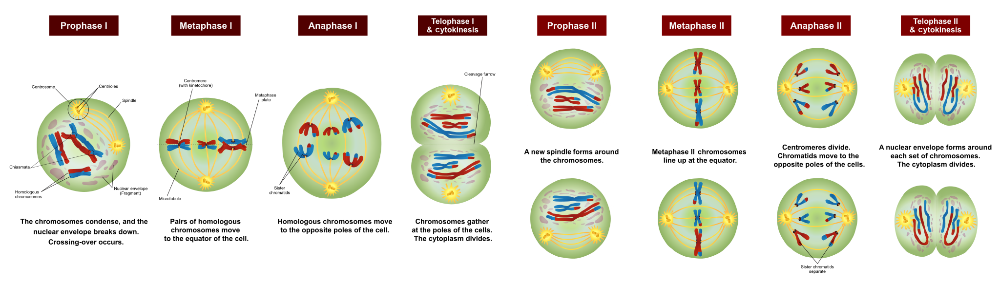
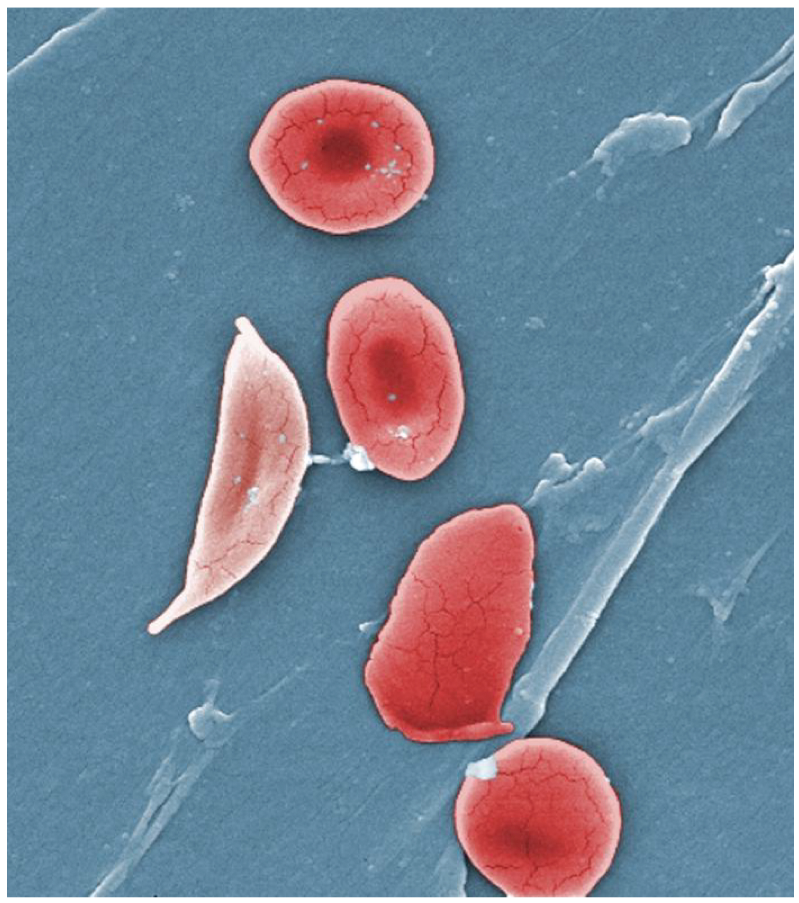

 

# What is Life?

## Schrödinger en Prigogine

Book: "What Is Life? The Physical Aspect of the Living Cell" (Schrödinger, 1944). 

Life is 

1. een open system that can generate order from chaos by exploiting external energy sources (entropy is disorder),

2. with the capacity to transmit its own specific blueprint from generation to generation (reproductive invariance). 

Note, that DNA was not known yet when Schrödinger wrote his seminal book. 

   

### How is this possible

- Second law of thermodynamics: a closed system is always gearing towards maximal entropy

- Entropy is a measure for disorder 

{width=30%} $\rightarrow$ {width=30%}

 

- Life is 
    
    - based on chemical reactions
    - an open system
    - solar energie 
    - chaos of molecules on earth  
    - While chemical reactions produce structure a lot of energy is lost into heat: dissipation. 
      
      $\rightarrow$ Increase of entropy

 

Prigogine did research to chemical systems far from equilibrium. 

- Open systems: influx of matter en energy 

- Reactions consist of many feedback loops  

- They dissipate incoming energy while producing structure

- He called them dissipative structures. 

 

Our globe is lying in a dissipative zone 

- Life produces entropy by dissipating energy from photons (light and UV) to heat through organic pigments (e.g. chlorophyll)   

- This heat induces secondary dissipative processes like the water cycle, wind and sea currents etc. 

- So life also transforms its environment.

   

## Definition according to de Duve

Book: "Life Evolving - Molecules, Mind and Meaning" (de Duve, 2002, First chapters give a very good overview. Later chapters get rather speculative).

Life is 

1. one
2. chemistry
3. information 

   

In bioinformatics we will work with the information part of life, however, we should not forget that life is more than that! 

 

Origin of life:

- first energy
- then chemistry and
- subsequently information

   

### Life is one

#### All organism consist of cells

- unicellular organisms

{width=50%}  
(Cyanobacterium, source: Chisholm Lab, wikipedia) 

   

- Essential: membrane that is separating them from there environment and enables interaction with the environment 

   

- Multicellular organisms 

  
(source: mrssmithsbiology)

   

#### LUCA (last Universal Common Ancestor).

- All cells orginate from the same population of ancestral cells living 3.5-3.8 billion years ago.  

(Source: wikipedia)    

   
    
#### Universal fuel for life (is actually chemistry)

(Source: adapted from wikipedia)

- ATP: Adinose-tri-phosphate
- Note that AMP is one of the building blocks of RNA. 
- Link between energy and information! 

   

#### Same building blocks for all living organisms 

1. Lipids: membranes
2. Carbohydrates (sugars): energy + building blocks
3. Amino acids: building blocks of proteins, which are the workhorses of a cell 
4. Nucleic Acids: building blocks of RNA and DNA

Note, that poly aromatic carbohydrates (PAHs) are omnipresent interstellar space

  - Cat's paw nebula
  - Green regions are regions where the radiation of hot stars induces fluorescence of PAHs. 
    
{width=200%} 
   

- They are further transformed in interstellar space

    - hydrogenation: waterstoffen, 
    - oxidation: zuurstof, 
    - hydroxylation (OH) 
    - ...

$\rightarrow$ first step to amino acids (building blocks of proteins) and nucleotides (building blocks of RNA and DNA) are just there, abundant in outer space.

##### Lipids 

(Source: Doug Hatfield, wikipedia)

   

##### Carbohydrates 

(Source: thebiologynotes.com)

   

##### Amino Acids

(Source: thebiologynotes.com)

   
    
##### Nucleic Acids

- Building blocks for the molecules that store the information that we inherit form our parents: RNA and DNA

{width=50%}  
(RNA, Source: wikipedia)

   

  
(DNA, Source: OpenStax, wikipedia)

   

  
(Source: Sponk, wikipedia)

   
    

#### Same genetic code (See Life is information)

   

### Life is Chemistry

(Source: Dr. Gerhard Michal, Roche)
<!-- 
Not working http in https

<iframe src= "http://googleweblight.com/?liteurl=https://biochemical-pathways.com/#/map/1" frameborder="0" allowfullscreen
      style="position:absolute;top:0;left:0;width:100%;height:100%;">
</iframe>

 -->

#### Energy 

(Source: wikipedia)

   

#### Catalysis

(Source: Narayanese, wikipedia)

   

<iframe
src="https://www.youtube.com/embed/yk14dOOvwMk?start=8&end=60"
frameborder="0"
style=" position:absolute;top: 0;left: 0;width: 100%;height: 100%;"
allow="autoplay; encrypted-media" allowfullscreen data-external="1" start=8></iframe>

   

"Any living organism is a reflection of its enzyme arsenal" 
 
- Catalysis: a large number of chemical reactions would never happen when we only would mix molecules without a catalist. 

- Catalist: chemical substance that helps a reaction to take place without being consumed itself.

- Biological catalists are referred to as enzymes  

- Enzymes are proteins that  
  
  - are fishing certain molecules from the complex mixture in a cell, 
  - which consists of thousands of chemical compounds 
  - generally at low concentrations;
  - through bindingsites they can facilitate that these molecules (substrates) are getting close so that they can react and form a new compound. 
   

#### Self-organisation

- Some proteins also give structure to a cel 
- The can spontaneously form structrue 
- See video where cytoplasm ("liquid in cell") was homogenised and is subsequently organising itself in cell-like structures. 
   

<iframe
src="https://www.youtube.com/embed/prq1Occu22s?start=0&end=7&loop=1"
frameborder="0"
style=" position:absolute;top: 0;left: 0;width: 100%;height: 100%;"
allow="autoplay; encrypted-media" allowfullscreen data-external="1" start=8></iframe>

(Source: Science DOI: 10.1126/science.aav7793)

   

Researchers found that the following was required for this: 

- ATP: the energy source of a cell 
- a filamentous proteines (microtubuli) 
- Dynein, a kind of motor protein

  
(Source: Pakorn Kanchanawong, wikipedia)

   

Proteins plays a central role in life: Catalysis + Structure 

A cell thus inherits not only genetic information but also its spatial organisation from a mother cell. 

   

### Life is information

   

- Gene: unit of genetic material, a DNA sequence that is encoding for the synthesis of a gene product, a protein or a functional RNA. 

(Source: Thomas Shafee, wikipedia)

 

- DNA: 4 letter code (4 bases: ACGT)
- RNA: 4 letter code (4 bases: ACGU)

{width=50%}  
(Source: Sponk, wikipedia)

   

  
(Source: [tokresources.org](http://www.tokresource.org/tok_classes/biobiobio/biomenu/transcription_translation/))

   

- Principle: hybridisation of complementary bases! 
- Transport RNA: codon (triplet van 3 basen) for each nucleic acid that is transported
   

- Protein: chain of amino acids 

    - there exist more than  400 amino acids
    - only 20 were selected by life to build proteins. 

{width=50%}  
(Source: wikipedia)

   

- Code is evolved so that many mutations give rise to 

  - synonymous codons (same amino acid) or
  - to incorporate amino acids that are similar  
  $\rightarrow$ protein function is conserved 

   

- DNA is the carier of genetic material (cfr. hard drive)

- RNA plays a more central role: 

    - Messenger RNA (cfr RAM memory)
    - Ribozymes: catalitic function
        - transfer RNA for translation of proteins 
        - in ribosomes for translation of proteins 
        - a lot of other rybozymes (catalic RNA)
    - RNA primer essential to copy DNA   
    - Carrier of genetic material (e.g. corona virus)

   

# Evolution and phylogenesis

 

 

(Source: wikipedia)    

   

## Evolution

### Variability and selection

Bacteria & Archae  
{width=70%}  
(Source: Ecoddington, wikipedia)

Eukaryota

(Source: Ali Zifan, wikipedia)

   

{width=40%}  
(Source: wikipedia)

  

- Error margin of DNA  replication: 1 error per billion basepairs that are copied (Human genome 6.4 billion basepairs)  

- Insertions/deletions: baseparen that are added or removed  

- Recombination: reshuffling of genetic traits, e.g. during sexual reproduction (e.g. recombination of paternal and maternal segments during meiosis).
$\rightarrow$ Mutations
$\rightarrow$ Natural variability

- Most mutaties are neutral $\rightarrow$ Molecular/Genetic clock
- But not always

   

{width=45%}
{width=45%}  
(Source: Thomas Samuel (1), OpenStax College (2), BruceBlaus(3), wikipedia)

   

- Many in Africa 
- Why does this mutation remains? 
- Selection by ecofactors: malaria resistence 

   

### Evolution

- Natural process that forms the basis of the origin of species (plants, animals, bacteria, fungi, ... and homonids)

- Driven by two opposing forces: **variation** en **selection**

- Variation by spontaneous copy errors in genetic code:  mutations

- Selection upon ecofactors, is mutation beneficial or harmfull for a particular organism in its specific environment.

- Odds on fixation of mutation depends on reproductive success

- Process of mutation and selection can eventually lead to new species upon many generations. 
   

### Genetic drift 

- Genetic drift: random fluctuations of alleles  

- Particularly strong in small populations

- As opposed to selection it is not adaptive. 

- New species will originate more quickly when a small fraction of the population gets isolated in a new environment. 

   

### Horizontal gene transfer 
- Non sexual transfer of genetic information 

- Very common between prokaryotes (eubacteria and arachae bacteria) 

  - e.g. exchange of antibiotics resistance. 

- between eukaryotes (mainly in protists, unicellular organisms with nucleus)  

- between prokaryotes (eubacteria and arachae bacteria) and eukaryotes (protisten, fungae, plants and animals)

   

### Teleonomy

- There is only the primitive goal to maintain and reproduce the species. 

- Evolution has no purpose or direction 

- When complex organs and organisms originate its seems as if there is a direction/purpose but that is not the case. 

   

{width=50%}  
(Source: Matticus78, wikipedia)

   

- The eye is not developed by evolution with the purpose to see. 

- The eye only has the function to see

- It is the result of a gradual process where each adaptation gave a reproductive advantage in a particular environment. 

- In another environment it can be nolonger functional and than it might dissapear, e.g. moles eye 
    
- The origin of a species is the result of evolution but not the purpose of evolution. 

- Evolution is adaptation with as goal maintance and reproduction 

   

#### Evolution has no direction

- Distribution of number of species and complexity

  
(Source: Stephen J. Gould, 1996, Full House: the spread of Excellence from Plato To Darwin)  
  
- Distribution of carbon mass fixated in different types of species. 

  
(Massa in giga ton koolstof. Source: doi.org/10.1073/pnas.1711842115)

   

- Note, large error margin on bacteria (can be a factor 10 larger). 

- Number of bacterial cells in our body (Source: doi.org/10.1371/journal.pbio.1002533): 
  - \#bacterial cells/\#human cells earlier estimated as $\pm$ 10/1 
  - recent estimatiom  $\pm$ 1/1. 
  - Human of 70kg $\pm$ 38 trillion bacterial cells/30 trillion humane cells (trillion: 1000 billion: 10$^{12}$!).

   

## Phylogenese 

Origin of all species by evolution

  
(Source: wikipedia)    

   

### Timescale

| 4.5 BYA | 4.3 BYA | 3.8 BYA | 3.5 BYA | 540 MYA | 520 MYA |
|---------|---------|---------|---------|---------|---------|
|         |         |         |         |         |         |

(Source: naturedocumetaries.org)

- Black Earth (4.5 BYA): hot basalt rock and dust in a cold vacuum

- Grey Earth (4.3 BYA): granite

- Blue Earth (3.8 BYA): water

- Red Earth (3.5 BYA): Radical change due to life. 

    - Cyanobacteria $\rightarrow$ fotosynthesis $\rightarrow$ oxygen
    - All iron in the ocean precipitates as iron oxide (rust, red) 
    - 250 $\rightarrow$ > 5000 minerals. 
    - Mass extinction
  
  
- White Earth (540 MYA)
    - Large ice age
    - Mass extinction
    - Volcanic activity comes to the rescue: greenhouse gasses 
  
  
- Green Earth (520 MYA)
    
    - Explosion of life 
    - from unicellular to more complex life.  

   

### Changepoint: Genesis of eukaryotic cell

Two archetypes: prokaryoten (simple cells,  0.1 to 5.0 $\mu m$) and eukaryotes (larger and more complex cells, 10-100 $\mu m$) 

{width=30%}
{width=30%}
{width=30%}  
(Source:  Ali Zifan (1) & Mariana Ruiz Villarreal (2 & 3), wikipedia) 

   

- 3.5 BYA - 520 MYA only prokaryote cells in fossils

   

Genesis of Eukaryotic cell by endosymbiosis:

  
(Source: Kelvinsong, wikipedia)

   

- Prokaryotes: reproduction by cell devision, mutation fixed in all daugther cells. 

   

- Eukaryotes: nearly all have a phase of sexual reproduction
  
  - much more variation: recombination of chromosomes
  - diploid organisms have two copies of each gene (father and mother) $\rightarrow$ successive mutations in 1 copy possible in the presence of another functional copy of the gene. 
  
   
  
- Eukaryotes evolve further in 

  - protists (unicellular)
  - fungae
  - plants
  - animals

   

Genetic information of a species can be seen as a record of the environments and development that it underwent up to this point 

   

## Evolution of evolution

1. Chemical evolution: selection of building blocks and complex chemistry
2. Biological evolution: cell/organism $\rightarrow$ selection genetic information and function
3. Cultural evolution can bypass natural evolution:
    
    - artificial selection: breeding of plants, pets, cattle, genetic manipulation, etc.
    - Technology: fast adaptation to new environment

   
    
# Ontogenesis

- Ontogenesis: development of organism from fertilized egg cell to adult individual until death 

- Each cell (except egg and sperm cell) of multi-cellular organism has same genetic material!

- Why are cells of same organism so morphologically diverse? 

 

## Epigenetics

  
(Source: NIH, wikipedia)

 

  
(Source: Mariuswalter, wikipedia)

   

- Differentiation $\rightarrow$ epigenetics

- Epigenetics: epigenetic markers on DNA and histones $\rightarrow$ gene can be transcribed or not. 

- Epigenetics is driven by ecofactors. 

- identical twins have almost the same genome (small differences have been build up in the womb), but it gets more easy to tell them apart over time: epigenetics

  

{width=50%}

(Difference due to eco-factor UV-exposure, Source: Swab & Hogenson, DOI: 10.1007/978-3-319-31143-2_65-1)

  

  
(Source doi: 10.1111/j.1526-4637.2012.01488.x)

   

- Epigenetics is very important in development of the brain and for learning. 

   

# Statistical Genomics 

- Genomics is the studies all genetic information of an organism
together: specific code, effects, functions and interactions

- With current high throughput methods we can measure the entire 
    - genome
    - transcriptome: expressed transcript of all genes
    - proteome: all translated proteins
    - epigenome
    - ...
    
- With statistical genomics we will try to make sense of this wealth of data so that we can find biomarkers and 'omics patterns that are reproducible. 

# Closing remarks 

- Life is
    - one
    - chemistry 
    - information 

   

- Note, however that we should not reduce organisms to their genome
- Indeed, organisms and life cannot be studied without considering there intimate relation to their environment/ecosystem

    - molecules do not work alone but in large networks
    - environmental conditions are important for self organisation
    - selective evolution: selection by eco-factors 
    - organisms adapt/shape in turn their environment and eco-factors: e.g. cyanobacteria
    - individual evolution: eco-factors $\leftrightarrow$ epigenetics 
    - eco-factors are also determined by other organisms: eco-system
    - Organisms interact and collaborate in their ecosystem
    - Genetic information can be considered as the record of all conditions in which our ancestral cells have lived.   
      
      $\rightarrow$ "Web of Life" 

# Organization of the course

## Module I: Quantitative Proteomics

  1. Identification and quantification of peptides and proteins
  2. Data exploration and quality control using plots
  3. Preprocessing: log-transformation, Filtering, Normalization,
Summarization
  4. Dealing with batch effects and other confounders
  5. Statistical Concepts
  
      1. Linear models/Linear mixed models
      2. Trade-off between biological relevance/effect size vs statistical
significance
      3. Empirical Bayes Methods
      4. Multiple testing
    
## Module II: Next generation sequencing (NGS, Transcriptomics)

  1. NGS Data exploration
  2. Preprocessing/normalization
  3. Additional Statistical Concepts
    
      1. Generalized linear models (GLM) for binary data
      2. GLM for count data
      3. Overdispersion

## Details

  1. Theory and Tutorials are blended
    
      - Module I: week 1-5
      - Module II: week 6-10
      - Project: week 1-10 via small assignments + week 11-12
  
  2.  Communication and submission of projects via Ufora
  3. All tutorials from week 2 onwards are based on
R/Bioconductor via R-studio
Scripts are made in R/markdown: a file format to combine
text, R code and R output.

