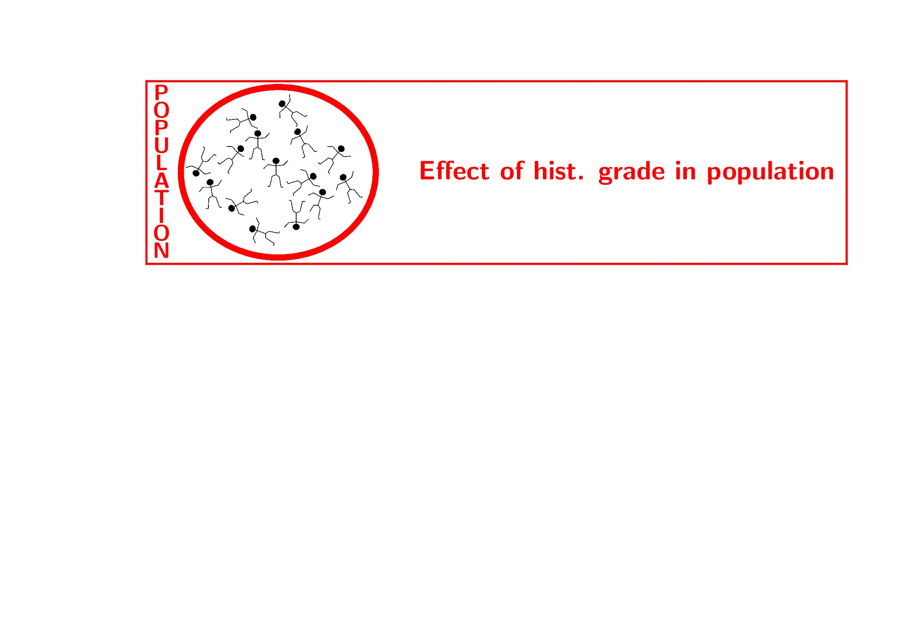
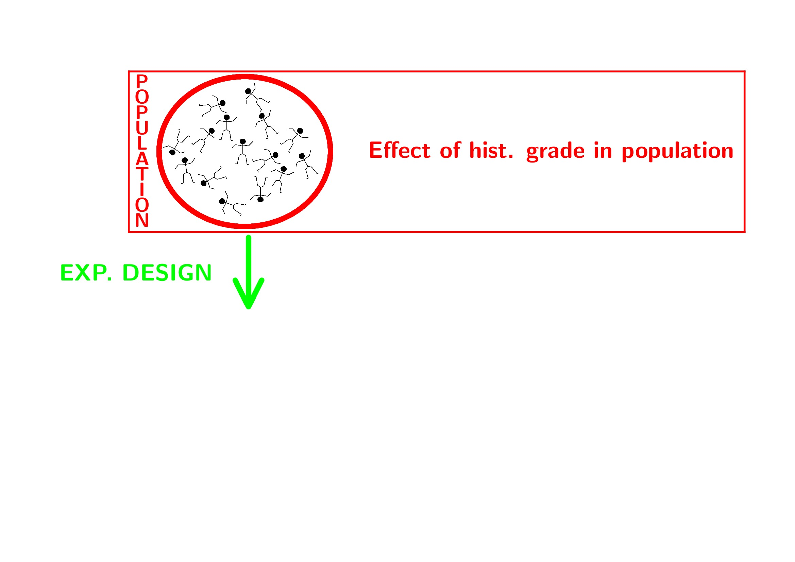
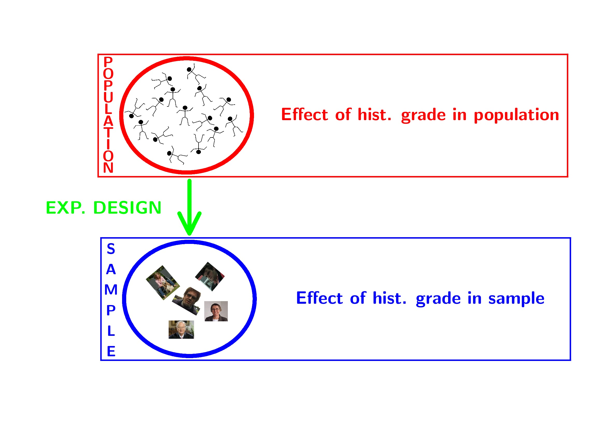
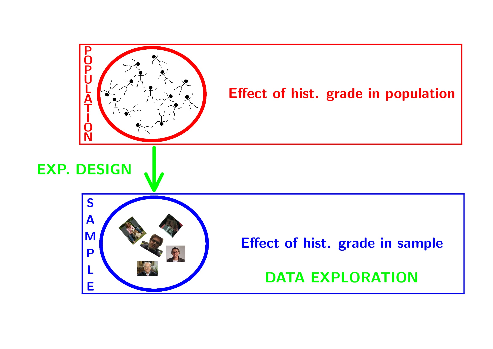
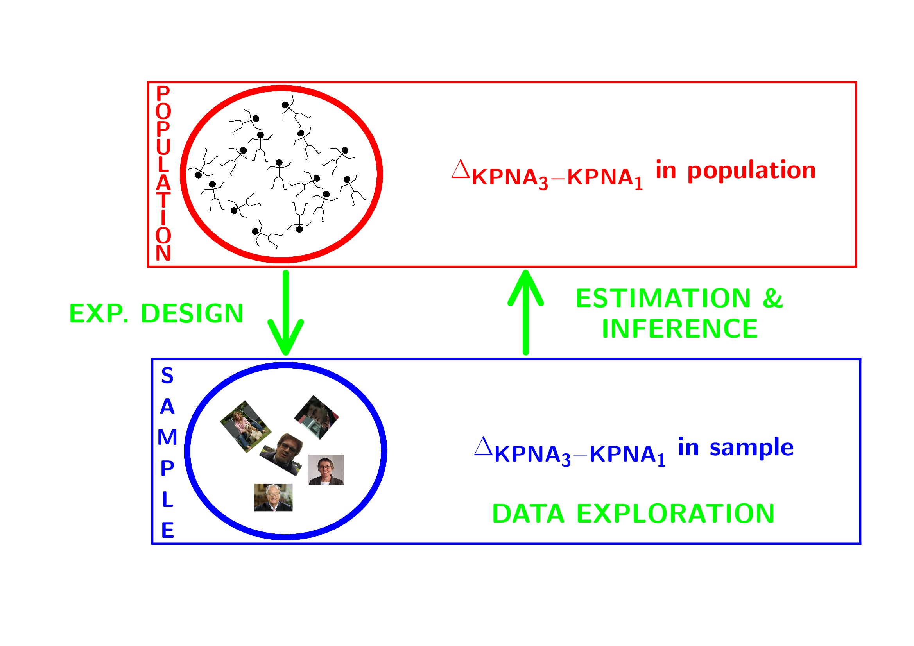
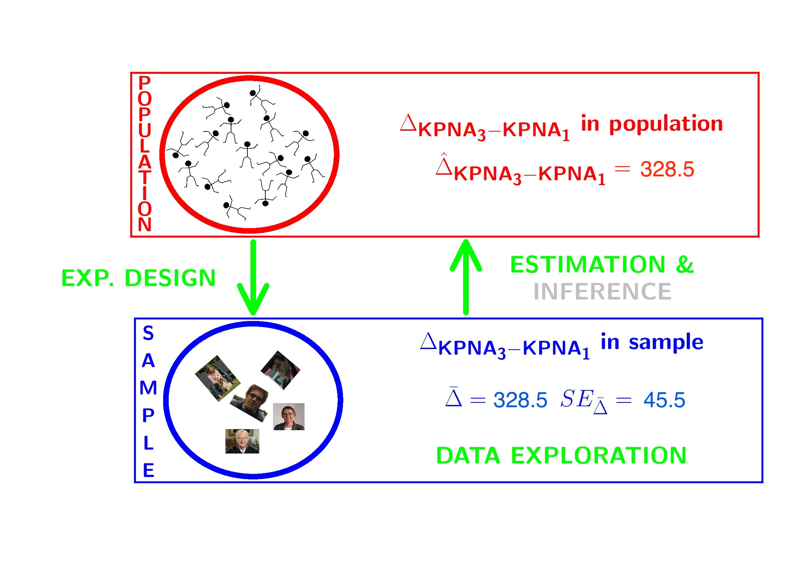
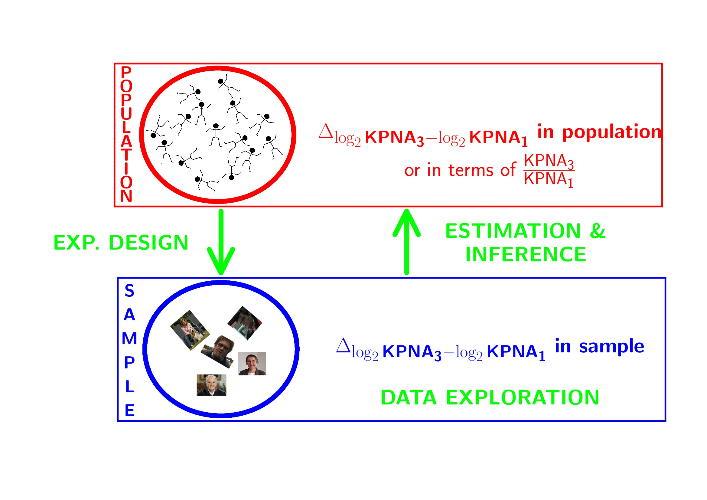
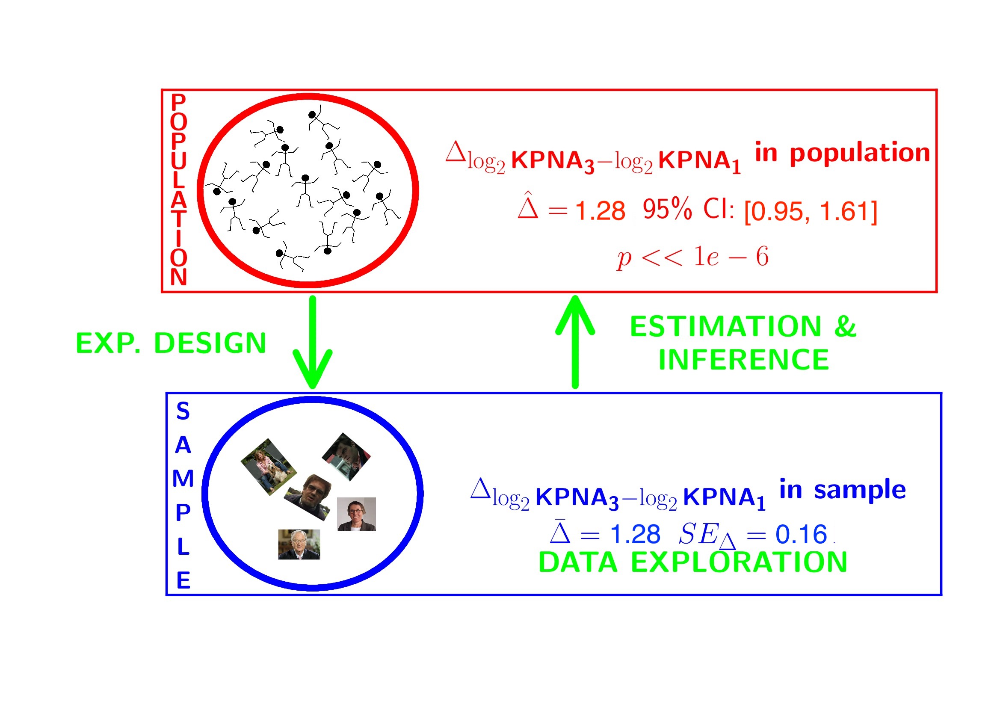
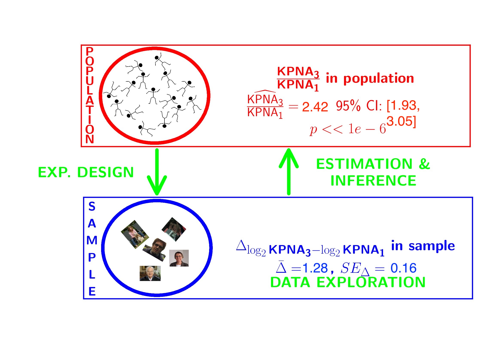
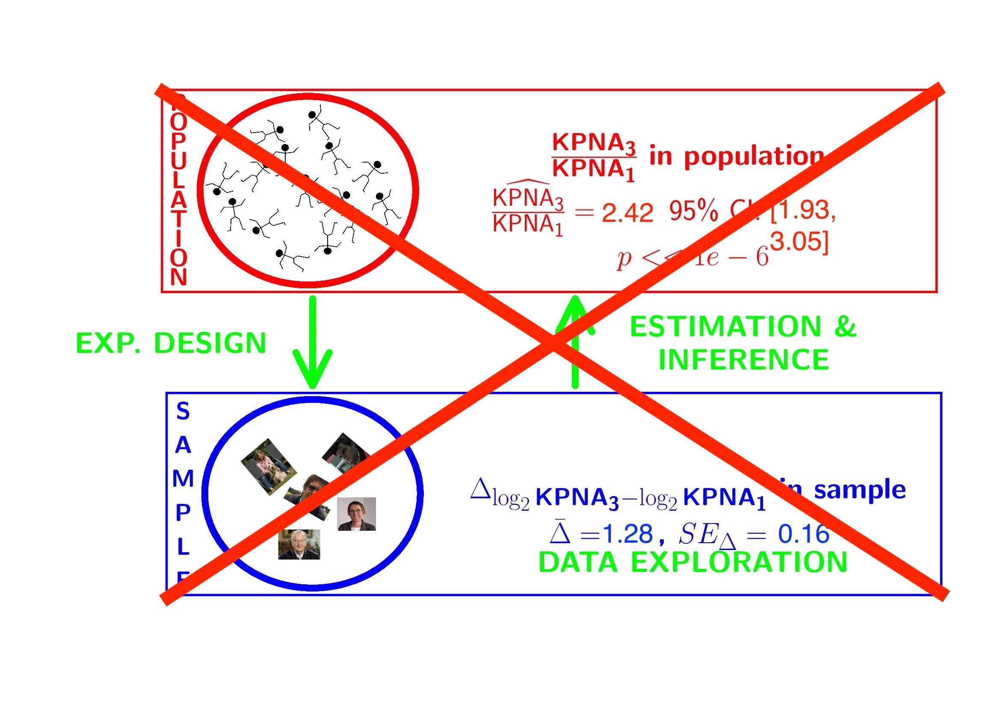

<a rel="license" href="https://creativecommons.org/licenses/by-nc-sa/4.0"></a>

This is part of the online course [Statistical Genomics 2022 (SGA)](https://statomics.github.io/SGA/)

# Breast cancer example

- part of study https://doi.org/10.1093/jnci/djj052)
- Histologic grade in breast cancer clinically prognostic.
Association of histologic grade on expression of KPNA2 gene that is known to be associated with poor BC prognosis.
- Population: all current and future breast cancer patients

---




---



---



---




---


---





# Data Exploration

## Import

```{r}
library(tidyverse)
gene <- read.table("https://raw.githubusercontent.com/statOmics/SGA21/master/data/kpna2.txt",header=TRUE)
head(gene)
```

We will transform the variable grade and node to a factor

```{r}
gene$grade <- as.factor(gene$grade)
gene$node <- as.factor(gene$node)
```

## Summary statistics

```{r}
geneSum <- gene %>%
  group_by(grade) %>%
  summarize(mean = mean(gene),
            sd = sd(gene),
            n=length(gene)
            ) %>%
  mutate(se = sd/sqrt(n))
geneSum
```

## Visualisation

```{r}
gene %>%
  ggplot(aes(x=grade,y=gene)) +
  geom_boxplot(outlier.shape=NA) +
  geom_jitter()
```

We can also save the plots as objects for later use!

```{r}
p1 <- gene %>%
  ggplot(aes(x=grade,y=gene)) +
  geom_boxplot(outlier.shape=NA) +
  geom_jitter()

p2 <- gene %>%
  ggplot(aes(sample=gene)) +
  geom_qq() +
  geom_qq_line() +
  facet_wrap(~grade)

p1
p2
```


## Research questions

Researchers want to assess the association of the histological grade on KPNA2 gene expression


---

## Estimation of effect size and standard error

```{r}
effectSize <- tibble(
  delta = geneSum$mean[2]- geneSum$mean[1],
  seDelta = geneSum %>%
    pull(se) %>%
    .^2 %>%
    sum %>%
    sqrt
  )
effectSize
```

# Statistical Inference

- Researchers want to assess the association of histological grade on KPNA2 gene expression
- Inference?

---




---


- Researchers want to assess the association of histological grade on KPNA2 gene expression
- Inference?
- testing + CI $ \rightarrow $ Assumptions

---

- In general we start from **alternative hypothese** $H_A$: we want to show an association
- Gene expression of grade 1 and grade 3 patients is on average different

- But, we will assess it by falsifying the opposite:

- The average KPNA2 gene expression of  grade 1 and grade 3 patients is equal

---

- How likely is it to observe an equal or more extreme association than the one observed in the sample when the null hypothesis is true?

- When we make assumptions about the distribution of our test statistic we can quantify this probability: **p-value**.
- If the p-value is below a significance threshold $\alpha$ we reject the null hypothesis

*We control the probability on a false positive result at the $\alpha$-level (type I error)*

- The p-value will only be calculated correctly if the underlying assumptions hold!

```{r}
library(gridExtra)
p1
p2
```

```{r}
t.test(gene~grade,data=gene)

effectSize <- effectSize %>%
  mutate(t.stat=delta/seDelta) %>%
  mutate(p.value= pt(-abs(t.stat),21.352)*2)

effectSize
```

- Intensities are often not normally distributed and have a mean variance relation
- Commonly log2-transformed
- Differences on log scale:

$$
\log_2(B) - \log_2(A) = \log_2 \frac{B}{A} = \log_2 FC_{\frac{B}{A}}
$$




---

## Log transformation

```{r}
gene <- gene %>%
  mutate(lgene = log2(gene))

p1 <- gene %>%
  ggplot(aes(x=grade,y=lgene)) +
  geom_boxplot(outlier.shape=NA) +
  geom_jitter()

p2 <- gene %>%
  ggplot(aes(sample=lgene)) +
  geom_qq() +
  geom_qq_line() +
  facet_wrap(~grade)

p1
p2

logtest <- t.test(lgene~grade,data=gene,var.equal=TRUE)
logtest

log2FC <- logtest$estimate[2]-logtest$estimate[1]
log2FC
names(log2FC) <- "g3-g1"
2^log2FC
```

## Conclusion

There is a extremely significant association of the histological grade on the gene expression in tumor tissue.  On average, the gene expression for the grade 3 patients is `r round(2^log2FC,2)` times higher than the gene expression in grade 1 patients (95\% CI  [`r paste(round(2^-logtest$conf.int[2:1],2),collapse=", ")`], $p<<0.001$).


 

---




---

The patients also differ in the their lymph node status. Hence, we have a two factorial design: grade x lymph node status!!!

Solution??



---

# General Linear Model

How can we integrate multiple factors and continuous covariates in linear model.

\[
y_i= \beta_0 + \beta_1 x_{i,1} + \beta_2 x_{i,2} + \beta_{12}x_{i,1}x_{i,2}+\epsilon_i,
\]
with

- $x_{i,1}$ a dummy variable for histological grade: $x_{i,1}=\begin{cases}
0& \text{grade 1}\\
1& \text{grade 3}
\end{cases}$
- $x_{i,2}$ a dummy variable for : $x_{i,2}=\begin{cases}
0& \text{lymph nodes were not removed}\\
1& \text{lymph nodes were removed}
\end{cases}$
- $\epsilon_i$?

---

## Implementation in R

```{r}
lm1 <- lm(gene~grade*node,data=gene)
summary(lm1)
```

---

## Assumptions

```{r}
plot(lm1)
```

---

## Breast cancer example

-  Paper: https://doi.org/10.1093/jnci/djj052
- Histologic grade in breast cancer provides clinically important prognostic information. Two factors have to be concidered: Histologic grade (grade 1 and grade 3) and lymph node status (0 vs 1). The researchers assessed gene expression of the KPNA2 gene a protein-coding gene associated with breast cancer and are mainly interested in the association of histological grade. Note, that the gene variable consists of background corrected normalized intensities obtained with a microarray platform. Upon log-transformation, they are known to be a good proxy for the $\log$ transformed concentration of gene expression product of the KPNA2 gene.
- Research questions and translate them towards model parameters (contrasts)?
- Make an R markdown file to answer the research questions


```{r}
library(ExploreModelMatrix)
explMx <- VisualizeDesign(gene,designFormula = ~grade*node)
explMx$plotlist
```

You can also explore the model matrix interactively:

```{r eval=FALSE}
ExploreModelMatrix(gene,designFormula = ~grade*node)
```
---

# Linear regression in matrix form

## Scalar form

- Consider a vector of predictors $\mathbf{x}=(x_1,\ldots,x_p)^T$ and
- a real-valued response $Y$
- then the linear regression model can be written as
\[
Y=f(\mathbf{x}) +\epsilon=\beta_0+\sum\limits_{j=1}^p x_j\beta_j + \epsilon
\]
with i.i.d. $\epsilon\sim N(0,\sigma^2)$

## Matrix form

- $n$ observations $(\mathbf{x}_1,y_1) \ldots (\mathbf{x}_n,y_n)$
- Regression in matrix notation
\[\mathbf{Y}=\mathbf{X\beta} + \mathbf{\epsilon}\]
with $\mathbf{Y}=\left[\begin{array}{c}y_1\\ \vdots\\y_n\end{array}\right]$,
$\mathbf{X}=\left[\begin{array}{cccc} 1&x_{11}&\ldots&x_{1p}\\
\vdots&\vdots&&\vdots\\
1&x_{n1}&\ldots&x_{np}
\end{array}\right]$,
$\mathbf{\beta}=\left[\begin{array}{c}\beta_0\\ \vdots\\ \beta_p\end{array}\right]$ and
$\mathbf{\epsilon}=\left[\begin{array}{c} \epsilon_1 \\ \vdots \\ \epsilon_n\end{array}\right]$

## Least Squares (LS)
- Minimize the residual sum of squares
\begin{eqnarray*}
RSS(\mathbf{\beta})&=&\sum\limits_{i=1}^n e^2_i\\
&=&\sum\limits_{i=1}^n \left(y_i-\beta_0-\sum\limits_{j=1}^p x_{ij}\beta_j\right)^2
\end{eqnarray*}
- or in matrix notation
\begin{eqnarray*}
RSS(\mathbf{\beta})&=&(\mathbf{Y}-\mathbf{X\beta})^T(\mathbf{Y}-\mathbf{X\beta})\\
&=&\Vert \mathbf{Y}-\mathbf{X\beta}\Vert^2_2
\end{eqnarray*}
with the $L_2$-norm of a $p$-dim. vector $v$ $\Vert \mathbf{v} \Vert=\sqrt{v_1^2+\ldots+v_p^2}$
$\rightarrow$ $\hat{\mathbf{\beta}}=\text{argmin}_\beta \Vert \mathbf{Y}-\mathbf{X\beta}\Vert^2_2$

---

### Minimize RSS
\[
\begin{array}{ccc}
\frac{\partial RSS}{\partial \mathbf{\beta}}&=&\mathbf{0}\\\\
\frac{(\mathbf{Y}-\mathbf{X\beta})^T(\mathbf{Y}-\mathbf{X\beta})}{\partial \mathbf{\beta}}&=&\mathbf{0}\\\\
-2\mathbf{X}^T(\mathbf{Y}-\mathbf{X\beta})&=&\mathbf{0}\\\\
\mathbf{X}^T\mathbf{X\beta}&=&\mathbf{X}^T\mathbf{Y}\\\\
\hat{\mathbf{\beta}}&=&(\mathbf{X}^T\mathbf{X})^{-1}\mathbf{X}^T\mathbf{Y}
\end{array}
\]

---

### Geometric Interpretation

#### Toy dataset

We will illustrate this on a toy dataset

```{r}
library(tidyverse)
data <- data.frame(x=1:3,y=c(1,2,2))
data
```

#### Matrix form for toy dataset 

We can also write this in matrix form

$$
\mathbf{Y} = \mathbf{X}\boldsymbol{\beta}+\boldsymbol{\epsilon}
$$

with

$$
\mathbf{Y}=\left[
\begin{array}{c}
1\\
2\\
2\\
\end{array}\right],
\quad
\mathbf{X}= \left[
\begin{array}{cc}
1&1\\
1&2\\
1&3\\
\end{array}
\right],
\quad \boldsymbol{\beta} = \left[
\begin{array}{c}
\beta_0\\
\beta_1\\
\end{array}
\right]
\quad
\text{and}
\quad
\boldsymbol{\epsilon}=
\left[
\begin{array}{c}
\epsilon_1\\
\epsilon_2\\
\epsilon_3
\end{array}
\right]
$$

#### Classical interpretation


Model fit and predictions based on the toy dataset 

```{r}
lm1 <- lm(y~x,data)
data$yhat <- lm1$fitted

data %>%
  ggplot(aes(x,y)) +
  geom_point() +
  ylim(0,4) +
  xlim(0,4) +
  stat_smooth(method = "lm", color = "red", fullrange = TRUE) +
  geom_point(aes(x=x, y =yhat), pch = 2, size = 3, color = "red") +
  geom_segment(data = data, aes(x = x, xend = x, y = y, yend = yhat), lty = 2 )
```


### Projection

There is also another picture to regression:

- Instead of plotting each observation $i= 1 \ldots n$ as a data-point in $\mathbb{R}^p$ with dimensions $1 \ldots p$ for every variable/feature that is recorded for each observation  

- We can also plot $\mathbf{Y}$, $\hat{\mathbf{Y}}$ and each column of $\mathbf{X}$: $\mathbf{X}_j$ with $j=1 \ldots p$ as a vector in $\mathbb{R}^n$ with dimensions $1 \ldots n$ for every observation.  

- In this representation linear regression can be interpreted as a projection of the vector $\mathbf{Y}$ onto the subspace of $\mathbb{R}^n$ that is spanned by the vectors for the predictors $\mathbf{X}_1 \ldots \mathbf{X}_p$.  

- The space $\mathbf{X}_1 \ldots \mathbf{X}_p$ is also referred to as the column space of $\mathbf{X}$, the space that consists of all linear combinations of the vectors of the predictors or columns $\mathbf{X}_1 \ldots \mathbf{X}_p$.  

#### Intermezzo: Projection of vector on X  and Y axis

$$
\mathbf{e}=\left[\begin{array}{c} e_1\\e_2\end{array}\right], \mathbf{u}_1 =  \left[\begin{array}{c} 1\\0\end{array}\right], \mathbf{u}_2 =  \left[\begin{array}{c} 0\\1\end{array}\right]
$$


```{r echo=FALSE}
plotdata <- data.frame(e1=3,e2=2)
plotdata %>% ggplot(aes(x=e1,y=e2)) +
  geom_point() + 
  geom_segment(aes(x = 3, y = 2, xend = 3, yend = 0),color="orange",linetype=2,size=2) +
geom_segment(aes(x = 3, y = 2, xend = 0, yend = 2),color="orange",linetype=2,size=2) +
 geom_segment(aes(x = 0, y = 0, xend = 3, yend = 2),
                  arrow = arrow(length = unit(0.5, "cm")),color="red",size=2) +
 geom_segment(aes(x = 0, y = 0, xend = 3, yend = 0),
                  arrow = arrow(length = unit(0.5, "cm")),color="orange",size=2) +
 geom_segment(aes(x = 0, y = 0, xend = 0, yend = 2),
                  arrow = arrow(length = unit(0.5, "cm")),color="orange",size=2)  +
 geom_segment(aes(x = 0, y = 0, xend = 0, yend = 1),
                  arrow = arrow(length = unit(0.5, "cm")),size=2) +
geom_segment(aes(x = 0, y = 0, xend = 1, yend = 0),
                  arrow = arrow(length = unit(0.5, "cm")),size=2) +
 geom_text(aes(x=3.05,y=2.2,label="e=(e1,e2)"),color="red",size = 7,hjust="left") + 
 geom_text(aes(x=3.05,y=0,label="(e1,0)"),color="orange",size = 7,hjust="left",vjust="top") +
 geom_text(aes(x=0,y=2.2,label="(0,e2)"),color="orange",size = 7,hjust="left") +
 geom_text(aes(x=0.05,y=1.2,label="u2=(0,1)"),size = 7,hjust="left") + 
   geom_text(aes(x=1.05,y=0.2,label="u1=(1,0)"),size = 7,hjust="left")  +
   coord_fixed() +
  xlim(-.5,4) +
  ylim(-.5,2.5)
```


1. Projection of error on x-axis 

\begin{eqnarray*}
\mathbf{u}_1^T \mathbf{e} &=& \Vert \mathbf{u}_1\Vert_2  \Vert \mathbf{e}_1\Vert_2 \cos <\mathbf{u}_1,\mathbf{e}_1>\\
&=&\left[\begin{array}{cc} 1&0\end{array}\right] \left[\begin{array}{c} e_1\\e_2\end{array}\right]\\ &=& 1\times e_1 + 0 \times e_2 \\
&=& e_1\\
\end{eqnarray*}

2. Projection of error on y-axis 

\begin{eqnarray*}
\mathbf{u}_2^T \mathbf{e} &=& \left[\begin{array}{cc} 1&0\end{array}\right] \left[\begin{array}{c} e_1\\e_2\end{array}\right]\\ &=& 0\times e_1 + 1 \times e_2 \\
&=& e_2
\end{eqnarray*}

3. Projection of error on itself 


\begin{eqnarray*}
\mathbf{e}^T \mathbf{e} &=&\left[\begin{array}{cc} e_1&e_2\end{array}\right] \left[\begin{array}{c} e_1\\e_2\end{array}\right]\\
&=&e_1^2+e_2^2\\
&=&\Vert e \Vert^2_2 \rightarrow \text{ Pythagorean theorem}
\end{eqnarray*} 

---

#### Interpretation of least squares as a projection

Fitted values:

$$
\begin{array}{lcl}
\hat{\mathbf{Y}} &=& \mathbf{X}\hat{\boldsymbol{\beta}}\\
&=& \mathbf{X} (\mathbf{X}^T\mathbf{X})^{-1}\mathbf{X}^T\mathbf{Y}\\
&=& \mathbf{HY}
\end{array}
$$
with $\mathbf{H}$ the projection matrix also referred to as the hat matrix.


```{r}
X <- model.matrix(~x,data)
X
```

```{r}
XtX <- t(X)%*%X
XtX
```

```{r}
XtXinv <- solve(t(X)%*%X)
XtXinv
```

```{r}
H <- X %*% XtXinv %*% t(X)
H
```


```{r}
Y <- data$y
Yhat <- H%*%Y
Yhat
```


- We can also interpret the fit as the projection of the $n\times 1$ vector $\mathbf{Y}$ on the column space of the matrix $\mathbf{X}$.

- So each column in $\mathbf{X}$ is also an $n\times 1$ vector.

- For the toy example n=3 and p=2.
  The other picture to linear regression is to consider $X_0$, $X_1$ and $Y$ as vectors in the space of the data $\mathbb{R}^n$, here $\mathbb{R}^3$ because we have three data points.
So the column space of X is a plane in the three dimensional space.

\[
\hat{\mathbf{Y}} = \mathbf{X} (\mathbf{X}^T\mathbf{X})^{-1} \mathbf{X}^T \mathbf{Y}
\]

1. Plane spanned by column space:
The other picture to linear regression is to consider $X_0$, $X_1$ and $Y$ as vectors in the space of the data $\mathbb{R}^n$, here $\mathbb{R}^3$ because we have three data points.


```{r}
originRn <- data.frame(X1=0,X2=0,X3=0)
data$x0 <- 1
dataRn <- data.frame(t(data))

library(plotly)

p1 <- plot_ly(
    originRn,
    x = ~ X1,
    y = ~ X2,
    z= ~ X3, name="origin") %>%
  add_markers(type="scatter3d") %>%
  layout(
    scene = list(
      aspectmode="cube",
      xaxis = list(range=c(-4,4)), yaxis = list(range=c(-4,4)), zaxis = list(range=c(-4,4))
      )
    )
p1 <- p1 %>%
  add_trace(
    x = c(0,1),
    y = c(0,0),
    z = c(0,0),
    mode = "lines",
    line = list(width = 5, color = "grey"),
    type="scatter3d",
    name = "obs1") %>%
  add_trace(
    x = c(0,0),
    y = c(0,1),
    z = c(0,0),
    mode = "lines",
    line = list(width = 5, color = "grey"),
    type="scatter3d",
    name = "obs2") %>%
  add_trace(
    x = c(0,0),
    y = c(0,0),
    z = c(0,1),
    mode = "lines",
    line = list(width = 5, color = "grey"),
    type="scatter3d",
    name = "obs3") %>%
  add_trace(
    x = c(0,1),
    y = c(0,1),
    z = c(0,1),
    mode = "lines",
    line = list(width = 5, color = "black"),
    type="scatter3d",
    name = "X1") %>%
    add_trace(
    x = c(0,1),
    y = c(0,2),
    z = c(0,3),
    mode = "lines",
    line = list(width = 5, color = "black"),
    type="scatter3d",
    name = "X2")
p1
```


2. Vector of Y:

Actual values of $\mathbf{Y}$:

```{r}
data$y
```

\[
\mathbf{Y}=\left[\begin{array}{c}
`r data$y[1]` \\
`r data$y[2]` \\
`r data$y[3]`
\end{array}\right]
\]

```{r}
p2 <- p1 %>%
  add_trace(
    x = c(0,Y[1]),
    y = c(0,Y[2]),
    z = c(0,Y[3]),
    mode = "lines",
    line = list(width = 5, color = "red"),
    type="scatter3d",
    name = "Y") 
p2
```

3. Projection of Y onto column space

Actual values of fitted values $\mathbf{\hat{Y}}$:

```{r}
data$yhat
```

\[
\mathbf{Y}=\left[\begin{array}{c}
`r data$yhat[1]` \\
`r data$yhat[2]` \\
`r data$yhat[3]`
\end{array}\right]
\]

```{r}
p2 <- p2 %>%
  add_trace(
    x = c(0,Yhat[1]),
    y = c(0,Yhat[2]),
    z = c(0,Yhat[3]),
    mode = "lines",
    line = list(width = 5, color = "orange"),
    type="scatter3d",
    name="Yhat") %>% 
    add_trace(
    x = c(Y[1],Yhat[1]),
    y = c(Y[2],Yhat[2]),
    z = c(Y[3],Yhat[3]),
    mode = "lines",
    line = list(width = 5, color = "red", dash="dash"),
    type="scatter3d",
    name="Y -> Yhat"
    )
p2
```

$\mathbf{Y}$ is projected in the column space of $\mathbf{X}$! spanned by the columns.

#### How does this projection works? 

$$
\begin{array}{lcl}
\hat{\mathbf{Y}} &=& \mathbf{X} (\mathbf{X}^T\mathbf{X})^{-1}\mathbf{X}^T\mathbf{Y}\\
&=& \mathbf{X}(\mathbf{X}^T\mathbf{X})^{-1/2}(\mathbf{X}^T\mathbf{X})^{-1/2}\mathbf{X}^T\mathbf{Y}\\
&=& \mathbf{U}\mathbf{U}^T\mathbf{Y}
\end{array}
$$


- $\mathbf{U}$ is a new orthonormal basis in $\mathbb{R}^2$, a subspace of $\mathbb{R}^3$

- The space spanned by U and X is the column space of X, e.g. it contains all possible linear combinantions of X.
$\mathbf{U}^t\mathbf{Y}$ is the projection of Y on this new orthonormal basis

```{r}
eigenXtX <- eigen(XtX)
XtXinvSqrt <- eigenXtX$vectors %*%diag(1/eigenXtX$values^.5)%*%t(eigenXtX$vectors)
U <- X %*% XtXinvSqrt
```


- $\mathbf{U}$ orthonormal basis

```{r}
U
t(U)%*%U
```

- $\mathbf{UU}^T$ equals projection matrix 

```{r}
U%*%t(U)
H
```


```{r}
p3 <- p1 %>%
  add_trace(
    x = c(0,U[1,1]),
    y = c(0,U[2,1]),
    z = c(0,U[3,1]),
    mode = "lines",
    line = list(width = 5, color = "blue"),
    type="scatter3d",
    name = "U1") %>%
  add_trace(
    x = c(0,U[1,2]),
    y = c(0,U[2,2]),
    z = c(0,U[3,2]),
    mode = "lines",
    line = list(width = 5, color = "blue"),
    type="scatter3d",
    name = "U2")

p3
```


- $\mathbf{U}^T\mathbf{Y}$ is the projection of $\mathbf{Y}$ in the space spanned by $\mathbf{U}$.
- Indeed $\mathbf{U}_1^T\mathbf{Y}$

```{r}
p4 <- p3 %>%
  add_trace(
    x = c(0,Y[1]),
    y = c(0,Y[2]),
    z = c(0,Y[3]),
    mode = "lines",
    line = list(width = 5, color = "red"),
    type="scatter3d",
    name = "Y") %>%
  add_trace(
    x = c(0,U[1,1]*(U[,1]%*%Y)),
    y = c(0,U[2,1]*(U[,1]%*%Y)),
    z = c(0,U[3,1]*(U[,1]%*%Y)),
    mode = "lines",
    line = list(width = 5, color = "red",dash="dash"),
    type="scatter3d",
    name="Y -> U1") %>% add_trace(
    x = c(Y[1],U[1,1]*(U[,1]%*%Y)),
    y = c(Y[2],U[2,1]*(U[,1]%*%Y)),
    z = c(Y[3],U[3,1]*(U[,1]%*%Y)),
    mode = "lines",
    line = list(width = 5, color = "red", dash="dash"),
    type="scatter3d",
    name="Y -> U1")
p4
```

- and $\mathbf{U}_2^T\mathbf{Y}$
```{r}
p5 <- p4 %>%
  add_trace(
    x = c(0,U[1,2]*(U[,2]%*%Y)),
    y = c(0,U[2,2]*(U[,2]%*%Y)),
    z = c(0,U[3,2]*(U[,2]%*%Y)),
    mode = "lines",
    line = list(width = 5, color = "red",dash="dash"),
    type="scatter3d",
    name="Y -> U2") %>% add_trace(
    x = c(Y[1],U[1,2]*(U[,2]%*%Y)),
    y = c(Y[2],U[2,2]*(U[,2]%*%Y)),
    z = c(Y[3],U[3,2]*(U[,2]%*%Y)),
    mode = "lines",
    line = list(width = 5, color = "red", dash="dash"),
    type="scatter3d",
    name="Y -> U2")
p5
```

- Yhat is the resulting vector that lies in the plane spanned by $\mathbf{U}_1$ and $\mathbf{U}_2$ and thus also in the column space of $\mathbf{X}$.

```{r}
p6 <- p5 %>%
  add_trace(
    x = c(0,Yhat[1]),
    y = c(0,Yhat[2]),
    z = c(0,Yhat[3]),
    mode = "lines",
    line = list(width = 5, color = "orange"),
    type="scatter3d",
    name = "Yhat") %>%
  add_trace(
    x = c(Y[1],Yhat[1]),
    y = c(Y[2],Yhat[2]),
    z = c(Y[3],Yhat[3]),
    mode = "lines",
    line = list(width = 5, color = "maroon2"),
    type="scatter3d",
    name = "e") %>%
  add_trace(
    x = c(U[1,1]*(U[,1]%*%Y),Yhat[1]),
    y = c(U[2,1]*(U[,1]%*%Y),Yhat[2]),
    z = c(U[3,1]*(U[,1]%*%Y),Yhat[3]),
    mode = "lines",
    line = list(width = 5, color = "orange", dash="dash"),
    type="scatter3d",
    name = "Y -> U")  %>%
  add_trace(
    x = c(U[1,2]*(U[,2]%*%Y),Yhat[1]),
    y = c(U[2,2]*(U[,2]%*%Y),Yhat[2]),
    z = c(U[3,2]*(U[,2]%*%Y),Yhat[3]),
    mode = "lines",
    line = list(width = 5, color = "orange", dash="dash"),
    type="scatter3d",
    name = "Y -> U")
p6
```

### Error 

Note, that it is also clear from the equation in the derivation of the least squares solution that the residual is orthogonal on the column space:

\[
 -2 \mathbf{X}^T(\mathbf{Y}-\mathbf{X}\boldsymbol{\beta}) = 0
\]


---

## Variance Estimator?
\[
\begin{array}{ccl}
\hat{\boldsymbol{\Sigma}}_{\hat{\mathbf{\beta}}}
&=&\text{var}\left[(\mathbf{X}^T\mathbf{X})^{-1}\mathbf{X}^T\mathbf{Y}\right]\\\\
&=&(\mathbf{X}^T\mathbf{X})^{-1}\mathbf{X}^T\text{var}\left[\mathbf{Y}\right]\mathbf{X}(\mathbf{X}^T\mathbf{X})^{-1}\\\\
&=&(\mathbf{X}^T\mathbf{X})^{-1}\mathbf{X}^T(\mathbf{I}\sigma^2)\mathbf{X}(\mathbf{X}^T\mathbf{X})^{-1}
\\\\
&=&(\mathbf{X}^T\mathbf{X})^{-1}\mathbf{X}^T\mathbf{I}\quad\mathbf{X}(\mathbf{X}^T\mathbf{X})^{-1}\sigma^2\\\\
%\hat{\boldmath{\Sigma}}_{\hat{\mathbf{\beta}}}&=&(\mathbf{X}^T\mathbf{X})^{-1}\mathbf{X}^T\var\left[\mathbf{Y}\right](\mathbf{X}^T\mathbf{X})^{-1}\mathbf{X}\\
&=&(\mathbf{X}^T\mathbf{X})^{-1}\mathbf{X}^T\mathbf{X}(\mathbf{X}^T\mathbf{X})^{-1}\sigma^2\\\\
&=&(\mathbf{X}^T\mathbf{X})^{-1}\sigma^2
\end{array}
\]

---

## Contrasts

Hypotheses often involve linear combinations of the model parameters!

e.g.

- $H_0: \log_2{FC}_{g3n1-g1n1}= \beta_{g3} + \hat\beta_{g3n1}=0$ $\rightarrow$ "grade3+grade3:node1 = 0"

- Let \[
\boldsymbol{\beta} = \left[
\begin{array}{c}
\beta_{0}\\
\beta_{g3}\\
\beta_{n1}\\
\beta_{g3:n1}
\end{array}
\right]\]
- we can write that contrast using a contrast matrix:
\[
\mathbf{L}=\left[\begin{array}{c}0\\1\\0\\1\end{array}\right] \rightarrow \mathbf{L}^T\boldsymbol{beta} \]

- Then the variance becomes:
\[
\text{var}_{\mathbf{L}^T\boldsymbol{\hat\beta}}= \mathbf{L}^T \boldsymbol{\Sigma}_{\boldsymbol{\hat\beta}}\mathbf{L}
\]


---

# Homework: Adopt the gene analysis on log scale in matrix form!

1. Study the solution of the exercise to understand the analysis in R


2. Calculate
- model parameters and contrasts of interest
- standard errors, standard errors on contrasts
- t-test statistics on the model parameters and contrasts of interest

3. Compare your results with the output of the lm(.) function


---

## Inspiration

Tip: details on the implementation can be found in the book of Faraway (chapter 2). https://people.bath.ac.uk/jjf23/book/

- Design matrix

```{r}
X <- model.matrix(~grade*node,data=gene)
```

- Transpose of a matrix: use function t(.)

```{r}
t(X)
```

- Matrix product %\*% operator

```{r}
t(X)%*%X
```

- Degrees of freedom of a model?

$$ df =  n-p$$

```{r}
summary(lm1)
dfRes <- (nrow(X)-ncol(X))
dfRes
```

- Variance estimator: MSE

$$
\hat \sigma^2 = \frac{\sum\limits_{i=1}^n\epsilon_i^2}{n-p}
$$


- Invert matrix: use function solve(.)

- Diagonal elements of a matrix: use function diag(.)

```{r}
t(X)%*%X
diag(t(X)%*%X)
```
