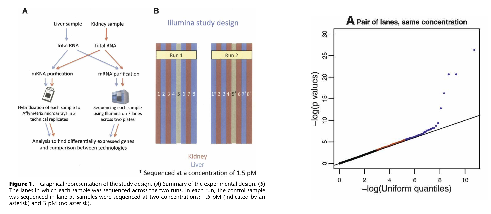
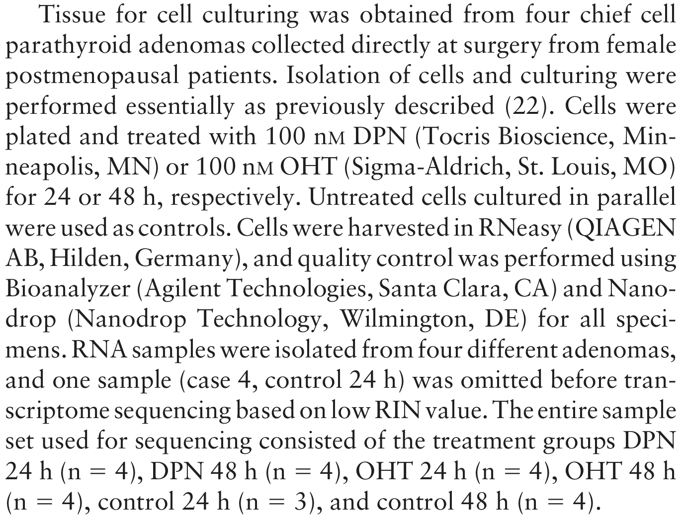
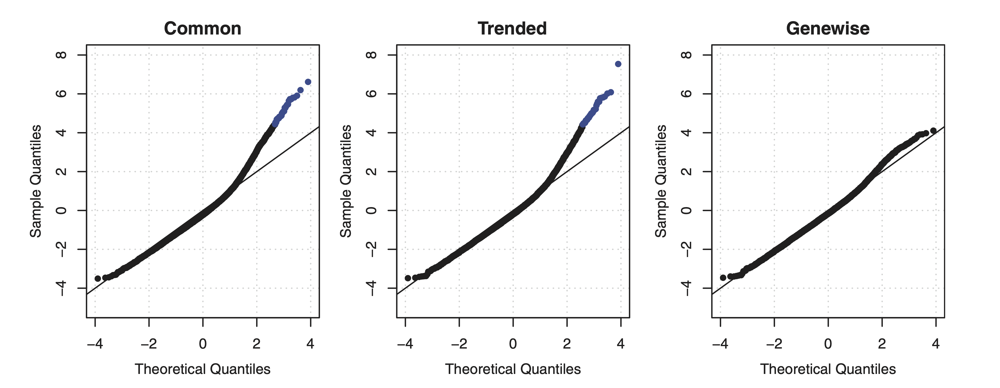

```{r functions, include=FALSE}
# A function for captioning and referencing images
fig <- local({
    i <- 0
    ref <- list()
    list(
        cap=function(refName, text) {
            i <<- i + 1
            ref[[refName]] <<- i
            paste("Figure ", i, ": ", text, sep="")
        },
        ref=function(refName) {
            ref[[refName]]
        })
})
``` 

```{r setup, include=FALSE}
knitr::opts_chunk$set(echo = TRUE)
suppressPackageStartupMessages({
  library(knitr)
  library(rmarkdown)
  library(ggplot2)
  library(tidyverse)
  library(SummarizedExperiment)
  library(edgeR)
  if(!"parathyroidSE" %in% installed.packages()[,1]) BiocManager::install("parathyroidSE")
})
```

In this lecture we will introduce the main principles of working with count data, and how to model these using generalized linear models (GLMs). We focus on introducing the concept of generalized linear models, and how  they can be applied to genomics data analysis.

# The Poisson distribution

 - The Poisson distribution is a typical count distribution that is generally popular and fairly easy to work with. It is defined by a single parameter: its mean $\mu$. For a Poisson distributed random variable $Y_i$ with observations $i \in \{1, \ldots, n\}$, its variance is equal to its mean. That is, if 
 
 $$Y_i \sim Poi(\mu)$$
 , then 
 
 $$E(Y_i) = Var(Y_i) = \mu.$$
 
 - This immediately shows an important feature of count data: the **mean-variance relationship**. Indeed, in count data, the variance will always be a function of the mean.
 
 - This is quite intuitive. Consider the following example. You have two bird cages, where in one bird cage there are $10$ birds, while in the other there are $100$ birds. You let a sample of people look to the number of birds in either one of the cages. It seems unlikely that a person in front of the 10-bird cage would come up with an estimate of $3$, while it seems likely that someone in front of the 100-bird cage would come up with an estimate of $80$. Even though the difference from the true value is the same, the exact value has an impact on the plausible deviation around it.
 
```{r}
set.seed(11)
y1 <- rpois(n=500, lambda=10)
y2 <- rpois(n=500, lambda=100)

par(mfrow = c(1,2))
qplot(y1, main="Poisson(10)", geom = "histogram", binwidth=.5,center=0)
qplot(y2, main="Poisson(100)", geom = "histogram", binwidth=.5,center=0)
```

## The Poisson distribution in RNA-seq

 - In RNA-seq, technical replicates represent different aliquots of the same sample being sequenced repeatedly. The underlying true expression of a gene can hence safely be assumed to be equal across these technical replicates.
 - [Marioni *et al.* (2008)](https://genome.cshlp.org/content/18/9/1509) have shown that, for most genes, the distribution of observed gene expression counts across technical replicates follow a Poisson distribution. A small proportion of genes ($\sim 0.5\%$) do not follow this Poisson model, however, and actually show evidence for *'extra-Poisson variation'*.
 
```{r, echo=FALSE, fig.cap=paste("Figure: Technical replication in RNA-seq. Figures from Marioni et al. (2008).")}
# All defaults

```

## Relative uncertainty for Poisson distributed random variables

Take a minute to consider the following question:

 - Suppose that we have a solid tumor sample from a cancer patient, as well as a sample of surrounding healthy tissue. For each sample, we have three technical replicates at our disposal. Let $Y_{grt}$ denote the observed gene expression values of gene $g$ in replicate $r \in \{1,2,3\}$ from tissue $t \in \{0,1\}$, where $t=0$ denotes healthy tissue and $t=1$ denotes tumoral tissue. 
 - We then know that the random variables $Y_{gr0}$ and $Y_{gr1}$ follow a Poisson distribution, and we would estimate its mean as $\bar{Y}_{g0} = \frac{1}{3} \sum_{r=1}^3 Y_{gr0}$ and $\bar{Y}_{g1} = \frac{1}{3} \sum_{r=1}^3 Y_{gr1}$, respectively. 
 - Similar, for another gene $k$, we observe $Y_{krt}$, and estimate $\bar{Y}_{k0}$ and $\bar{Y}_{k1}$ correspondingly.
 - Now suppose that $\beta_{k} = \bar{Y}_{k1} / \bar{Y}_{k0} = 5$, but also $\beta_g = \bar{Y}_{g1} / \bar{Y}_{g0} = 5$, i.e., the two genes have the same average expression ratio (also often called a fold-change) across samples. However, they are differently expressed as $\bar{Y}_{k1} = 100$, and $\bar{Y}_{g1} = 10$ (making $\bar{Y}_{k0} = 20$, and $\bar{Y}_{g0} = 2$).
 - For which of the two genes is the uncertainty on the expression ratio the highest? In other words, do we trust $\beta_k$ more or do we trust $\beta_g$ more?
 
 ---

Let's approximate the uncertainty in $beta_g$ and $\beta_k$ using simulation:
 
```{r}
N <- 1e3
beta_g <- beta_k <- vector(length=N)
for(ii in 1:N){
  ygr1 <- rpois(n=3, lambda=10)
  ygr0 <- rpois(n=3, lambda=2)
  ykr1 <- rpois(n=3, lambda=100)
  ykr0 <- rpois(n=3, lambda=20)
  beta_g[ii] <- mean(ygr1) / mean(ygr0)
  beta_k[ii] <- mean(ykr1) / mean(ykr0)
}

par(mfrow=c(1,2), mar=c(4,2,3,1))
hist(beta_g, breaks=seq(0,50,by=1), xlim=c(0,50))
hist(beta_k, breaks=seq(0,50,by=1), xlim=c(0,50))
```
 
 --- 
 
 We clearly see that the uncertainty on $\beta_k$ is much lower than on $\beta_g$. Even though the variance on the counts of gene $k$ is higher, since its mean is higher and it is distributed as a Poisson variable. How do we explain this?
 
 - We may explain this by considering the relative uncertainty on the mean. Relative uncertainty may be defined as the coefficient of variation $CV = \frac{\sigma}{\mu}$ (this is, the standard deviation divided by the mean). Indeed, the CV describes the relative deviation of the distribution relative to its mean, where a low CV indicates low dispersion with respect to the mean.
 - Calculating the CV shows that **the relative uncertainty for gene $k$ than for gene $g$, even though the variance on the raw counts is higher for gene $k$ than for gene $g$**. 
 - This lower relative uncertainty on the mean then propagates further to a lower uncertainty on the fold-change. This basic result will be essential for understanding the results of a differential expression analysis!
 
```{r}
sqrt(100)/100 #CV for gene k

sqrt(10)/10 #CV for gene g
```
 
# Modeling count data: Generalized linear models

Just like we have modeled protein abundances in the proteomics module of this course in order to assess differential protein abundance, we can model gene expression counts to identify genes with differences in average expression between groups of samples.

## Why we can('t) use linear models to model count data

 - If we are using a linear model to model a response $Y_i$, with $i \in \{1, \ldots, n\}$ in function of a single covariate $X_i$, the linear model can be defined as follows:

\[
\left\{
\begin{array}{ccc}
Y_i & = & \beta_0 + \beta_1 x_i + \epsilon_i \\
Y_i | x_i & \sim & N(\beta_0 + \beta_1 x_i, \sigma^2 ).
\end{array}
\right.
\]

 - Or, equivalently, we can write it in matrix form as
  $$
  \left\{
  \begin{array}{ccc}
  Y & = & \mathbf{X}^T \boldsymbol{\beta} + \epsilon \\
  Y | \mathbf{X} & \sim & N(\mathbf{X} \boldsymbol{\beta}, \sigma^2 \mathbf{I}),
  \end{array}
  \right.
  $$
where $\mathbf{X}$ now represents our $n \times p$ design matrix, with row $i$ corresponding to observation $i$.

 ---

 - The variance-covariance matrix of $\mathbf{Y}$ is assumed a diagonal matrix with $\sigma^2$ on the diagonal elements and zero everywhere else. This means that the data points are uncorrelated, and that every observation has the same variance $\sigma^2$, also referred to as homoscedasticity. 
 
 - The latter does not hold for count data, due to the mean-variance relationship. This makes linear models, in its basic form, unsuitable to model count data.
 
 - In addition, count data are non-negative, while there are no such constraints in the standard linear model to make sure that our estimates will be non-negative. 
 Indeed, $\hat{Y}_i = \hat\mu_i = \mathbf{X}^T_i \hat{\beta} \in ] -\infty, \infty[$.

## Generalized linear models

 - As the name suggests, generalized linear models (GLMs) extend linear models. In GLMs, we extend two things with respect to the linear model:
    - The **conditional distribution of the response variable $Y_i | X_i$** can be assumed to follow any distribution that belongs to the **exponential family** of distributions, which includes the Gaussian but also other commonly known distributions, such as the Binomial, Gamma and Poisson distribution.
    - The linear model assumed a linear relationship between $Y_i$ and $X_i$, since we assumed that $E(Y_i | X_i) = \mathbf{X}^T_i \beta$. In GLMs, we will allow a **link function** $g()$ that links the conditional mean to the covariates. Hence, in GLMs we have that $g(E(Y_i | X_i)) = \mathbf{X}^T_i \beta$. Note that each family has got a canonical link function, which is the identity link function $g(\mu) = \mu$ for Gaussian, the log link function $g(\mu) = \log \mu$ for Poisson, or the logit link function $g(\mu) = \log(\frac{\mu}{1-\mu})$ for Binomial.
    
### A Poisson GLM

 - We can define a Poisson GLM as follows
  $$
  \left\{
  \begin{array}{ccc}
  Y_i & \sim & Poi(\mu_i) \\
  \log \mu_i & = & \eta_i \\
  \eta_i & = & \mathbf{X}^T_i \beta \\
  \end{array}
  \right.
  $$
where $Y_i$ is the response variable, with mean $\mu_i$, $\eta_i$ is the linear predictor, $\mathbf{X}$ is the $n \times p$ model matrix and $\beta$ is the $p \times 1$ matrix of regression coefficients.
  - It is insightful to compare this model to a linear model where $Y_i$ is log-transformed. Indeed, in the linear model case, we would be modeling $E(\log Y_i )$, while in the GLM we are modeling $\log E(Y_i)$.
  - This shows that in the GLM setting we are modeling a transformed version of the expected value, and after retransforming we can interpret the fit in terms of the mean of our response variable. In the transformed linear model, however, we are working with the expected value of a transformed version of our response variable, and we will not be able to interpret the fit in terms of the mean (because $E( \log Y_i) \ne \log E(Y_i)$. In this specific case, we would have to resort to interpreting changes in terms of a geometric mean.
  - Also note that $\mathbf{X}^T_i \beta \in ]-\infty, \infty[$, while $Y_i$ must be non-negative $[0, \infty[$. The link function helps with this, since the exponential function transforms any real number to a non-negative number, i.e., $\exp(\mathbf{X}^T_i \beta) \in [0, \infty[$. 

# Sequencing Data

In this lecture we will use a subset of the real bulk RNA-seq dataset from [Haglund *et al.* (2012)](https://academic.oup.com/jcem/article/97/12/4631/2536573).

Lets try to work out the experimental design using the following paragraph from the Methods section of the paper.

```{r, echo=FALSE, fig.cap=paste("Figure: A paragraph from the Methods section.")}
# All defaults

```

## Technical repeats 

There are technical repeats in the data! 

```{r}
data("parathyroidGenesSE", package="parathyroidSE")
se <- parathyroidGenesSE
rm(parathyroidGenesSE)
colData(se) %>% knitr::kable(.)
```

```{r}
se %>% 
  colData %>%
  as.data.frame %>%
  pull(sample) %>% 
  nlevels

se %>% 
  colData %>% 
  nrow
```

Extract sample names of duplicates! 

```{r}
dupl <- which(table(colData(se)$sample) > 1) %>% names
techreps <- assays(se)$counts[,colData(se)$sample==dupl[1]]
```

### Explore the data of two technical repeats

We expect the counts to be very similar. Indeed, they are based on the same cell culture, stimulated with the same stimulus and incubated for the same time. 

```{r}
qplot(techreps[,1],techreps[,2]) +
  geom_abline(intercept = 0, slope = 1) + 
  xlab("Technical repeat 1") +
  ylab("Technical repeat 2")
```

- The plot shows a systematic difference between the counts of both technical repeats!

- However, plotting the data on the original count scale does not give a good overview of the data. The plot is dominated by a few very abundant genes, i.e. genes with very high counts. 

### Explore the data of two technical repeats


```{r}
qplot(techreps[,1],techreps[,2], log="xy") +
  geom_abline(intercept = 0, slope = 1) + 
  xlab("Technical repeat 1") +
  ylab("Technical repeat 2")
```

- The plot clearly shows that the counts for all genes are very different in the two technical repeats. 

- However, we have to look at the plot via the diagonal. 

- In omics we therefore often use MA plots. With M (log ratio) and A (log average). 

```{r}
A <- techreps %>% log2 %>% rowMeans
M <- techreps %>% log2 %>% apply(.,1,diff)
w <- techreps[,1]==min(techreps[,1]) | techreps[,2]==min(techreps[,2])
if (any(w)) {
            A[w] <- runif(sum(w), min = -1, max = .1)
            M[w] <- log2(techreps[w,2] + 1) - log2(techreps[w,1] + 1)
}

MAplot <- qplot(A, M, col=w) +
  theme(legend.position = "none") + 
  scale_color_manual(values = c("black","orange")) +
  xlab("A: log2 Average") +
  ylab("M: log2 Fold Change")

MAplot +
  geom_abline(intercept=0,slope=0)
```

The MA plot clearly shows that the counts of one technical repeat are systematically higher than that of the other technical repeats. 

```{r}
colSums(techreps)
logFCdepth <- colSums(techreps) %>% log2 %>% diff
logFCdepth
2^logFCdepth
```

The technical repeats differ with a factor `r round(2^logFCdepth,1)` in sequencing depth! 


```{r}
MAplot + geom_abline(intercept = logFCdepth, slope = 0, color="red")
```

- This log2 fold change in sequencing depth is also the baseline around which the log2 fold changes between technical repeats of individual genes are fluctuating! 

Hence, we will have to correct for differences in sequencing depth. 

## Count scaling using GLM offsets 

- We have previously discussed count scaling transformations such as CPM and TPM.

- A more appropriate and natural way when working with GLMs is through the use of offsets. The general use of an offset is to account for the ‘effort’ performed in order to gather that observation of the response variable.

$\rightarrow$ i.e. sample being sequenced deeper contains more information as compared to a sample being sequenced relatively shallow. We have more confidence in a count from a deeply sequenced sample than that from a shallowly sequenced sample. We can therefore use the sequencing depth $N_i=\sum_g Y_{gi}$ as offset in the model.


- Adding an offset to the model is different from adding a new variable to the model. For each new variable we add, we will estimate its average effect $\beta$ on the response variable. When adding an offset, however, we implicitly set $\beta=1$.

- Offsets are typically added on the scale of the linear predictor. Suppose we have a gene g and sample i specific offset $O_{gi}$, then we can define our GLM including the offset as

  $$
  \left\{
  \begin{array}{ccc}
  Y_{gi} & \sim & Poi(\mu_{gi}) \\
  \log \mu_{gi} & = & \eta_{gi} \\
  \eta_{gi} & = & \mathbf{X}^T_i \beta_g + log(O_{gi}) \\
  \end{array}
  \right.
  $$

When we would like to correct for the overall sequencing depth $O_{gi}=N_i$. However, better offsets exist!

Note, that 

$$
\mu_{ig}= \exp(\mathbf{X}^T_i \beta_g) \times O_{gi}
$$
or 
$$
\log\left(\frac{\mu_{ig}}{O_{gi}}\right)= \mathbf{X}^T_i \beta_g
$$

## Biological repeats

We extract the four biological repeats from the study for the control treatment at time 24h. 

```{r}
bioreps <- colData(se)$treatment=="Control" & colData(se)$time=="24h"
biorepCounts <- assays(se)$counts[,bioreps]
qplot(rowMeans(biorepCounts),rowVars(biorepCounts),log="xy") +
  geom_abline(intercept = 0,slope = 1,col="red") +
  geom_smooth(col="orange")
```

- Having data on thousands of genes provides the opportunity to empirically assess the mean-variance relationship.

- It is clear that the data is overdispersed with respect to the Poisson distribution (red y=x line). There also seems to be a quadratic trend of the variance as a function of the mean. 

# Negative binomial distribution

The observed quadratic mean variance trend has motivated the use of the negative binomial distribution to model (bulk) RNA-seq gene expression data.

$$
  \left\{
  \begin{array}{ccc}
  Y_{gi} & \sim & NB(\mu_{gi},\phi_g) \\
  \log \mu_{gi} & = & \eta_{gi} \\
  \eta_{gi} & = & \mathbf{X}^T_i \beta_g + log(O_{gi}) \\
  \end{array}
  \right.
  $$

with 

$$ 
\text{var}[Y_{gi}] = \mu_{gi} + \phi_g \mu_{gi}^2 
$$

|   | $\quad$ | Seq. technology  | $\quad$ | real expression  | 
|---|---|---|---|---|
| total variability | = | technical variability | + | biological variability   |
| $\text{var}[Y_{gi}]$ | = | $\mu_{gi}$  | + | $\phi_g \mu_{gi}^2$ | | total CV$^2$ | = | technical CV$^2$ | + | biological CV$^2$ |
| total CV$^2$ | = | $\frac{1}{\mu_{gi}}$ | + | $\phi_g$  |

##  What about technical repeats? 

- Technical repeats are Poisson distributed.
- The sum of two Poisson distributed counts is again Poisson. So we can summarize over technical repeats by taking the sum of the counts. This enables us to collapse the technical repeats to the level of biological repeats. 
- We will illustrate that in the tutorial session.

## Estimating the overdispersion?

- Gene wise: for every single gene, very unstable due to the lack of data 
- Common dispersion for all genes 
- Trended dispersion
- Tag-wise: EB shrinkage to a common (trended) dispersion: Borrow strength across genes (McCarthy & Smyth, 2012, [DOI: 10.1093/nar/gks042](https://doi.org/10.1093/nar/gks042))

In the tutorials we will analyse the entire study and we will focus on assessing the main research questions: i.e. comparing the early and late effects of the stimuli, and if the effect of stimuli is changes over time. 

Here, we illustrate the estimation using the edgeR tool on a subset of control treatment for patients 1, 2 and 3. For this subset only biological repeats are sequenced and a measurement on time 24 and 48h has been taken for cells of each patient.  
So we can model the study using a simple block design with a time effect and a block effect for patient.

1. Setup the data
 

```{r}
seSub <- se[,colData(se)$treatment=="Control"&colData(se)$patient%in%1:3]
colData(seSub)$patient <- colData(seSub)$patient %>% 
  as.double %>% 
  as.factor
y <- DGEList(counts = assays(seSub)$counts)

design <- model.matrix(~time+patient,colData(seSub))
```

2. Typically lowly expressed genes are filtered. 

```{r}
keep <- filterByExpr(y,design)
y <- y[keep,]
```

3. Normalisation to correct for differences in library size.

```{r}
y <- calcNormFactors(y)
```

4. Estimate the dispersions using empirical Bayes (EB)

```{r}
y <- estimateDisp(y, design)
```

5. Estimate gene-wise dispersions without shrinkage for comparison purposes 

```{r}
yNoEB <- estimateDisp(y, design, prior.df = 0)
```

6. Visualisation and comparison of tag-wise (EB) and genewise dispersion 

```{r}
o <- order(y$AveLogCPM)
data.frame(
  AveLogCPM=rep(yNoEB$AveLogCPM[o],2),
  BCV=sqrt(
    c(yNoEB$tagwise.dispersion[o],
      y$tagwise.dispersion[o])
    ), 
  method=rep(c("genewise","tagwise"), each=nrow(y))) %>%
  ggplot(aes(AveLogCPM,BCV,color=method)) +
  geom_point(size = .2) +
  geom_line(
    data = data.frame(
      AveLogCPM=y$AveLogCPM[o],
      BCV = sqrt(y$trended.dispersion[o]),
      method="trended")) +
    scale_colour_manual(values =c('black','orange','blue'))+
  ylab("Biological Coefficient of Variation") +
  xlab("Average log CPM")
```

Note, that 

- The gene-wise dispersion is very variable (black dots).
- There is a dispersion - mean trend (blue line)
- The tag-wise dispersions (orange dots) are the result of shrinking the gene-wise dispersion (black dots) to the trend (blue line) 

By default edgeR provides the following plot 

```{r}
plotBCV(y)
```

In the methods paper of edgeR different dispersion estimators were compared and the tag-wise dispersions seemed to provide the best goodness of fit. 

```{r refGenome, echo=FALSE, fig.cap="QQ-plots of goodness of fit statistics using common, trended or empirical Bayes. Image from McCarthy and Smyth, 2012, NAR, DOI: 10.1093/nar/gks042"}

```

# Statistical Inference 

- Asymptotic statistical tests exist to test if (contrasts of the) parameters of the GLM are different from zero.

- Implemented in edgeR and DESeq2.

- Again we have to correct for multiple testing !!! FDR correction is done by  default in the edgeR and DESeq2 output 

1. Fit the model

```{r}
fit <- glmFit(y,design)
head(fit$coefficients)
```

Interpretation of model parameters? 


2. Statistical test to assess the time effect 

```{r}
lrt <- glmLRT(fit, coef = "time48h")
topTags(lrt)
```

