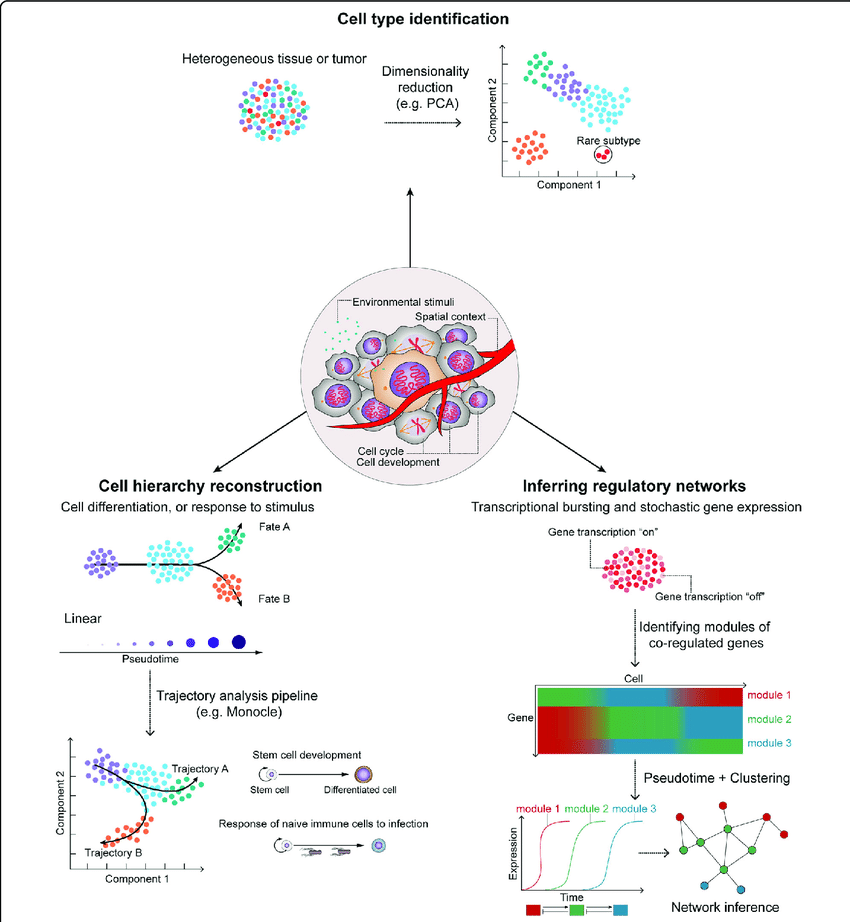
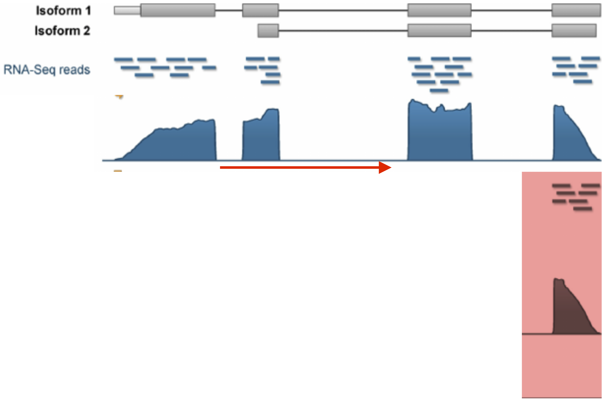
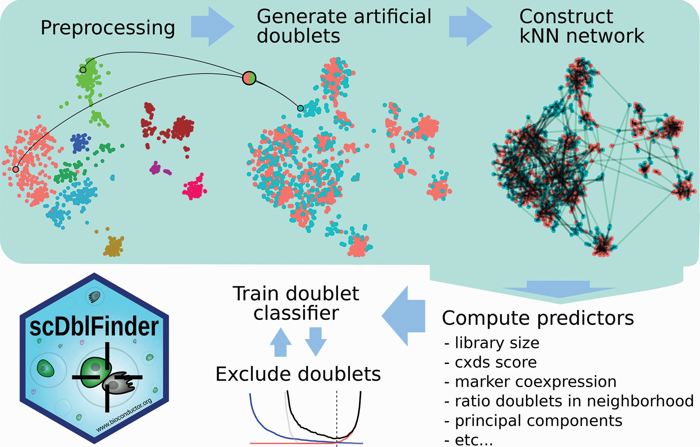
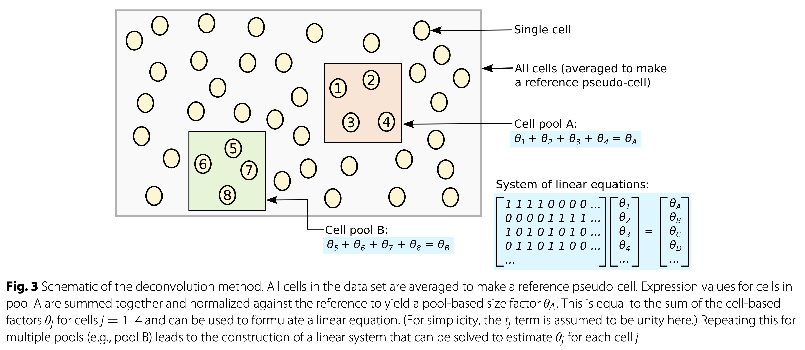
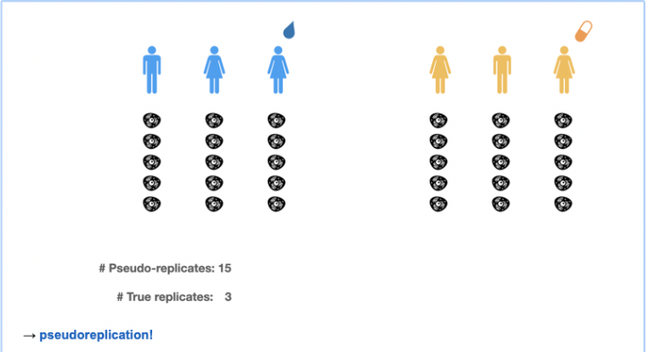

```{r functions, include=FALSE}
# A function for captioning and referencing images
fig <- local({
    i <- 0
    ref <- list()
    list(
        cap=function(refName, text) {
            i <<- i + 1
            ref[[refName]] <<- i
            paste("Figure ", i, ": ", text, sep="")
        },
        ref=function(refName) {
            ref[[refName]]
        })
})
```

```{r, echo=FALSE, message=FALSE, eval=TRUE}
suppressPackageStartupMessages({
  library(knitr)
  library(rmarkdown)
  library(ggplot2)
  library(printr)
  library(gridExtra)
  library(tidyverse)
  library(plotly)
  library(jpeg)
  library(grid)
  library(ggpubr)
  if(!"scDblFinder" %in% installed.packages()[,1]) BiocManager::install("scDblFinder")
  library(scDblFinder)
})
```

# Introduction 

## Evolution of gene expression measurements

```{r lar, fig.cap="Image credit: @BoXia7", out.width="100%", echo=FALSE}
organ <- readJPEG("./images_sequencing/scRNA-seq_fullOrgan.jpeg")
bulk <- readJPEG("./images_sequencing/scRNA-bulkRNAseq.jpeg")
sc <- readJPEG("./images_sequencing/scRNA-scRNA.jpeg")
spat <- readJPEG("./images_sequencing/scRNA-spatialRNAseq.jpeg")

g <- gridExtra::grid.arrange(
  rasterGrob(organ, interpolate=TRUE),
  rasterGrob(bulk, interpolate=TRUE),
  rasterGrob(sc, interpolate=TRUE),
  rasterGrob(spat, interpolate=TRUE),
  top = "organ",
  bottom = "Bulk RNA-seq                                  scRNA-seq                                 spatial RNA-seq",
  ncol=11,
  nrow=2,
  layout_matrix = rbind(
    c(NA, NA, NA, NA, 1, 1, 1, NA, NA, NA, NA),
    c(2, 2, 2, NA, 3, 3, 3, NA, 4, 4, 4))) 
```

<br/><br/>

## Exciting applications 

```{r applications, out.width="100%", fig.cap="Hwang et al. 2018, doi: 10.1038/s12276-018-0071-8", echo=FALSE, out.width="100%"}

```
<br/><br/>

## Bulk vs single cell

### Protocol

```{r bulkVsSc1, fig.cap="Owens, 2012, doi: 10.1038/491027a", echo=FALSE, out.width="100%"}
include_graphics("./images_sequencing/owensSingleCell.png")
```
<br/>

- Bulk RNA-seq datasets are typically characterized by a high sequencing depth, i.e., typically millions of reads are sequenced for each individual sample. This is possible since there are often only a limited number of samples being sequenced.

- This is different for single-cell RNA-sequencing (scRNA-seq), where many individual cells (thousands to millions) are sequenced. Due to this high cell number, only a limited number of sequencing reads are typically available for each individual cell.

This difference in wetlab protocol will have a significant impact on the statistical analysis of the data. The data analysis is affected by the data-generating protocol, and one must carefully take this into consideration.

<br/><br/>

### Variability in data

```{r bulkVsSc2, fig.cap="Image credit: Davide Risso", echo=FALSE, out.width="100%"}
include_graphics("./images_sequencing/increaseVariabilityRisso.png")
```
<br/><br/>

## scRNA-seq Protocols

```{r protocols, fig.cap="Griffiths et al., 2018, doi.org/10.15252/msb.20178046", echo=FALSE, out.width="100%"}
include_graphics("./images_sequencing/scRNA-seqTechnologies.png")
```

<br/><br/>

```{r umi2, fig.cap="Image credit: Davide Risso", echo=FALSE, out.width="100%"}

```

<br/><br/>


- Full-length protocols (typically plate-based). Here, a count has a similar interpretation to bulk RNA-seq: the number of sequenced reads that mapped back to that genomic locus. The count is a proxy for the concentration of mRNA molecules in the cell.

- UMI-based protocols (typically droplet-based). Here, one count corresponds to one observed mRNA molecule present in the cell. Thanks to the use of UMI barcodes, PCR artifacts are reduced. However, no full length information on transcript because with fragmentation based protocols only one fragment would have the UMI!

Both protocols suffer from a low ‘capture frequency’, i.e., the number of molecules present in the cell that have actually been captured and may therefore be observed.

<br/><br/>

## Multiplexing 

```{r kangMultiplex, fig.cap="Kang et al. 2018, doi: 10.1038/nbt.4042", echo=FALSE, out.width="100%"}
include_graphics("./images_sequencing/kangMultiplexing.png")
```

<br/><br/>

Experimental Design!!!

```{r echo=FALSE}
suppressPackageStartupMessages({
library(ExperimentHub)
library(scater)
})
```

```{r}
eh <- ExperimentHub()
sce <- eh[["EH2259"]]
sce
```

```{r}
plotReducedDim(sce, dimred="TSNE", colour_by="cell")
plotReducedDim(sce, dimred="TSNE", colour_by="stim")
```

<br/>

- Note, that we see huge effect of treatment. If we see such large effects we always have to be on our guard!

- Cells of 8 patients were not stimulated  or stimulated. 

- Cells of different patients could be hashed. 

- So all control cells were sequenced in a first run and all stimulated cells were on a second sequencing run. 

- So the large effect might be an effect of batch!

<br/><br/>


# Typical Workflow

See [OSCA book](https://github.com/OSCA-source/OSCA)

```{r oscaworkflow, fig.cap="Image credit: OSCA book", echo=FALSE, out.width="100%"}
include_graphics("./images_sequencing/scRNA-data-workflow.png")
```

<br/><br/>

## Preprocessing 

Additional challenges arise as compared to bulk RNA-seq.

- Cellular barcode identification: Errors occurring during PCR amplification and sequencing can corrupt the cellular barcode sequence.

  - Alevin-fry only quantifies cells reliably assigned as non-empty droplets by looking for the “knee” inflection point in the CDF of the total number of UMIs for each droplet.

  - Once this list of barcodes is generated, reads with cellular barcodes not in this set are “corrected” against it by checking if they are within one edit of the set.

- Cell demultiplexing: 

  - Cell Hashing: Cellular barcode identification from HTO counts.
  - Biological variation: Model-based clustering of cells to individuals.

- Processing thousands-millions of cells

- UMI identification and collapsing:

  - Determine the set of genes corresponding to all reads of a particular UMI.
  - Often, a UMI count is assigned to the gene with highest frequency amongst all reads having that UMI. Also here, UMI barcodes may become corrupted.

<br/><br/>

## Single cell experiment class 

```{r singleCellExperiment, fig.cap="Image credit: OSCA book", echo=FALSE, out.width="100%"}
include_graphics("./images_sequencing/SingleCellExperiment.png")
```

<br/><br/>

Why use a SingleCellExperiment object?

- Convenient framework to store all essential (meta)data in one object.
- All different (meta)data structures are linked: avoids confusion on whether, e.g., the cluster labels and the count matrix are identically sorted.
- Filtering of genes or cells immediately also filters the corresponding metadata.
- Most Bioconductor software accepts a SingleCellExperiment object as input, and outputs a SingleCellExperiment object $
rightarrow$ one common infrastructure across entire analysis workflow.
- Please see the [OSCA chapter on SingleCellExperiment class](http://bioconductor.org/books/3.14/OSCA.intro/the-singlecellexperiment-class.html) for more information and how to use it (please try and get familiar!).

<br/><br/>

### Example 

We illustrate these steps using a dataset on Peripheral Blood Mononuclear Cell (PBMC) data from a healthy donor provided by 10X Genomics. We use the DropletTestFiles Bioconductor package to download the raw (i.e., unfiltered) count matrix that contains the UMI counts of all genes in all droplets.


```{r echo=FALSE}
suppressPackageStartupMessages({
  if(!"DropletTestFiles" %in% installed.packages()[,1]) BiocManager::install("DropletTestFiles")
  library(DropletTestFiles)
  
  if(!"DropletUtils" %in% installed.packages()[,1]) BiocManager::install("DropletUtils")
  library(DropletUtils)
  
  if(!"EnsDb.Hsapiens.v86" %in% installed.packages()[,1]) BiocManager::install("EnsDb.Hsapiens.v86")
  library(EnsDb.Hsapiens.v86)

})
```

```{r}
raw.path <- getTestFile("tenx-2.1.0-pbmc4k/1.0.0/raw.tar.gz")
out.path <- file.path(tempdir(), "pbmc4k")
untar(raw.path, exdir=out.path)

fname <- file.path(out.path, "raw_gene_bc_matrices/GRCh38")
sce <- read10xCounts(fname, col.names=TRUE)
sce
```

The read10xCounts function starts from the output of the Cell Ranger software and imports the data into R as an object of class SingleCellExperiment.

We can notice that the dimension of the matrix is very big; in fact this matrix includes the UMI that have been detected in all the droplets that have been sequenced, including the empty droplets that may contain only ambient RNA.

This is a very sparse matrix, with a large fraction of zeros; read10xCounts is aware of this and stores the counts as a sparse matrix, which has a very small memory footprint.

<br/><br/>

### Explore SingleCellExperiment object

```{r}
sce %>% 
  counts %>% 
  head(n=c(6,6))

sce %>% 
  counts %>% 
  class

sce %>% 
  assays

sce %>% 
  rowData %>% 
  head

sce %>% 
  colData %>% 
  head
```

<br/><br/>

### Use sensible gene names

Before starting the analysis, it may be a good idea to store the names of the genes in a more human-friendly ID system. We can also include information on the chromosome location of the genes; this will be useful for e.g. identifying mitochondrial genes.


```{r}
library(scuttle)
rownames(sce) <- uniquifyFeatureNames(
    rowData(sce)$ID, rowData(sce)$Symbol)

rowData(sce)$location <- mapIds(EnsDb.Hsapiens.v86,
                                     keys=rowData(sce)$ID, 
                                     column="SEQNAME", keytype="GENEID")
rowData(sce)$location[is.na(rowData(sce)$location)] <- "NA"
rowData(sce)
```

<br/><br/>

## Filter non-informative genes

```{r}
keep <- rowSums(assays(sce)$counts > 0) > 10
table(keep)
sce <- sce[keep,]
```

<br/><br/>

## Detection and removal of empty droplets 

The first step is the identification of droplets that do not contain any live cell.

The reason why these droplets contain some RNA is that there may be some ambient RNA due to some cell leaking or they may contain dead or dying cells.

<br/><br/>

### Example 

The barcodeRanks function can be used to rank the barcodes by number of UMIs and to estimate the knee and inflection point of the distribution.


```{r}
bcrank <- barcodeRanks(counts(sce))

# Only showing unique points for plotting speed.
uniq <- !duplicated(bcrank$rank)
plot(bcrank$rank[uniq], bcrank$total[uniq], log="xy",
    xlab="Rank", ylab="Total UMI count", cex.lab=1.2)

abline(h=metadata(bcrank)$inflection, col="darkgreen", lty=2)
abline(h=metadata(bcrank)$knee, col="dodgerblue", lty=2)

legend("bottomleft", legend=c("Inflection", "Knee"), 
        col=c("darkgreen", "dodgerblue"), lty=2, cex=1.2)
```

<br/>

- There is a sharp distinction between droplets with very high counts, very likely to contain a live cell, and droplets with very low counts, very likely to be empty.

- However, it is not straightforward to classify the droplets in the middle of the distribution.

- We can apply a statistical test of hypothesis to decide, for each droplet, if its RNA profile is significantly different from the profile of ambient RNA, estimated from the very low counts (Aaron TL Lun et al. 2019).

- We use a very low threshold on the False Discovery Rate to have very few false positive cells.

```{r}
set.seed(100)
e.out <- emptyDrops(counts(sce))
summary(e.out$FDR <= 0.001)
```

<br/><br/>

The large majority of droplets are not tested, since by default all droplets with fewer than 100 UMIs are considered empty.

```{r}
table(colSums(counts(sce))>100, e.out$FDR<=0.001, useNA = "ifany")
```

<br/><br/>

We can now proceed by removing the empty droplets and keep only the ones identified to be cells.

```{r}
sce <- sce[,which(e.out$FDR <= 0.001)]
sce
```

<br/><br/>

## Quality control

Some cells have poor quality (e.g., damaged or stressed cells).

- Expression of mitochondrial genes, total number of genes expressed, read distribution across genes and library size are good indicators for a cell’s quality.

<br/><br/>

### Concerns 

One concern is that we would inadvertently remove, e.g., an entire cell type from the downstream analysis. QC variables may not be independent of biological state. There is a trade-off between only working with high-quality cells and risk of removing biological signal.

<br/>

### Criteria

- A high-quality cell should have

  - A high number of genes expressed
  - A fair library size
  - No major expression of mitochondrial genes, relative to other genes

- Based on this information, we could set a fixed threshold, e.g., "keep cells with 4000 genes expressed, a library size of at least 10000 and fewer than 5% of the total output coming from mitochondrial genes".

  - Requires substantial experience with the biological system and scRNA-seq data, e.g., tumors typically express a relatively higher amount of mitochondrial genes.

- A better approach is to use an adaptive threshold.

  - Again assumes most cells are high-quality cells $\rightarrow$ identification of outliers allows identification of low-quality cells.
  - For example, for removing low library size cells in the OSCA book they use

$$I(N_i < median(\mathbf{N})-3 \times MAD(\mathbf{N}))$$
with $N_i$ the library size of cell i and $\mathbf{N}=[N_1,\ldots,N_m]$ with $m$ the number of cells.

<br/><br/>


### Example 

The `perCellQCMetrics` function can be used to compute a set of metrics useful to evaluate the quality of the samples. The `isOutlier` function uses a data driven threshold to define cells of lower quality compared to the rest of the dataset.

```{r}
stats <- perCellQCMetrics(sce,
            subsets=list(Mito=which(rowData(sce)$location=="MT")))
```

High-quality cells should have many features expressed, and a low contribution of mitochondrial genes. Here, we see that several cells have a very low number of expressed genes, and where most of the molecules are derived from mitochondrial genes. This indicates likely damaged cells, presumably because of loss of cytoplasmic RNA from perforated cells, so they have to be removed for the downstream analysis.

```{r}
colData(sce) <- cbind(colData(sce), stats)
plotColData(sce, x = "sum", y="detected")
plotColData(sce, x = "detected", y="subsets_Mito_percent")
```

<br/>

We normally remove cells that are outlying with respect to

1. A low sequencing depth (number of UMIs);
2. A low number of genes detected;
3. A high percentage of reads from mitochondrial genes.

```{r}
lowFeatures <- isOutlier(stats$detected, type="lower", log=TRUE)
lowLib <- isOutlier(stats$sum, type="lower", log=TRUE)
highMito <- isOutlier(stats$subsets_Mito_percent, type="higher")
table(lowFeatures)
table(lowLib)
table(highMito)
```

<br/><br/>

```{r}
discardCells <- (lowLib|lowFeatures|highMito)
table(discardCells)
colData(sce)$discardCells <- discardCells
```

<br/><br/>

```{r}
scater::plotColData(sce, y="subsets_Mito_percent",
        colour_by="discardCells")
scater::plotColData(sce, y="detected",
        colour_by="discardCells")
scater::plotColData(sce, y="sum",
        colour_by="discardCells")
plotColData(sce, x = "detected", y="subsets_Mito_percent", colour_by = "discardCells")
```

<br/><br/>

## Detection and removal of doublets

Not all droplets contain a single cell; some contain >1 cell.

Doublet cell clusters may be mistaken for intermediate/transitory states.

<br/><br/>

### Methods


```{r scDbiFinder, fig.cap="Germain et al. 2021, doi: 10.12688/f1000research.73600.2", out.width="100%"}

```

<br/><br/>

1. PCA on log-normalized expression counts.
2. Randomly select two cells, sum their counts and normalize, and project into PCA space.
3. Repeat step 2 many times.
4. For each cell, check its neighborhood to simulated doublets as compared to original cells.
5. Use this information, along with other predictors, to train a classifier for doublets.

<br/><br/>

### Concerns

A potential concern is that we would inadvertently remove biological single cells, that may have e.g. a low transcriptome complexity. There is a trade-off between only working with high-quality cells and risk of removing biological signal.

<br/> 

### Example

```{r}
dbl.dens <- computeDoubletDensity(sce)
sce$DoubletScore <- dbl.dens
summary(dbl.dens)

dbl.calls <- doubletThresholding(data.frame(score=dbl.dens),
    method="griffiths", returnType="call")
summary(dbl.calls)
```

<br/><br/>

```{r}
sce <- sce[, dbl.calls == "singlet"]
sce
```

<br/><br/>

Note that, similarly to what we have said for the removal of low-quality cells, one should be careful in removing putative doublets. Indeed, it may be difficult to distinguish between rare transient cell populations and doublet cells.

<br/><br/>

## Normalisation

Normalization aims to remove technical effects such as sequencing depth so that 
	comparisons between cells are not confounded by them.

As in bulk RNA-seq, the most commonly used methods are scaling normalizations, where a scaling factor (also called size factor, normalization factor) is estimated for each cell.

<br/>

### Concerns

- Some cell types may naturally have fewer mRNA molecules and therefore a lower library size. Removal of sequencing depth effects across cells therefore also risks removing some biological signal.
	
- The assumption of a cell-specific scaling factor is that any technical effect it supposedly accounts for, affects all genes equally through a scaling of the mean count. This is not necessarily realistic.

- Scaling the data and log-transforming the data is not a good option.  Use offsets! 

```{r glmPCAFig2, fig.cap="Townes et al. 2019, DOI: 10.1186/s13059-019-1861-6", out.width="100%"}
knitr::include_graphics("./images_sequencing/glmPCAFig2.png")
```

<br/><br/>

### Offsets

Let $y_{gi}$ be the expression for gene $g$ in cell $i$. 
Assume, as in bulk RNA-seq that 

$E[y_{gi}] = \mu_{gi} =  \pi_{gi} s_iN_i$

In the edgeR model, $s_iN_i$ is referred to as the ‘effective library size’, which is used as 
	offset in the GLM, thereby effectively focussing the statistical inference on $\pi_{gi}$.

```{r lunNormalisation, fig.cap="Lun et al. 2016, DOI: 10.1186/s13059-016-0947-7", echo=FALSE, out.width="100%"}
knitr::include_graphics("images_sequencing/lunNormalisation.png")
```

<br/>

- TMM and DESeq2 normalisation are largely driven by a few genes without zero counts! 

Popular, bespoke single-cell normalization methods attempt to alleviate these issues.

```{r lunNormalisation2, fig.cap="Lun et al. 2016, DOI: 10.1186/s13059-016-0947-7", echo=FALSE, out.width="100%"}

```

<br/><br/>

### Example 

Here, we use the scran method to normalize the data for differences in sequencing depth. This approach is based on the deconvolution of size factors estimated from pools of cells (Lun et all. 2016).

Since we have a heterogeneous cell population, we perform a quick clustering to make sure that we pool together cells that are not too different from each other.

```{r}
library(scran)
cl <- quickCluster(sce)
table(cl)
sce <- computeSumFactors(sce, clusters = cl)
summary(sizeFactors(sce))
```

<br/>

We can check that the estimated library sizes are not too far from the library size factors, estimated from the total number of counts.

```{r}
plot(librarySizeFactors(sce), sizeFactors(sce), xlab="Library size factor",
    ylab="Deconvolution size factor", log='xy', pch=16,
    col=as.integer(factor(cl)))
abline(a=0, b=1, col="red")
```

<br/><br/>

## Feature selection 


- The curse of dimension: In high-dimensional data, all data points appear to be dissimilar (i.e., they are far apart), as the data become sparse in the high-dimensional space as dimensions increase (e.g., Euclidean distance). 

- What does this mean for scRNA-seq? Trying to recover the global structure of a dataset using all genes is not a good idea. Often, we perform a variable selection step, selecting genes which we believe to be highly informative for a dataset’s structure. One may view this as a first simple step of dimension reduction.

We will thus select genes which we hope are informative for recovering the biological structure. Prior to visualisation.

<br/>

### Concerns

Feature selection is crucial for dimension reduction. However, it remains subjective and there are no clear guidelines to follow. The amount of features to select depends on the complexity of your dataset, and the informativeness of each individual feature.

Many issues remain. 

<br/><br/>

### What defines an informative gene?

- Genes that are not expressed in any cell are obviously uninformative. 

- Neither are genes that 
	are highly expressed at a similar level in all cells. So what should we be looking for?

- Genes with high variance. But note our previous observations on the mean-variance relationship. 

- Simply selecting features on high variance is common, but possibly not optimal.

- Genes with high variance relative to their mean. A (rightly so) popular approach is to select genes that have a high variance with respect to their mean. Often, first an empirical mean-variance trend is fitted, upon which genes with the highest positive residuals are selected. Being intuitive, reasonable and fairly straight-forward, this method is widely used.

- Genes with high deviance. See Townes et al. (2019) for feature selection based on Binomial deviance. Genes with a high deviance will most poorly fit a null model where the relative abundance is equal for all cells, which therefore are informative.

<br/><br/>

### Example: feature selection based on high variance wrt mean

You need an assay log counts for this. 

```{r}
sce <- logNormCounts(sce)
dec <- modelGeneVar(sce)
varfit <- metadata(dec)
plot(varfit$mean, varfit$var, 
     xlab="Mean of log-expression",
    ylab="Variance of log-expression")
curve(varfit$trend(x), col="dodgerblue", add=TRUE, lwd=2)
```

<br/><br/>

Select highly variable genes with variance larger than expected based on the mean variance trend. We then have to select the top number of most variable genes. We can for instance take the top 10% of the most variable genes

```{r}
hvg <- getTopHVGs(dec, prop=0.1)
head(hvg)

plot(varfit$mean, varfit$var, 
     col = c("orange", "darkseagreen3")[(names(varfit$mean) %in% hvg)+1],
     xlab="Mean of log-expression",
    ylab="Variance of log-expression")
curve(varfit$trend(x), col="dodgerblue", add=TRUE, lwd=2)
legend("topleft", 
       legend = c("Selected", "Not selected"), 
       col = c("darkseagreen3", "orange"),
       pch = 16,
       bty='n')
```

<br/><br/>


### Genes with high deviance

See Townes et al. (2019) for feature selection based on 
	Binomial deviance. Genes with a high deviance will most poorly fit a null model where the relative abundance is equal for all cells, which therefore are informative.
	
Note that the deviance for a GLM  is defined as: 

$$
D = 2 [l(\mathbf{y},\mathbf{y}) - l(\mathbf{y},\hat{\mathbf{\mu}})]
$$

which is follows a $\chi^2$ distribution with n degrees of freedom. Indeed, it is a LR test between the best model with a perfect model fit and the current model. 

If the difference is significant, there is lack of fit.

```{r glmPCADeviance, fig.cap="Townes et al. 2019, DOI: 10.1186/s13059-019-1861-6", out.width="50%",echo=FALSE}
knitr::include_graphics("./images_sequencing/glmPCADeviance.png")
```

<br/><br/>

### Variance-stabilizing transformation (VST) using Pearson residuals

Lause et al. 2021 introduced the use of Pearson residuals to stabilize the variance (doi: 10.1186/s13059-021-02451-7). 

- When a model is fitted to each gene we can construct pearson residuals that correct for the mean variance relation. 

- Here we model $y_{ig} \sim NB(\mu_{ig}=\pi_gs_iN_i,\phi_g)$ 
- Pearson residuals are then defined as 

$$
e_i = \frac{y_{ig} - \mu_{g}}{\sqrt{\mu_{g} + \phi\mu_{g}^2}} 
$$

Indeed, the residuals are corrected for the mean variance relationship.

We can then assess if the residuals exhibit over excess  variance with respect to the trend. If this is the case, the gene is informative. There is more variance than we expect under the intercept model.

$$
\hat\sigma^2 = \sum\limits_{i=1}^n \frac{e_i^2}{n-p}
$$
Note, that this one of the variance estimator of the quasi-negative binomial model (See Lund et al., 2012, DOI 10.1515/1544-6115.1826). 

Genes with high variance are informative. 

Note, that there is also a close connection to the method of Townes. Another type of residuals for GLMs are deviance residuals, i.e. 

$$
e_i^d = \sqrt{2 [l(y_{ig},y_{ig})-l(y_{ig},\hat\mu_{ig})]}
$$

Another variance estimator is 

$$
\hat\sigma^2 = \sum\limits_{i=1}^n \frac{(e_i^d)^2}{n-p} = \frac{D}{n-p}
$$
Note, that this is the other excess variance estimator for the quasi-negative binomial model. See Lund et al., 2012 (DOI 10.1515/1544-6115.1826). 

<br/><br/>

## Dimension reduction 

We would like to be able to project the data to a low-dimensional space, while 
retaining as much information as possible. This will be useful downstream for, e.g., 
 visualization, identification of batch effects, clustering, trajectory inference.
 
Many dimension reduction methods exist and this is a very active area of research in scRNA-seq. We will discuss the most common methods such as PCA, GLM-PCA, t-SNE and UMAP.

<br/>

### Concerns

Like feature selection, this remains a subjective step in the analysis. Several choices have to be made: input data, e.g., log-transformed data or not?; number of components to retain;
 parameter tuning; etc..

<br/><br/>

### Principal Component Analysis 

- A DR method is linear when the reduced dimensions are a linear function of the original variables. 

- In PCA, each principal component is a linear combination of genes. 
See here for a [geometric interpretation of PCA](https://statomics.github.io/HDDA/svd.html#3_Geometric_interpretation) and for a [PCA details](https://statomics.github.io/HDDA/svd.html#8_SVD_and_principal_component_analysis_(PCA))

-Typically, PCA is performed on log-transformed normalized counts. 
The log-transformation helps somewhat, but not completely, to account for the mean-variance relationship.

- PCA works well for bulk RNA-seq data. However, the structure of scRNA-seq data is often 
	too complex to be visualized by a small number of PCs.

<br/><br/>

#### Example 

We do PCA on the highly variable genes. 

```{r}
sce <- runPCA(sce, subset_row = hvg)
plotPCA(sce)
```

Note that the subset_row argument ensures that we use the previously selected HVGs to compute the PCs. Also note that by default runPCA will store the PCs in the PCA slot, hence overwriting the previous PCs. In the tutorials we will see that we already use PCA during the QC for visualisation purposes. These results are based on a quick normalization and prior to removing noisy genes and cells. Hence, it is ok to overwrite them. In other cases, it may be reasonable to keep more than one set of PCs: this can be achieved by specifying a different slot name via the name argument.

Finally, note that by default scater will compute the top 50 PCs. This is a reasonable choice, but it may be a good idea to explore the variance explained by each component to decide the number of components to retain. An alternative is to use the denoisePCA function from scran that aims at selecting the number of PCs that explain biological variability.

<br/><br/>

### GLM-PCA

A generalization of PCA to exponential family distributions is provide by Townes et al. 2019.
PCA is based on squared/Euclidean distances (e.g.Townes et al. 2019), which has a close link to Gaussian likelihood, which is inappropriate for count data due to the mean-variance relationship. 
Therefore, PCA results risks to be dominated by highly expressed genes, which have large variance. 

```{r glmPCAFig2Rep, fig.cap="Townes et al. 2019, DOI: 10.1186/s13059-019-1861-6", echo=FALSE, out.width="100%"}
knitr::include_graphics("./images_sequencing/glmPCAFig2.png")
```

<br/>

They argue that UMI data are multinomially distributed, which can be approximated by a Poisson distribution when conditioning on the library size and propose a generalisation of PCA. 

```{r glmPCADeriv, fig.cap="Townes et al. 2019, DOI: 10.1186/s13059-019-1861-6", out.width = "50%",echo=FALSE}
knitr::include_graphics("./images_sequencing/glmPCADerivation.png")
```

<br/><br/>

```{r glmPCAOnDevResids, fig.cap="Townes et al. 2019, DOI: 10.1186/s13059-019-1861-6", echo=FALSE, out.width="80%"}
knitr::include_graphics("./images_sequencing/glmPCA_OnDevianceResiduals.png")
```

<br/><br/>

- Note, that full length plate based data scRNA-seq data are over disperse with respect to the Poisson distribution and therefore NB-PCA would be better.

<br/><br/>

### GLM-PCA Example 

GLM-PCA is implemented in the `scry` Bioconductor package; it uses a Poisson model by default, but this can be changed to use negative binomial, multinomial or binomial.

Unlike runPCA, the GLM-PCA function does not allow for a selection of genes. Hence, we will first create a filtered SingleCellExperiment object that contains only the HVGs.

Similarly to PCA, GLM-PCA needs the number of components (factors) that need to be calculated. Here, we compute 10 latent factors.

We use the minibatch argument to use only a random subset of observations to compute the gradient in the optimization algorithm. This speeds up computations and avoids memory problems in big datasets.

```{r echo=FALSE, warning=FALSE, message=FALSE}
suppressPackageStartupMessages({
  if(!"NewWave" %in% installed.packages()[,1]) BiocManager::install("NewWave")
  if(!"scry" %in% installed.packages()[,1]) BiocManager::install("scry")
})
```

<br/>

```{r}
suppressPackageStartupMessages({
  library(scry)
})
set.seed(100000)
filtered <- sce[hvg,]
filtered <- GLMPCA(filtered, L=10, minibatch = "stochastic")
filtered
```

<br/>

To visualize the first two components of GLM-PCA, we can use the plotReducedDim function from `scater`.

```{r}
plotReducedDim(filtered, "GLMPCA")
```

<br/><br/>

### NewWave

An alternative method is implemented in the NewWave package, which implements a negative binomial factor analysis model and uses a penalized likelihood to estimate the latent factors (Agostinis et al. 2022 DOI: 10.1093/bioinformatics/btac149). 

<br/>

#### NewWave Example

NewWave can also use minibatches, and if multiple CPUs are available parallel computing, to speed up computations. The n_gene_par, n_cell_par, and n_gene_disp arguments allow the user to choose how many observations to use to estimate the gene- and cell-specific parameters. The children argument allows one to use multiple cores; here we use four, but you should change it depending on how many cores your computer has (see parallel::detectCores()).


```{r}
suppressPackageStartupMessages({
  library(NewWave)
})
set.seed(100000)
filtered <- newWave(filtered, K=10, children=4,
                    n_gene_disp = 100, n_gene_par = 100, 
                    n_cell_par = 100)
filtered
plotReducedDim(filtered, "newWave")
```

<br/><br/>

### TSNE and UMAP

- Non-linear dimension reduction methods

- Visualizations of reduced dimensions from linear dimension reduction methods are often 
	‘overcrowded’, and it is hard to see structure.

- Non-linear dimension reduction methods can overcome this problem. As the name suggests, the reduced dimensions are a non-linear function of the observed data. We will not go into detail as to how these work under the hood, but provide a few guidelines for the most popular methods. Often, the top (10-50) PCs are provided as input.
	
- t-SNE: Preserving local rather than global distances. Therefore, distances on a t-SNE reduced dimension plot can only be interpreted locally, i.e., cells that are close together in reduced dimension will have a similar transcriptome, but cells that are far away may not necessarily have a very distinct transcriptome.

- UMAP: Claimed to be better than t-SNE on preserving global differences. Therefore, UMAP is also often used in analyses such as trajectory inference, where this is important.

<br/>

#### Example 

```{r}
sce <- runTSNE(sce, dimred="PCA")
plotTSNE(sce)
```

<br/>

```{r}
  if(!"uwot" %in% installed.packages()[,1]) BiocManager::install("uwot")
sce <- runUMAP(sce, dimred = 'PCA', external_neighbors=TRUE)
plotUMAP(sce,)
```

<br/>

```{r}
filtered <- runTSNE(filtered, dimred="GLMPCA")
plotTSNE(filtered)
```

<br/><br/>

## Clustering: unsupervised cell type identification

- The identification of homogeneous, biologically relevant entities that define a common cell identity.

- Traditional clustering methods do not perform great, often graph-based clustering or 
ensemble methods are used.

<br/>

### Concerns

- There are many resolutions at which this can be done, and there is no such thing as 
	an optimal cell type resolution; cells can be described by a hierarchy of different cell types and states. More clusters may result in higher resolution cell types, but 
	can hamper replicability of the results across datasets. 
<br/><br/>

## (Semi-)supervised cell type identification 

- We can use prior knowledge to reliably identify cell clusters and annotate them.

- We can annotate a new scRNA-seq dataset by training a classifier that predicts cell type label based on existing data.

  1. Gather reference data that are relevant for your current dataset you would like to annotate.
  2. Train a classifier (lasso/ridge, SVM, neural net, kNN, …) to classify cells into cell types, given gene expression data.
  3. Use pre-trained classifier to estimate, for each cell, 
	P(cell i is cell type Z | gene expression of cell i).

<br/>

### Concerns

The reference data used for training the classifier must be representative for the dataset we would like to annotate. Problems may occur if e.g., different technologies are used, or particular (rare) cell types are not present in the reference data.

<br/><br/>

# Differential expression (DE), discovery of marker genes

- DE is often a first step towards interpreting differences between cell groups, and provides 
	a basis for further biological validation.

- DE analysis in scRNA-seq is typically similar to bulk RNA-seq, e.g. edgeR analysis. In fact, due to the high number of cells, often simpler methods may be used, e.g. Wilcoxon tests.

<br/>

## Concerns

- There is an ongoing debate in the community about the appropriate noise model for scRNA-seq data. For example, are the data zero inflated?

- Post-selection inference problem, the data are used twice
  1. Cluster
  2. Find biomarkers between clusters
  
- Pseudo-replication in multi-subject-multi-cell experiments! 

<br/>

## Zero-inflation 

```{r zeroInflation1, out.width="100%"}
knitr::include_graphics("./images_sequencing/zeroInflation.png")
```

<br/><br/>

```{r out.width="50%", echo=FALSE, warning=FALSE, message=FALSE}
library(MASS)
##### FULL-LENGTH PROTOCOLS ######
set.seed(9)
## simulate NB
x=rnbinom(n=400, mu=430, size=4)
## estimate NB param
m <- glm.nb(x~1)
hist(x, freq=FALSE, breaks=40, main="NB Data")
grid <- round(seq(0,max(x),length=500))
lines(x=grid, y=dnbinom(grid, mu=exp(coef(m)), size=m$theta), col="red", lwd=3)

## add ZI and re-estimate
x[1:15]=0
mNB <- glm.nb(x~1)
hist(x, freq=FALSE, breaks=40, main="ZINB Data")
lines(x=grid, y=dnbinom(grid, mu=exp(coef(mNB)), size=mNB$theta), col="orange", lwd=3)

## ZINB estimation
w <- c(rep(0, 15), rep(1, 400-15))
mZINB <- glm.nb(x~1, weights=w)
lines(x=grid, y=dnbinom(grid, mu=exp(coef(mZINB)), size=mZINB$theta), col="darkseagreen3", lwd=3)
lines(x=rep(0, 10), y=seq(0, 0.0005, length=10), col="darkseagreen3", lwd=3)
legend("topright", c("NB", "ZINB"), col=c("orange", "darkseagreen3"), lty=1, lwd=3, bty='n')
```

<br/>

- Motivation for zero-inflation is that we may consider two types of zeros in scRNA-seq data:
	
	-  Biological zeros: We observe a zero count because the gene is not expressed in that cell.
	- Technical zeros: Even though the gene was expressed in that cell, we do not observe any 
		molecules due to technical reasons (e.g., low capture efficiency / sequencing depth).

- A zero-inflated count distribution is a mixture distribution that consists of a point mass at zero and a count component. For example, a zero-inflated negative binomial (ZINB) distribution.

$$ 
\begin{array}{lcl}
Y_{ig} & \sim & ZINB(\mu_{ig}, \phi_g, \pi_{ig})\\\\
f(Y_{ig}) &=& \pi_{ig} \delta_0 + (1-\pi_{ig}) f_{NB}(\mu_{ig},\pi_{ig})
\end{array}
$$

Our take: 

- Data from full-length protocols consist of high counts and many zeros, and are more likely to be zero inflated. 

- Instead, data from UMI droplet-based protocols consist of low counts with manyzeros. This seems to reasonably fit under a negative binomial distribution, and zero inflation may not be necessary.

<br/>

## Pseudo-replication in multi-cell-multi-patient scRNA-seq data

- In multi-patient datasets, we have a hierarchical correlation structure.

- Cells are nested within patient $\rightarrow$ Expect correlation between cells from the same patient.

```{r pseudoreplication, fig.cap="Image credit Milan Malfait", echo = FALSE, out.width="100%"}

```

<br/>

- When assessing differences in means within cell types between different treatments, we can bulk the cells of the same cell types to perform pseudobulks per subject. 

- These pseudobulk samples can than be assessed using conventional bulk RNA-seq tools.  


```{r pseudoreplication2, fig.cap="Crowell et al. 2020 (DOI: 10.1038/s41467-020-19894-4)", echo=FALSE, out.width="80%", fig.align='center'}
knitr::include_graphics("./images_sequencing/muscat.png")
```

<br/>

```{r pseudoReplicationFP, fig.cap="Juntilla et al. 2022 (DOI 10.1093/bib/bbac286)", echo=FALSE, out.width="100%"}
knitr::include_graphics("./images_sequencing/pseudoReplicationFalsePositives.png")
```

<br/>

```{r pseudoReplicationAUC, fig.cap="Squair et al. 2021 (DOI 10.1038/s41467-021-25960-2)", echo=FALSE, out.width="100%"}
knitr::include_graphics("./images_sequencing/pseudoreplicationComparison.png")
```

<br/>

- Implementation see [OSCA Book](http://bioconductor.org/books/3.16/OSCA.multisample/multi-sample-comparisons.html#creating-pseudo-bulk-samples)

<br/><br/>

## differential distributions

- A few methods exist that compare distributions between treatments. 

- But, they do not allow to interpret the difference in the distributions.
