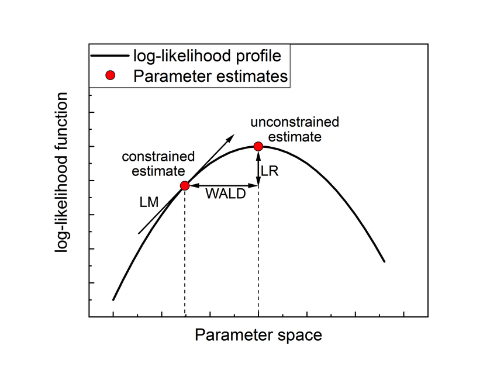
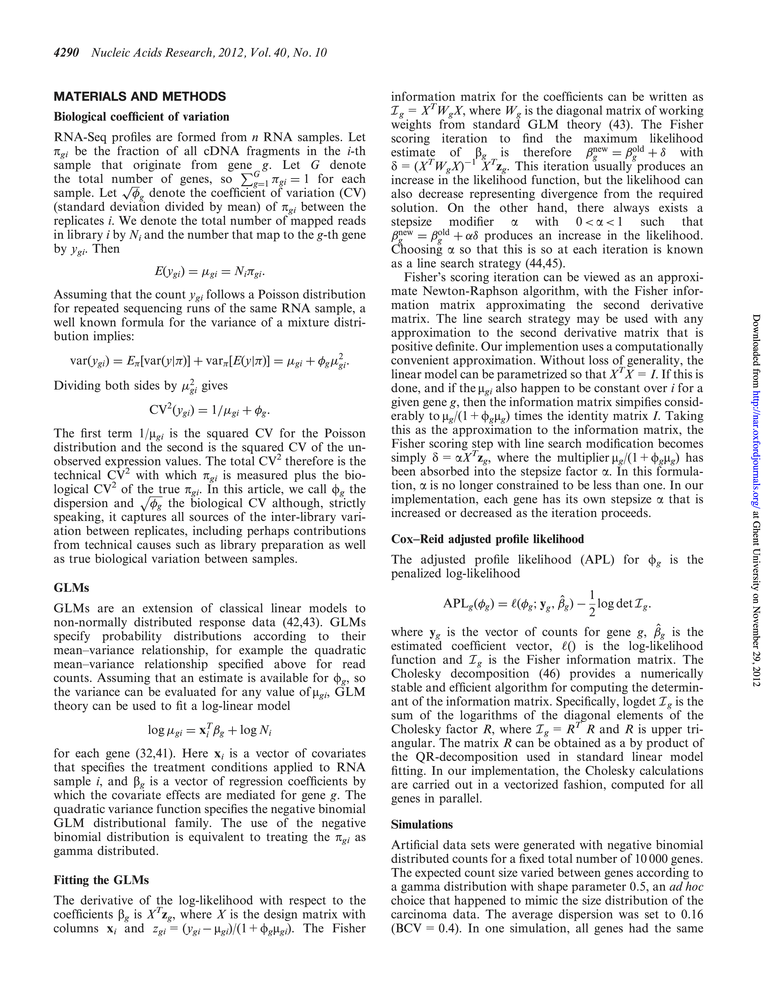
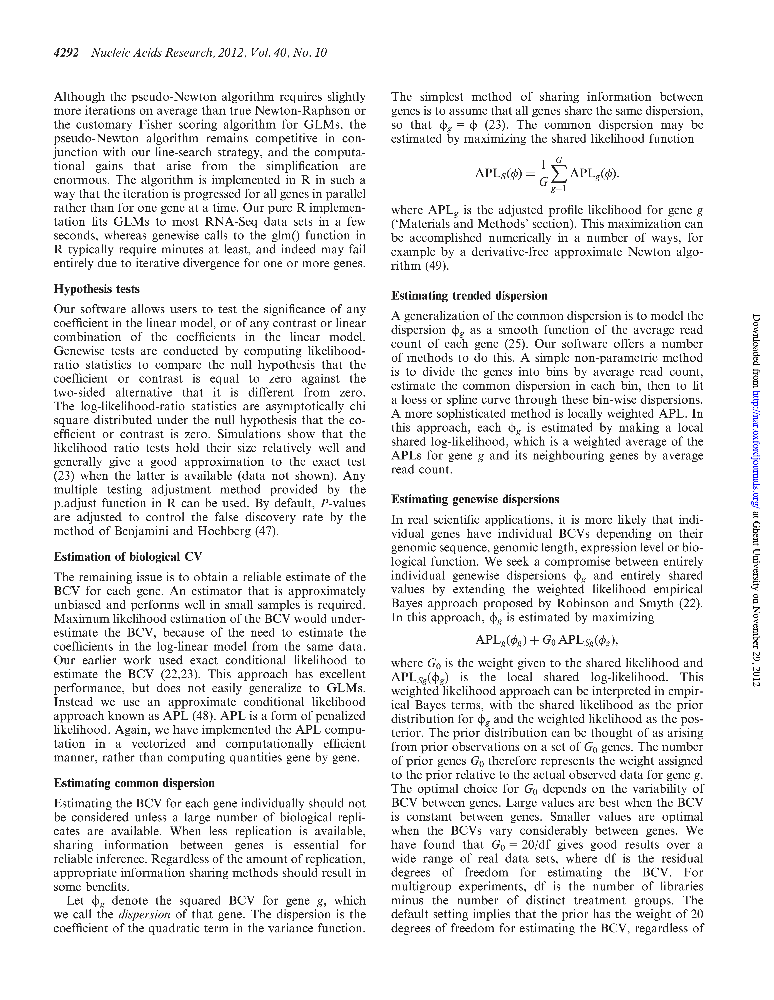
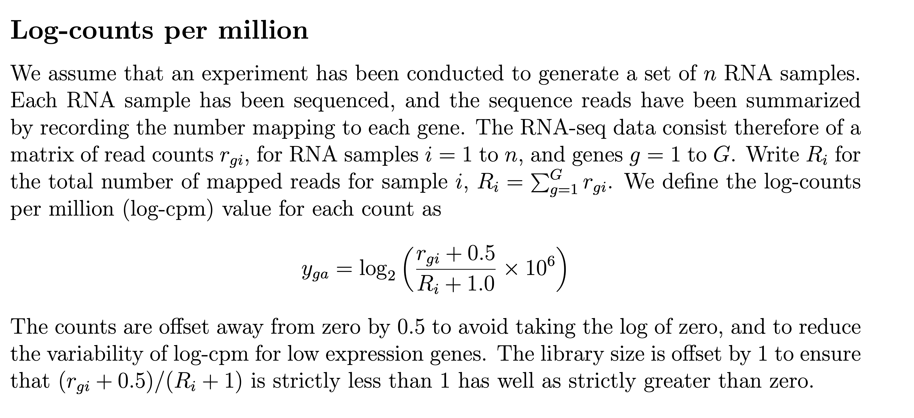
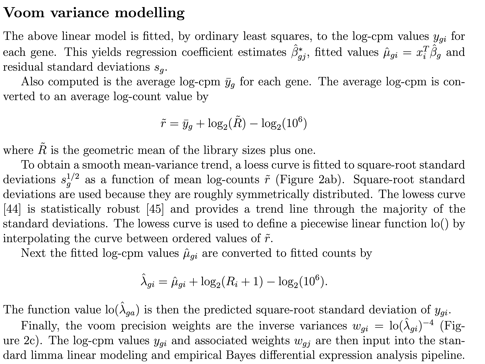
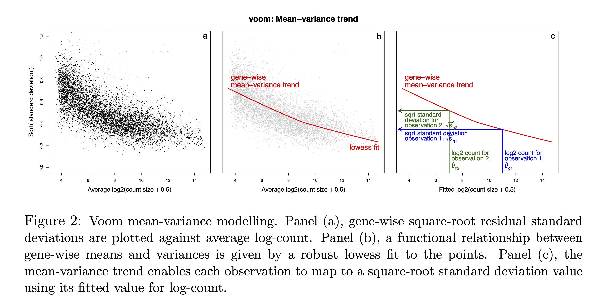
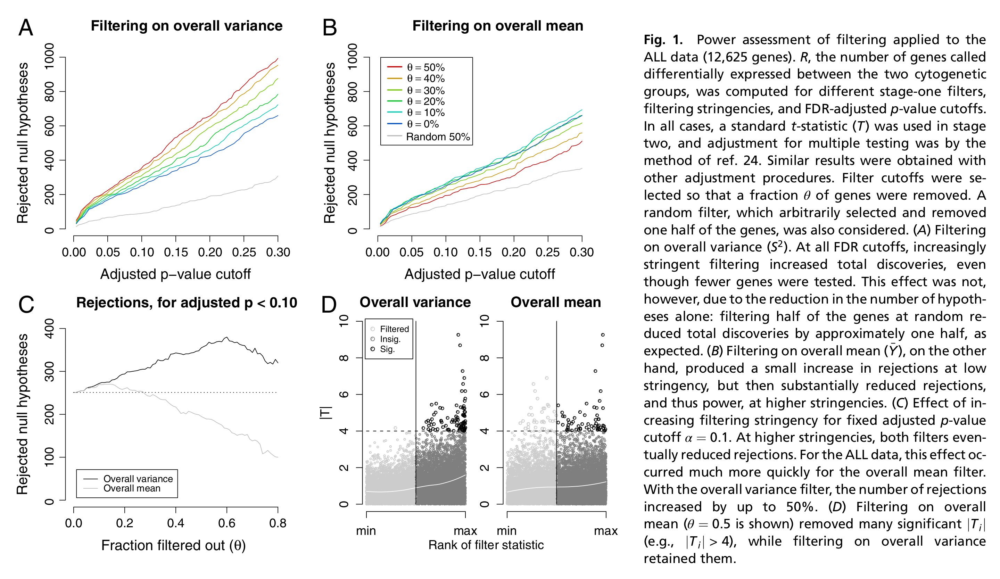
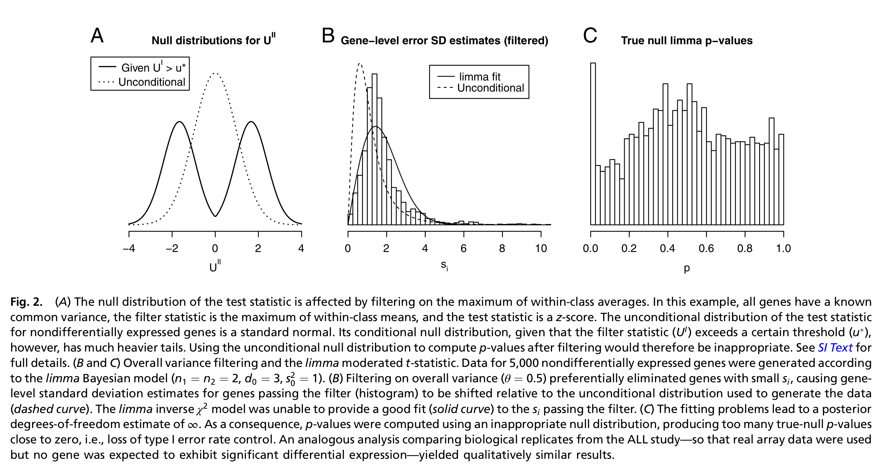
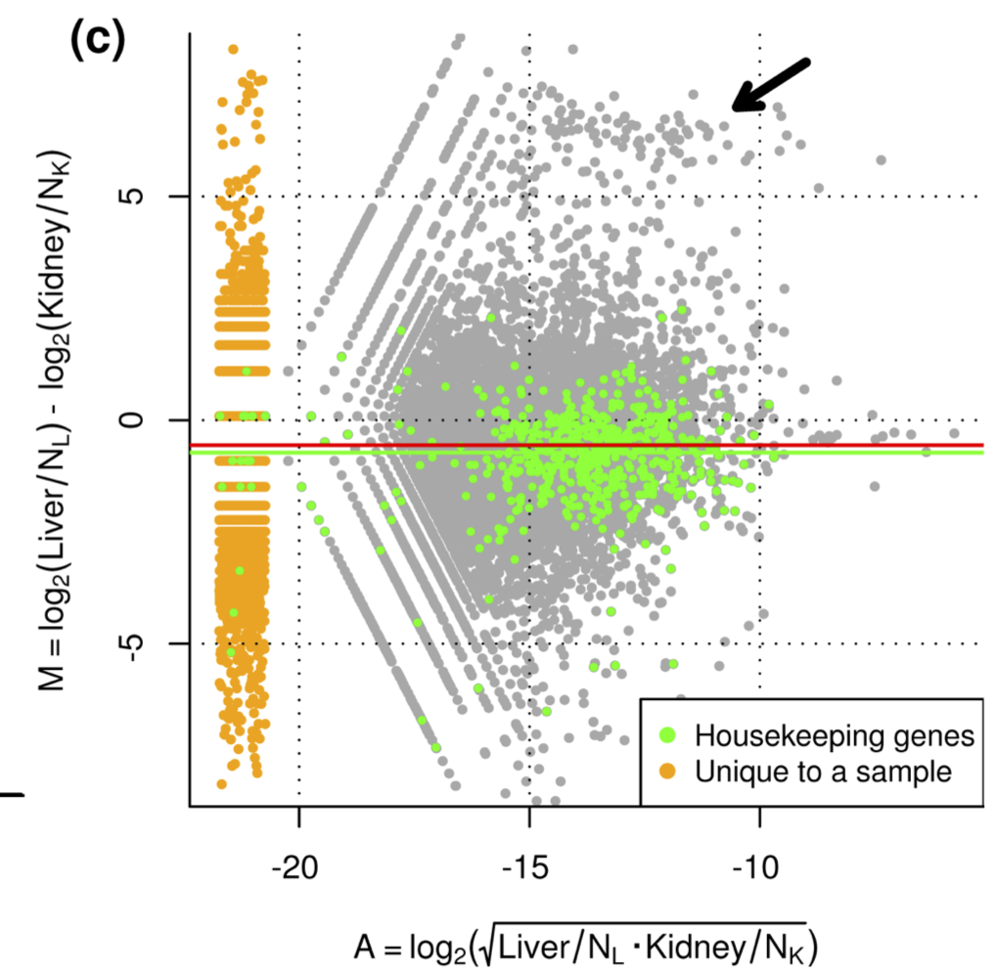

```{r functions, include=FALSE}
# A function for captioning and referencing images
fig <- local({
    i <- 0
    ref <- list()
    list(
        cap=function(refName, text) {
            i <<- i + 1
            ref[[refName]] <<- i
            paste("Figure ", i, ": ", text, sep="")
        },
        ref=function(refName) {
            ref[[refName]]
        })
})
```

```{r, echo=FALSE, message=FALSE, eval=TRUE}
suppressPackageStartupMessages({
  library(knitr)
  library(rmarkdown)
  library(ggplot2)
  library(printr)
  library(gridExtra)
  library(tidyverse)
  library(plotly)
})
```

# Parameter Estimation and Inference in Generalized linear models 

## Simulate Poisson Data

- We simulate data for 100 observations.
- Covariates x are simulated from normal distribution
- The $\beta$ are chosen at $\beta_0=2$, $\beta_1=0.8$, $\beta_2=1.2$

```{r}
set.seed(300)
xhlp<-cbind(1,rnorm(100),rnorm(100))
betasTrue<-c(2,0.8,1.2)
etaTrue<-xhlp%*%betasTrue
y<-rpois(100,exp(etaTrue))
data.frame(coef =0:2,betasTrue=betasTrue) %>% 
  ggplot(aes(x=coef,y=betasTrue)) + 
  geom_point() +
  geom_line() +
  ylab("parameter value") +
  xlab("beta") +
  ylim(0,4) +
  theme_bw() +
  scale_x_continuous(breaks=c(0,1,2))


```

```{r echo=FALSE, warning=FALSE}
x1 <- xhlp[,2]
x2 <- xhlp[,3]
p1 <- plot_ly(
    x = ~x1,
    y = ~x2,
    z= ~y,
    mode="markers",
    size=.5) %>%
  add_markers(type="scatter3d") %>%
  layout(
    scene = list(
      aspectmode="cube",
      xaxis = list(range=range(xhlp[,2]))), yaxis = list(range=range(xhlp[,3])), zaxis = list(range=range(y))
      )
p1
```

```{r echo=FALSE, warning=FALSE}
x1 <- xhlp[,2]
x2 <- xhlp[,3]
p1 <- plot_ly(
    x = ~x1,
    y = ~x2,
    z= ~ log2(y+.5),
    mode="markers",
    size=.5) %>%
  add_markers(type="scatter3d") %>%
  layout(
    scene = list(
      aspectmode="cube",
      xaxis = list(range=range(xhlp[,2]))), yaxis = list(range=range(xhlp[,3])), zaxis = list(range=range(y))
      )
p1
```


## Exponential Family

$$
f(y_i\vert \theta_i,\phi)=\exp\left\{ \frac{y_i\theta_i- b(\theta_i)}{a(\phi)}+c(y_i,\phi)\right\}
$$

with

- $\theta_i$: canonical parameters
- $\phi$: dispersion parameter
- $a(.)$, $b(.)$, $c(.)$: specific functions that depend on the distribution, 

e.g. for normal distribution 

- $\phi=\sigma^2$, 
- $\theta=\mu$, 
- $a(\phi)=\phi=\sigma^2$, 
- $b(\theta_i)=\theta_i^2/2$, 
- $c(y_i,\phi)=-\frac{1}{2}[y^2/\phi+\log(2\pi\phi)]$

### Poisson Distribution

$$
y_i \sim \frac{\mu_i^{y_i}e^{-\mu_i}}{y_i!}
$$

In format of exponential family: 

$$
y_i \sim \exp\left\{y_i\log(\mu_i) - \mu_i - \log(y_i!)\right\}
$$

## Components of Generalized Linear Model

$$
\left\{\begin{array}{ccc}
y_i\vert x_i&\sim&f(y_i\vert{\theta}_i,\phi)\\\\
\text{E}\left[ y_i\vert \mathbf{x}_i\right]&=&\mu_i\\\\
g(\mu_i)&=&\eta(\mathbf{x}_i)\\\\
\eta(\mathbf{x}_i)&=&\mathbf{x}_i^T\boldsymbol{\beta}
\end{array}\right.,
$$
with $g(.)$ the link function, e.g. 

- $g(.)=.$ : identity link for Normal distribution
- $g(.)=\log(.)$ : canonical link for Poisson distribution
- $g(.)=\text{logit}(.)=\log\left[\frac{(.)}{(1-.)}\right]$ : canonical link for Bernouilli distribution.

### Poisson GLM

$$\left\{\begin{array}{lcr}
y_i &\sim& Poisson(\mu_i)\\
E[y_i]&=&\mu_i\\
\log(\mu_i)&=&\eta_i\\
\eta_i&=&\mathbf{x}_i\boldsymbol{\beta}
\end{array}\right.$$

## Likelihood

We start from a sample, and consider it as fixed and known. 

- In particular we do NOT consider the sample observations as random variables. 

- Therefore we write the observed sample as $y_i, . . . , y_n$

- The theory is based on the likelihood function, which  can be interpreted as a measure for the probability that the given sample is observed as a realisation of a sequence of random variables $Y_1, \ldots Y_n$ 

- The random variables $Y_i$ are characterized by a distribution or density function which has typically unknown parameters, e.g. a Poisson distribution $f(Y_i)\sim \text{Poisson}(\theta_i)$.

- When the subjects are mutually independent the joint likelihood to observe $y_1, \ldots, y_n$ equals 
$$\prod\limits_{i=1}^n f(y_i,\theta_i,\phi)$$
- The densities are actually also a function of the parameters $\theta_i, \phi$. To stress this, we indicated that in the density formulation.

- The likelihood function is a function of all parameters 

$$
L(\boldsymbol{\theta},\phi\vert \boldsymbol{y})=\prod\limits_{i=1}^n f(y_i,\theta_i,\phi)
$$

- The log-likelihood function is often used, which is defined as
$$
l(\boldsymbol{\theta},\phi\vert \boldsymbol{y}) = \log L(\boldsymbol{\theta},\phi\vert \boldsymbol{y}) =  \sum\limits_{i=1}^n \log  f(y_i,\theta_i,\phi)
$$
 
### Poisson Example 

The log-likelihood for our simulated dataset given the real model parameters is: 

For one observation:
$$l(\mu_i \vert y_i) = y_i \log \mu_i - \mu_i - \log y_i!$$

- Verify in R.

```{r}
muTrue <- exp(etaTrue)
loglikPois <- dpois(y,muTrue,log = TRUE)
logLikSelf <- y*log(muTrue) - muTrue - lfactorial(y)
qplot(loglikPois,logLikSelf) + theme_bw() + geom_abline(intercept = 0, slope=1)
```

The log-likelihood can also be written in terms of the canonical model parameters $\theta$

$$l(\mu_i \vert y_i) = y_i \theta_i - e^{\theta_i} - \log y_i!$$

- Note that $\theta_i = \eta_i$. The canonical parameter for the poisson equals the linear predictor!
  $$\theta_i=\eta_i=\mathbf{x}_i^t\boldsymbol{\beta}$$

Log-likelihood for all observations, given that they are independent:
$$l(\boldsymbol{\mu} \vert \mathbf{y}) = \sum\limits_{i=1}^n \left\{ y_i \theta_i - e^{\theta_i} - \log y_i!\right\}$$

- Calculate in R: 

```{r}
dpois(y,lambda = muTrue, log = TRUE) %>% 
  sum()
```

### Properties of the Log-Likelihood

$$
l(\theta_i,\phi\vert y_i)=\left\{ \frac{y_i\theta_i- b(\theta_i)}{a(\phi)}+c(y_i,\phi)\right\}
$$

- $E[y_i]=\mu_i=b^\prime(\theta_i)$
- $\text{var}[y_i]=b^{\prime\prime}(\theta_i) a(\phi)$

Note that, 

- Variance $\text{var}[y_i]$ depends on mean! 
- Often there is no dispersion parameter e.g. Bernouilli: $\text{var}[y_i]=\mu_i(1-\mu_i)$, 

### Poisson Example 

- Canonical model parameter $\theta_i=\log{\mu_i}$.
- $b(\theta_i) = \exp(\theta_i)$
- $c(y_i,\phi) = - \log(y_i!)$
- $\phi = 1$
- $a(\phi)= 1$
- $\mu_i =\frac{\partial b(\theta_i)}{\partial \theta_i}=  \frac{\partial \exp(\theta_i)}{\partial \theta_i}=\exp(\theta_i)$
- $\text{Var}\left[y_i \right]= a(\phi)\frac{\partial^2 b(\theta_i)}{(\partial \theta_i)^2}=  \frac{\partial^2 \exp(\theta_i)}{\partial \theta_i^2}=\exp(\theta_i)$.
- Mean is equal to variance for Poisson!

## Parameter Estimation: Maximum Likelihood

Choose the parameters $\boldsymbol{\beta}$ so that the likelihood to observe the sample under the statistical model is maximized.

It is easier and equivalent to maximize the log-likihood

$$\text{argmax}_{\boldsymbol{\beta}} l(\boldsymbol{\mu} \vert \mathbf{y})$$

$$
\frac{\partial  l(\boldsymbol{\mu} \vert \mathbf{y})}{
\partial{\boldsymbol{\beta}}}=0
$$

$\frac{\partial  l(\boldsymbol{\mu} \vert \mathbf{y})}{
\partial{\boldsymbol{\beta}}}$ is also referred to as the score function.

### Score function

$$
S_i(\theta_i)= \frac{\partial l(\theta_i,\phi\vert y_i)}{\partial \theta_i}
$$

$$
S_i(\theta_i)= \frac{\partial l(\theta_i,\phi\vert y_i)}{\partial \theta_i}=\frac{y_i - \mu_i}{a(\phi)}
$$

when canonical link function is used:

- $\mu_i=b^\prime(\theta_i)$ 


Regression (chain rule and $i=1,\ldots,n$ i.i.d observations)

\begin{eqnarray*}
S(\boldsymbol{\beta})&=&\frac{\partial  \sum\limits_{i=1}^n \left\{ \frac{y_i \theta_i - b(\theta_i)}{a(\phi)}+c(y_i,\phi)\right\}}{\partial \beta}\\
&=&\sum\limits_{i=1}^n\frac{\partial  \left\{ \frac{y_i \theta_i - b(\theta_i)}{a(\phi)}+c(y_i,\phi)\right\}}{\partial \theta}\frac{\partial \theta}{\partial\mu}\frac{\partial\mu}{\partial\eta}\frac{\partial\eta}{\partial\beta}\\
&=&\sum\limits_{i=1}^n\frac{y_i-\mu_i}{a(\phi)}\frac{1}{b^{\prime\prime}(\theta)}\frac{\partial\mu}{\partial\eta}\mathbf{x}^t\\
&=&\mathbf{X}^T\mathbf{A}\left(\mathbf{y}-\boldsymbol{\mu}\right)
\end{eqnarray*}


- $\boldsymbol{A}$ is a diagonal matrix: $a_{ii}=\left(\text{var}[y_i]\frac{\partial \eta_i}{\partial \mu_i}\right)^{-1}$, $\boldsymbol{y}=[y_1,\ldots, y_n]^T$, $\boldsymbol{\mu}=[\mu_1,\ldots,\mu_n]^T$ 

#### Poisson Example 


For poisson data: $a(\phi)b^{\prime\prime}(\theta)=\mu$ and $\frac{\partial \mu}{\partial \eta}=\mu$. So $\mathbf{A}=\mathbf{I}$ and

$$ S(\beta)=\mathbf{X}^T \left\{\mathbf{Y}-\boldsymbol{\mu}\right\}$$

### Solve Score Equations

Find  parameter estimator  $\hat{\boldsymbol{\beta}}$ so that
$$ S(\boldsymbol{\beta}) = \mathbf{0}$$
$$\mathbf{X}^T\mathbf{A}\left(\mathbf{y}-\boldsymbol{\mu}\right) =\mathbf{0}$$
Problem! Non linear in $\beta$ due to 

- link function: $\boldsymbol{\mu}=h^{-1}(\eta)$ 
- $a_{ii}=\left(\text{var}[y_i]\frac{\partial \eta_i}{\partial \mu_i}\right)^{-1}$

$\rightarrow$ Find roots of score equation by using Newton-Raphson method.

### Newton-Raphson

```{r echo=FALSE, fig.cap= "Newton-Raphson algorithm: The algorithm starts at an initial guess bk for the root of the score function S. It walks along the tangent line of the score function in S(bk)  to move into the direction where the score function becomes zero (and where the log-likelihood function is maximal). The new estimate of the root is taken at bk+1 where the tangent line becomes zero. It then calculates the score for the updated parameter estimator and the whole process is repeated until the root is found."}
S <- function(beta) (beta - 3)^2 
dS <- function(beta) 2*(beta-3)
dSline <- function(beta, betak) dS(betak) *beta + S(betak) - dS(betak) * betak

beta <- seq(-21,15,length=100)
betak <- -20
betak1 <- betak - 1/dS(betak)*S(betak)
betaSeqDk <- seq(betak,betak1,length=100)
pNR <- qplot(beta, S(beta), geom="line") +
  annotate("line",x=betaSeqDk,y=dSline(betaSeqDk,betak),linetype = "dashed",col="red") +
    annotate("line",x=rep(betak1,2),y=c(0,S(betak1)),linetype = "dashed",col="red") +
    annotate("point",x=betak,y=S(betak),col="red") +
  theme_bw()
betaNs <- betak1
for (i in 1:5)
{
betak <- betak1
betak1 <- betak - 1/dS(betak)*S(betak)
betaNs <- c(betaNs,betak1)
betaSeqDk <- seq(betak,betak1,length=100)
pNR <- pNR +
    annotate("line",x=betaSeqDk,y=dSline(betaSeqDk,betak),linetype = "dashed",col="red") +
    annotate("line",x=rep(betak1,2),y=c(0,S(betak1)),linetype = "dashed",col="red") 
}
pNR + 
  annotate("text",x=-20,y=S(-20)+40,label=paste0("S(beta[k])"),col="red",parse=TRUE) +
  annotate("text",x=betaNs[1:2],y=S(betaNs[1:2])+40,label=paste0("S(beta[k+",1:2,"])"),col="red",parse=TRUE)   +
  annotate("text",x=betaNs[1:3],y=rep(-40,3),label=paste0("beta[k+",1:3,"]"),col="red",parse=TRUE) +
  annotate("point",x=betaNs,y=S(betaNs),col="red") +
  annotate("text",x=-20,y=400, label="frac(partialdiff*S, partialdiff*beta)*' |'*beta[k]", col="red",parse=TRUE) +
  xlab(expression(beta)) +
  ylab(expression(S(beta)))
```

Newton Raphson algorithm to find the root of the score function. 

1. Choose initial parameter estimate $\boldsymbol{\beta}^k=\boldsymbol{\beta}^0$
2. Calculate score $S(\boldsymbol{\beta})\vert_{\boldsymbol{\beta}=\boldsymbol{\beta}^k}$
3. Calculate derivative of the function for which you want to calculate the roots
4. Walk along first derivative until line (plane) of the derivative crosses zero
5. Update the betas $\boldsymbol{\beta}^{k+1}$
6. Iterate from step 2 - 5 until convergence.


#### Derivative of Score 

We have to implement an interative algorithm for optimisation. To make things tractable we will act as if $\mathbf{A}$ is known and fix it using the current values of $\boldsymbol{\beta}^k$. Note, that for Poisson regression $\mathbf{A}=\mathbf{I}$.

\begin{eqnarray*}
\frac{\partial S(\boldsymbol{\beta})}{\partial \boldsymbol{\beta}} &=& \frac{ \mathbf{X}^T\mathbf{A} \left\{\mathbf{Y}-\boldsymbol{\mu}\right\}}{\partial \boldsymbol{\beta}}\\
&=& - \mathbf{X}^T \mathbf{A}\left[
\begin{array}{cccc} \frac{\partial \mu_1}{\partial \eta_1} &0&\ldots&0\\
 0&\frac{\partial \mu_2}{\partial \eta_2} &\ldots&0\\
\vdots&\vdots&\vdots&\vdots\\
0&0&\ldots& \frac{\partial \mu_n}{\partial \eta_n}\\
\end{array}\right] \frac{\partial \boldsymbol{\eta}}{\partial \boldsymbol{\beta}}\\
&=&-\mathbf{X}^T\mathbf{WX}
\end{eqnarray*}

#### Define equation of Tangent Line (Plane)

- We know two points of the tangent plane $(\boldsymbol{\beta}^k,S(\boldsymbol{\beta}^k))$ and $(\boldsymbol{\beta}^{k+1},0)$
- We know the direction of the plane $S^\prime(\boldsymbol{\beta})=\frac{\partial S(\boldsymbol{\beta})}{\partial \boldsymbol{\beta}}$
- Equation of Plane:
$$S(\boldsymbol{\beta})={\alpha}_0+S^\prime\vert_{\boldsymbol{\beta}^k} \boldsymbol{\beta}$$

- Get $\boldsymbol{\beta}_{k+1}$
\begin{eqnarray*}
\mathbf{0}&=&{\alpha}_0+S^\prime\vert_{\boldsymbol{\beta}^{k}} \boldsymbol{\beta}^{k+1}\\
\boldsymbol{\beta}^{k+1}&=&-\left(S^{\prime}\vert_{\boldsymbol{\beta}^{k}}\right)^{-1}{\alpha}_0\\
\end{eqnarray*}

- Get ${\alpha}_0$
\begin{eqnarray*}
S(\boldsymbol{\beta}^k)&=&\boldsymbol{\alpha}_0+S^\prime\vert_{\boldsymbol{\beta}^k} \boldsymbol{\beta}^k\\
{\alpha}_0&=&-S^\prime\vert_{\boldsymbol{\beta}^k} \boldsymbol{\beta}^k + S(\boldsymbol{\beta}^k)\\
\end{eqnarray*}

- Get $\boldsymbol{\beta}_{k+1}$

\begin{eqnarray*}
\boldsymbol{\beta}^{k+1}&=&\boldsymbol{\beta}^k-\left(S^{\prime}\vert_{\boldsymbol{\beta}^{k}}\right)^{-1}S(\boldsymbol{\beta}^k)\\
\boldsymbol{\beta}^{k+1}&=&\boldsymbol{\beta}^k+ \left(\mathbf{X}^T\mathbf{WX}\right)^{-1} S(\boldsymbol{\beta}^k)
\end{eqnarray*}

With $J(\boldsymbol{\beta})=I(\boldsymbol{\beta})=\mathbf{X}^T\mathbf{WX}$  the Fisher information matrix.

### Fisher Scoring

Because we use the canonical model parameters the observed  Fisher information matrix equals the expected  Fisher information matrix $J(\boldsymbol{\beta})=I(\boldsymbol{\beta})$.
Indeed, the observed Fisher information matrix is not depending on the observations, but only on the design and the variance of the data (via the weights).

Hence, Newton-Raphson is equivalent to Fisher scoring when the canonical link function is used.

Note, that the Fisher matrix, minus second derivative (or hessian) of the likelihood to the model parameters, is also the inverse of the variance covariance matrix of the model parameters. It is thus related to the precision.


### Iteratively Reweighted Least Squares (IRLS).

We can rewrite Newton Raphson or Fisher scoring as IRLS.

\begin{eqnarray*}
\boldsymbol{\beta}^{k+1}&=&\boldsymbol{\beta}^k+ \left(\mathbf{X}^T\mathbf{WX}\right)^{-1} S(\boldsymbol{\beta}^k)\\
\boldsymbol{\beta}^{k+1}&=&\boldsymbol{\beta}^k+ \left(\mathbf{X}^T\mathbf{WX}\right)^{-1} \mathbf{X}^T\mathbf{A} \left(\mathbf{Y}-\boldsymbol{\mu}\right)\\
\boldsymbol{\beta}^{k+1}&=& \left(\mathbf{X}^T\mathbf{WX}\right)^{-1}\mathbf{X}^T\mathbf{WX}\boldsymbol{\beta}^k+ \left(\boldsymbol{X}^T\mathbf{WX}\right)^{-1} \mathbf{X}^T \mathbf{W}\frac{\partial \eta}{\partial \mu}  \left(\mathbf{Y}-\boldsymbol{\mu}\right)\\
\boldsymbol{\beta}^{k+1}&=& \left(\mathbf{X}^T\mathbf{WX}\right)^{-1}\mathbf{X}^T\mathbf{W} \left[\mathbf{X}\boldsymbol{\beta}^k + \frac{\partial \eta}{\partial \mu}  \left(\mathbf{Y}-\boldsymbol{\mu}\right)
\right]\\
\boldsymbol{\beta}^{k+1}&=& \left(\mathbf{X}^T\mathbf{WX}\right)^{-1}\mathbf{X}^T\mathbf{Wz}
\end{eqnarray*}

with $\mathbf{z}=\left[\mathbf{X}\boldsymbol{\beta}^k + \frac{\partial \eta}{\partial \mu}  \left(\mathbf{Y}-\boldsymbol{\mu}\right)\right]$

So we can fit the model by performing iterative regressions of the pseudo data $\mathbf{z}$ on $\mathbf{X}$.
In each iteration we will update $\mathbf{z}$, the weights $\mathbf{W}$ and the model parameters.

For Poisson data 

- $\frac{\partial \eta}{\partial \mu}=\frac{\partial\log \mu}{\partial\mu}=\frac{1}{\mu}=\exp(-\eta)$  
- $\mathbf{W}=\mathbf{A}\frac{\partial{\mu}}{{\partial \eta}}$ is a diagonal matrix with $[\frac{\partial{\mu_i}}{{\partial \eta_i}}]_{ii}=[\mu_i]_{ii}=[\exp(\eta_i)]_{ii}$ on its diagonal elements.


### Variance-Covariance Matrix of Mean Model Parameters?

In the IRWLS algorithm, the data is weighted according to the variance of $\mathbf{Y}$. We correct for the fact that the data are heteroscedastic.

Count data have a mean variance relation (e.g. in Poisson case $\text{E}\left[Y \right]=\text{var}\left[Y \right]=\mu$).
The IRWLS also corrects for the scale parameter $\phi$ in $\mathbf{W}$. (Note that the scale parameter for Poisson is $\phi=1$).

So IRWLS the variance-covariance matrix for the model parameter equals
$$\mathbf{\Sigma}_{\hat\beta}=\left(\mathbf{X}^T\mathbf{WX}\right)^{-1}.$$

Note, that the Fisher Information Matrix equals the inverse of the variance-covariance matrix of the experiment.
The larger the Fisher Information Matrix the more information we have on the experiment to estimate the model parameters.
FIM $\uparrow$, precision $\uparrow$, $\text{SE}\downarrow$

## Poisson Example 


### Initial Estimate

This is a very poor initial estimate used to illustrate the algorithm.
Otherwise convergence for this simple example is way too quick

```{r}
iteration=0
betas<-c(log(mean(y)),0,0)
plot(betasTrue,
     ylab=expression(beta),
     ylim=c(0,4),
     pch=19,
     type="b", 
     main=paste0("likelihood real beta=",
                 round(sum(dpois(y,exp(etaTrue),log=TRUE)),1),"\nlikelihood fit=", round(sum(dpois(y,exp(xhlp%*%betas),log=TRUE)),1))
)
lines(betas,type="b",lty=2 )
```

### Iteratively Reweighted Least Squares

#### Pseudo Data

$$z_i= \eta_i + \frac{\partial \eta_i}{\partial \mu_i}(y_i -\mu_i)$$
$$z_i= \eta_i + e^{-\eta_i} y_i -1$$

#### Weight Matrix?

$$[w_{ii}]= var_{y_i}^{-1} \left(\frac{\partial \mu}{\partial \eta}\right)^2$$
$$[w_{ii}]= e^{\eta_i}$$

#### Run Update Step Multiple Times

First 3 times (colors are black 0, red iteration 1, green iteration 2, blue iteration 3)

```{r}
plot(betasTrue,ylab=expression(beta),ylim=c(0,4),pch=19,type="b")
lines(betas,type="b",lty=2)

cat("\nlikelihood TRUE=", round(sum(dpois(y,exp(xhlp%*%betasTrue),log=TRUE)),1))
cat("\nlikelihood initial fit=", round(sum(dpois(y,exp(xhlp%*%betas),log=TRUE)),1))

#Calculate current eta
eta<-xhlp%*%betas

iteration=0
for (i in 1:3)
{
#start IRLS UPDATE STEP
iteration=iteration+1
#calculate pseudo data based on current betas
z=eta+exp(-eta)*(y-exp(eta))
#calculate new weights: diagonal elements
w<-c(exp(eta))

#update betas
lmUpdate<-lm(z~-1+xhlp,weight=w)
#eta<-xhlp%*%betas
eta<-lmUpdate$fitted
betas<-lmUpdate$coef
lines(betas,type="b",col=iteration+1,pch=iteration,lty=2)
cat("\nlikelihood current fit=", round(sum(dpois(y,exp(xhlp%*%betas),log=TRUE)),1))
}
```


## Comparison with GLM Function

### Smarter Initialisation
```{r}
z<-log(y+.5)
betas<-lm(z~-1+xhlp)$coef
plot(betasTrue,ylab=expression(beta),ylim=c(0,4),pch=19,type="b")
lines(betas,col=2,type="b",lty=2)
#calculate current eta
eta<-xhlp%*%betas

cat("\nlikelihood TRUE=", round(sum(dpois(y,exp(xhlp%*%betasTrue),log=TRUE)),1))
cat("\nlikelihood initial fit=", round(sum(dpois(y,exp(xhlp%*%betas),log=TRUE)),1))
```

### Evaluation Stopping Criterion

- Residual deviance: Is 2 log of LR between best possible fit and current fit
$$LR=\frac{L_\text{best}}{L_\text{current}}$$
$$D=2 (\log L_\text{best}- \log L_\text{current})$$
$$D=2 (l_\text{best}-l_\text{current})$$
- Best fit: $\mu=y$
- Optimal poisson:
$$ l_\text{best}=\sum\left[y_i \log(y_i) - y_i - \log\left(y_i!\right)\right]$$
- Current fit
$$ l_\text{current}=\sum \left[y_i \eta_i -e^{\eta_i} - log\left(y_i!\right)\right]$$
- Deviance D:
$$D = 2 \sum \left[ y_i log(y_i) - y_i \eta_i - (y_i -e^{\eta_i})\right]$$
- Problem to calculate it if y=0 but by apply l'Hopital's rule we know
$$\lim_{y_i \to 0} y_i \log(y_i) =0$$

```{r}
ylogy<-function(y)
{
return(ifelse(y==0,rep(0,length(y)),y*log(y)))
}

deviance<-2*sum(ylogy(y)-y*eta-(y-exp(eta)))

devianceOld<-1e30
```


### Run Update Step until Convergence

```{r}
plot(betasTrue,ylab=expression(beta),ylim=c(0,4),pch=19,type="b")
lines(betas,type="b",lty=2)

tol<-1e-6
iteration=0
while(((devianceOld-deviance)/devianceOld)>tol)
{
#start IRLS UPDATE STEP
iteration=iteration+1
#calculate pseudo data based on current betas
z=eta+exp(-eta)*(y-exp(eta))
#calculate new weights: diagonal elements
w<-c(exp(eta))

#update betas
lmUpdate<-lm(z~-1+xhlp,weight=w)
#eta<-xhlp%*%betas
eta<-lmUpdate$fitted
betas<-lmUpdate$coef
lines(betas,type="b",col=iteration+1,pch=iteration,lty=2)

#criterion for convergence
devianceOld<-deviance
deviance<-2*sum(ylogy(y)-y*eta-(y-exp(eta)))
cat("iteration",iteration,"Deviance Old",devianceOld,"Deviance", deviance,"\n")
}
```

### Variance $\beta$?

$$\Sigma_{\beta}=\left(\mathbf{X}^T\mathbf{W} \mathbf{X}\right)^{-1}$$

```{r}
varBeta=solve(t(xhlp)%*%diag(w)%*%xhlp)
```

### Comparison with GLM fit

Use -1 because intercept is already in xhlp
```{r}
glmfit=glm(y~-1+xhlp,family=poisson)
comp=data.frame(glmfit=c(glmfit$deviance,glmfit$coef,summary(glmfit)$coef[,2]),ourFit=c(deviance,betas,sqrt(diag(varBeta))))
row.names(comp)=c("deviance",paste("beta",1:3,sep=""),paste("se",1:3,sep=""))
comp
```


## Hypothesis testing: Large sample theory

### Wald test

- Follows immediately from the information matrix for generalized linear models
 \[I(\boldsymbol{\beta}) = \mathbf{X}^T\mathbf{WX}\] 
 
 so large sample distribution of the maximum likelihood estimator $\hat{\boldsymbol{\beta}}$ is multivariate normal
\[
\hat{\boldsymbol{\beta}} \sim MVN\left[\boldsymbol{\beta},\left(\mathbf{X}^T\mathbf{WX}\right)^{-1}\right]
\]

We can perform a Wald Test for a single model parameter 

$$
W = \frac{\hat\beta_m}{\hat{\text{se}}_{\hat\beta_m}} \approx N(0,1)\vert H_0
$$
to test for 

$$
H_0: \beta_p=0 \leftrightarrow H_1:\beta_p\neq0
$$


Again, we can also assess contrasts! Indeed, linear combinations of model parameter estimators also follow a normal distribution. 

$$
\mathbf{L}^T\hat{\boldsymbol{\beta}} \sim N\left[\mathbf{L}^T\boldsymbol{\beta},\mathbf{L}^T\hat{\boldsymbol{\Sigma}}_{\hat{\boldsymbol{\beta}}}\mathbf{L}\right]
$$

With $\mathbf{L}$ a vector for a single contrast. 

$$
W = \frac{\mathbf{L}^T\hat{\boldsymbol{\beta}}}{\hat{\text{se}}_{\mathbf{L}^T\hat{\boldsymbol{\beta}}}} \approx N(0,1)\vert H_0
$$
testing for 
$$
H_0: \mathbf{L}^T\boldsymbol{\beta}=0 \leftrightarrow H_1:\mathbf{L}^T\boldsymbol{\beta}\neq0
$$

We can also test for multiple contrasts simultaneously, e.g. by assuming that multiple model parameters are zero. Suppose that $\mathbf{L}$ is the contrast matrix that corresponds testing for $c$ model parameters, simultaneously.  Then 

$$
\mathbf{L}^T\hat{\boldsymbol{\beta}} \sim MVN\left[\mathbf{L}^T\boldsymbol{\beta},\mathbf{L}^T\hat{\boldsymbol{\Sigma}}_{\hat{\boldsymbol{\beta}}}\mathbf{L}\right]
$$

and 

$$ 
W = \mathbf{L}^T\hat{\boldsymbol{\beta}}\left(\mathbf{L}^T\hat{\boldsymbol{\Sigma}}_{\hat{\boldsymbol{\beta}}}\mathbf{L}\right)^{-1}\hat{\boldsymbol{\beta}}\mathbf{L} \sim \chi^2_c\vert H_0
$$
to test for 

$$
H_0: \mathbf{L}^T\boldsymbol{\beta}=\mathbf{0} \leftrightarrow H_1:\mathbf{L}^T\boldsymbol{\beta}=\mathbf{0}\neq0
$$

In general, when we test for $c\geq1$ contrasts, then the test statistic $W∼\chi^2_r|H_0$, with $r$ the rank of the contrast matrix.


###  Likelihood ratio test

The likelihood ratio test (LRT) measures the discrepancy in log-likelihood between our current model (sometimes also referred to as full model) and a reduced model (sometimes also referred to as null or alternative model). 

The reduced model must be nested in (and therefore of lower dimension as compared to) the full model. 

While adding more covariates will always explain more variability in our response variable, the LRT tests whether this is actually significant. 

For example, in the example of gene differential expression between healthy versus tumoral tissue, the full model could be a GLM where the mean is modeled according to an intercept and a tissue indicator variable (healthy / tumor), while the alternative model could be a GLM with just an intercept. Indeed, if the gene is similarly expressed between healthy and tumor tissue, the log-likelihood of the alternative model will decrease only a little as compared to the full model. 

As the name suggests, the likelihood ratio test assesses whether the ratio of the log-likelihoods provides sufficient evidence for a worse fit of the alternative versus full model

 $$
 \lambda=2\left[l(\hat{\boldsymbol{\beta}}_\text{full})-2l(\hat{\boldsymbol{\beta}}_\text{0})\right]
 $$ 
 
    Asymptotically, under the null hypothesis it can be shown that
   $$ L \sim \chi_c^2 | H_0, $$
   with $c$ the number of parameters dropped in the alternative model versus the full model. 
   
Let $\mathbf{C}$ denote the $c \times p$ contrast matrix denoting the contrast for the parameters being dropped, the null and alternative hypothesis are as in the Wald test setting:
   $$ H_0: \mathbf{C} \beta = 0$$
   $$ H_1: \mathbf{C} \beta \ne 0$$
   

 - It is important to keep in mind that standard statistical inference theory in GLMs works **asymptotically in terms of the sample size**.

Thus we need many data points in order for the theory to hold in practice. In order for the $p$-values to be correct, our parametric (distributional) assumptions as well as the independence assumption, must also hold.

 - In bulk RNA-seq, we are often working with a limited number of samples and so we typically do not expect asymptotic theory to hold yet. In single-cell RNA-seq, we often perform several preprocessing steps before calculating $p$-values for each gene and so we may be 'using the data multiple times'. Rather than attaching strong probabilistic interpretations to the $p$-values, we therefore advice to view the $p$-values simply as useful numerical summaries for ranking the genes for further inspection in genomics applications.
 
```{r echo=FALSE, fig.width=0.5, fig.caption="Difference between Wald and LRT test",fig.align='center'}

```
 

# EdgeR

[McCarthy and Smyth, 2012](https://www.ncbi.nlm.nih.gov/pmc/articles/PMC3378882/)

```{r fig.width=.99, echo=FALSE}

```


```{r fig.width=.99, echo=FALSE}

```

# EdgeR - Quasi-Likelihood

[Lund et al. 2012](https://www.degruyter.com/document/doi/10.1515/1544-6115.1826/html)

For quasi-likelihood we do not specify the full distribution, only the first two moments: the mean and variance.

$$
\left\{
\begin{array}{lcl}
E[y_{ig}\vert \mathbf{x}_{ig}]&=&\mu_{ig}\\
log(\mu_{ig})&=&\eta_{ig}\\
\eta_{ig}&=& \mathbf{x}_{i}^T\boldsymbol{\beta}+ \log N_i\\
\text{Var}[y_{ig}\vert \mathbf{x}_{ig}]&=&\sigma^2_g\left(\mu_{ig}+\phi\mu_{ig}^2\right)
\end{array}\right.
$$

We will look-up the details in the paper. 


# Limma - Voom

[Law et al. (2013). Genome Biology](https://genomebiology.biomedcentral.com/articles/10.1186/gb-2014-15-2-r29)

- Count models vs transformation: Poisson counts, $\sqrt(y)$  stabilises the variance, insufficient for negative binomial. 
Log transformation: the transformed data are still heteroscedastic.$\rightarrow$ limma-voom
- Use normalized log-cpm Limma pipeline for sequencing

Problem: counts have a mean variance relationship: heteroscedastic

How do we deal with heteroscedasticity in traditional linear models?

Two stage approach:

1. Stage I

  - OLS
  - Estimate variances at each data point
  - Use variances as weights: $W=\text{diag}[1/\hat\sigma_i^2]$

2. Stage II WLS $\text{argmin}_{\boldsymbol{\beta}} \{ (\mathbf{y}-\mathbf{X}\boldsymbol{\beta})^T\mathbf{W} (\mathbf{y}-\mathbf{X}\boldsymbol{\beta})\}$


Port this idea to RNA-seq pipeline

```{r fig.width=.99, echo=FALSE}

```

```{r fig.width=.99, echo=FALSE}

```

```{r fig.width=.99, echo=FALSE}

```


# Independent Filtering

Independent filtering is a strategy to remove features (in this case, genes) prior to the analysis. Removal of these features may lower the multiple testing correction for other genes that pass the filter. We try to remove genes that have a low power to be found statistically significant, and/or that are biologically less relevant. 
A common filtering strategy is to remove genes with a generally low expression, as low counts have lower relative uncertainty (hence lower statistical power), and may be considered biologically less relevant.

Implementation in edgeR. 

```{r}
?filterByExpr
```

```{r}
suppressPackageStartupMessages({
  library(limma)
  library(edgeR)
  library(DESeq2)
})

dds <- makeExampleDESeqDataSet()
simCounts <-counts(dds)
group <- dds$condition
dge <- edgeR::DGEList(simCounts)
design <- model.matrix(~group)
keep <- filterByExpr(dge, design)
table(keep)
```

```{r}
lib.size <- dge$samples$lib.size * dge$samples$norm.factors
cpmMinCount <- 10/median(lib.size)*1e6
keep <- rowSums(cpm(dge) > cpmMinCount) >= 6
table(keep)
```

Independent filtering has been formalized by [Bourgon *et al.* (2010)](https://www.pnas.org/content/107/21/9546).

```{r, echo=FALSE, fig.cap=paste("Figure 1 from Bourgon *et al.* (2010)."), fig.width=0.99}
# All defaults

```

 ---

The concept of independent filtering can be summarized as follows:

 - For each feature we calculate two statistics, $S_F$ and $S_T$, respectively used for two stages: filtering and testing (e.g., differential expression).
 - In order for a feature to be deemed significant, both of its statistics must be greater than some cut-off.
 - We want to control the type I error rate of the second stage (testing). But note that **the second stage is conditional on the first stage**, as we only test features passing the filter, and basically ignore the fact that filtering was performed. Indeed, one criticism is that computing and correcting the $p$-values as if filtering had not been performed may lead to overoptimistic adjusted $p$-values.
 - [Bourgon *et al.* (2010)](https://www.pnas.org/content/107/21/9546) show that filtering is only appropriate (i.e., does not inflate type I error rate) if the conditional null distribution of test statistics for features passing the filter is the same as the unconditional null distribution. Therefore, **filtering is appropriate if the statistic used for filtering is independent of the statistic used for testing under the null hypothesis**.
 
```{r, echo=FALSE, fig.cap=paste("Figure 2 from Bourgon *et al.* (2010)."), fig.width=0.99,fig.align='center'}
# All defaults

```
  ---
  
Let's try a couple of examples to get some intuition using simulated data.

```{r}
suppressPackageStartupMessages(library(DESeq2))
set.seed(24)
dds <- DESeq2::makeExampleDESeqDataSet()
simCounts <- counts(dds)
group <- dds$condition
```

## A Dependent Test Statistic

```{r}
filterStatEffectSize <- abs(rowMeans(simCounts[,group == "A"]) - rowMeans(simCounts[,group == "B"]))
testStat <- genefilter::rowttests(simCounts, group)

## unconditional distribution
plot(density(testStat$statistic, na.rm=TRUE),
     xlab = "Test statistic",
     main = "Unconditional distribution")

## conditional distribution: very different!
mean(filterStatEffectSize > 1)
hist(filterStatEffectSize, breaks=40)
abline(v=1, col="red")
keepEffectSize <- filterStatEffectSize > 1
plot(density(testStat$statistic[keepEffectSize], na.rm=TRUE),
     xlab = "Test statistic",
     main = "Conditional distribution")
```


## An Independent Test Statistic

```{r}
filterStatGlobalMean <- rowMeans(simCounts)
mean(filterStatGlobalMean > 5) # we remove a similar fraction
keepGlobalMean <- filterStatGlobalMean > 5

## unconditional distribution
plot(density(testStat$statistic, na.rm=TRUE),
     xlab = "Test statistic",
     main = "Unconditional distribution")

## conditional distribution: the same.
plot(density(testStat$statistic[keepGlobalMean], na.rm=TRUE),
     xlab = "Test statistic",
     main = "Conditional distribution")
```


# Normalization

Normalization is necessary to correct for several sources of technical variation:

 - **Differences in sequencing depth** between samples. Some samples get sequenced deeper in the sense that they consist of more (mapped) reads and therefore can be considered to contain a higher amount of information, which we should be taking into account. In addition, if a sample is sequenced deeper, it is natural that the counts for each gene will be higher, jeopardizing a direct comparison of the expression counts.
 - **Differences in RNA population composition** between samples. As an extreme example, suppose that two samples have been sequenced to the exact same depth. One sample is contaminated and has a very high concentration of the contaminant cDNA being sequenced, but otherwise the two samples are identical. Since the contaminant will be taking up a significant proportion of the reads being sequenced, the counts will not be directly comparable between the samples. Hence, we may also want to correct for differences in the composition of the RNA population of the samples.
 - **Other technical variation** such as sample-specific GC-content or transcript length effects may also be accounted for.
 
 
```{r}
data("parathyroidGenesSE", package="parathyroidSE")
se1 <- parathyroidGenesSE
rm(parathyroidGenesSE)

colData(se1) %>% 
  as.data.frame() %>% 
  filter(duplicated(experiment)) 
```

There are technical repeats in the data. 

We mentioned previous lectures that we can sum over technical repeats, because techical repeats are Poisson and the sum of two Poisson variables is again Poisson. 

```{r}
dupExps <- colData(se1) %>% 
  as.data.frame() %>% 
  filter(duplicated(experiment))  %>% 
  pull(experiment)

counts <- assays(se1)$counts
newCounts <- counts
cd <- colData(se1)
for(ss in 1:length(dupExps)){
  # check which samples are duplicates
  relevantId <- which(colData(se1)$experiment == dupExps[ss])
  # sum counts
  newCounts[,relevantId[1]] <- rowSums(counts[,relevantId])
  # keep which columns / rows to remove.
  if(ss == 1){
    toRemove <- relevantId[2]
  } else {
    toRemove <- c(toRemove, relevantId[2])
  }
}

# remove after summing counts (otherwise IDs get mixed up)
newCounts <- newCounts[,-toRemove]
newCD <- cd[-toRemove,]

# Create new SummarizedExperiment
se <- SummarizedExperiment(assays = list("counts" = newCounts),
                            colData = newCD,
                            metadata = metadata(se1))

treatment <- colData(se)$treatment
table(treatment)
```

```{r}
qplot(colSums(assays(se)$counts)/1e6, geom="histogram", bins=10,col="black") +
  theme(legend.position = "none") +
  xlab("libsize (million reads)")

qplot(
  colData(se)$treatment:colData(se)$time,
  colSums(assays(se)$counts)/1e6,geom="boxplot"
  ) +
  xlab("treatment")+
  ylab("libsize (million reads)")

qplot(
  colData(se)$patient,
  colSums(assays(se)$counts)/1e6,geom="boxplot"
  ) +
  xlab("Patient")+
  ylab("libsize (million reads)")
```
```{r}
ma2Samp <- function(countMx) {
stopifnot("`countMx` is not a matrix with two columns" = ncol(countMx) == 2)
A <- countMx %>% log2 %>% rowMeans
M <- countMx %>% log2 %>% apply(.,1,diff)
w <- countMx[,1]==min(countMx[,1]) | countMx[,2]==min(countMx[,2])
if (any(w)) {
            A[w] <- runif(sum(w), min = -1, max = .1)
            M[w] <- log2(countMx[w,2] + 1) - log2(countMx[w,1] + 1)
}
MAplot <- qplot(A, M, col=w) +
  theme(legend.position = "none") + 
  scale_color_manual(values = c("black","orange")) +
  xlab("A: log2 Average") +
  ylab("M: log2 Fold Change")

MAplot +
  geom_abline(intercept=0,slope=0,col="red")
}
```

Let’s take a look at how comparable different replicates are in the Control condition at 48h in our dataset. We will investigate this using MD-plots (mean-difference plots as introduced by Dudoit et al. (2002)), also sometimes referred to as MA-plots.

```{r}
ids <- which(colData(se)$treatment =="Control" & colData(se)$time == "48h")
ids
colSums(assays(se)$counts[,ids]) / 1e6
```

```{r}
pairComb <- combn(
  ids, 
  m=2)
plots <- apply(pairComb,2,function(x) ma2Samp(assay(se)[,x]) + ggtitle(paste("samples",x[2],"vs", x[1])))
do.call("grid.arrange",c(plots,ncol=3))
```

We see clear bias for some pairwise comparisons. For example, in the first plot comparing sample 8 versus sample 2, the log fold-changes are biased downwards. This means that, on average, a gene is lower expressed in sample 8 versus sample 2. Looking at the library sizes, we can indeed see that the library size for sample 2 is about $11×10^6$ while it is only about $7×10^6$ for sample 8! This is a clear library size effect that we should take into account.


We can solve these issues by introducing offsets in our model.

$$
  \left\{
  \begin{array}{ccc}
  Y_{gi} & \sim & Poi(\mu_{gi}) \\
  \log \mu_{gi} & = & \eta_{gi} \\
  \eta_{gi} & = & \mathbf{X}^T_i \beta_g + log(O_{gi}) \\
  \end{array}
  \right.
  $$
  
## TMM method (default of `edgeR`)

[Robinson and Oshlack (2010). Genome Biology](https://genomebiology.biomedcentral.com/articles/10.1186/gb-2010-11-3-r25)

```{r fig.width=0.5, fig.align='center', fig.cap==" Robinson and Oshlack (2010). Genome Biology."}

```

- On the plot we see a clear effect on all genes
- Correcting for library size tends to over correct. 
- Some DE genes are highly abundant and determine the library size to a large extend

The trimmed mean of M-values (TMM) method introduced by [Robinson & Oshlack (2010)](https://genomebiology.biomedcentral.com/articles/10.1186/gb-2010-11-3-r25) is a normalization procedure that calculates a single normalization factor for each sample. As the name suggests, it is based on a trimmed mean of fold-changes ($M$-values) as the scaling factor. A trimmed mean is an average after removing a set of ``extreme'' values. 
Specifically, TMM calculates a normalization factor $F_i^{(r)}$ across genes $g$ for each sample $i$ as compared to a reference sample $r$,
$$
\log_2(F_i^{(r)}) = \frac{\sum_{g \in {\cal G}^*} w_{gi}^r M_{gi}^r}{\sum_{g \in {\cal G}^*} w_{gi}^r},
$$
where $M_{gi}^r$ represents the $\log_2$-fold-change of the gene expression fraction as compared to a reference sample $r$, i.e.,
$$ M_{gi}^r = \log_2\left( \frac{Y_{gi} / N_i}{ Y_{gr} / N_r} \right), $$
and $w_{gi}^r$ represents a precision weight calculated as
$$
 w_{gi}^r = \frac{N_i - Y_{gi}}{N_i Y_{gi}} + \frac{N_r - Y_{gr}}{N_r Y_{gr}},
$$
and ${\cal G}^*$ represents the set of genes after trimming those with the most extreme average expression. The weights serve to account for the fact that fold-changes for genes with lower read counts are more variable.

The procedure only takes genes into account where both $Y_{gi}>0$ and $Y_{gr}>0$. By default, TMM trims genes with the $30\%$ most extreme $M$-values and $5\%$ most extreme average gene expression, and chooses as reference $r$ the sample whose upper-quartile is closest to the across-sample average upper-quartile. The normalized counts are then given by $\tilde{Y}_{gi} = Y_{gi} / N_i^s$, where 
$$N_i^s = \frac{N_i F_i^{(r)}}{\sum_{i=1}^n N_i F_i^{(r)}/n}.$$

TMM normalization may be performed from the `calcNormFactors` function implemented in `edgeR`:

```{r}
dge <- edgeR::calcNormFactors(se)
dge$samples #normalization factors added to colData
```

Let's check how our MD-plots look like after normalization. Note that, we can rewrite the GLM as
$$ \log\left( \frac{\mu_{gi}}{N_i^s} \right) = \mathbf{X}_i^T \beta_g $$
and so $\frac{\mu_{gi}}{N_i^s}$ can be considered as an 'offset-corrected count'.

We see that all MD-plots are now nicely centered around a log-fold-change of zero!

```{r}
## normalize
effLibSize <- dge$samples$lib.size * dge$samples$norm.factors
normCountTMM <- sweep(assays(se)$counts, 2, FUN="/", effLibSize)

plotsNorm <- apply(pairComb,2,function(x) ma2Samp(normCountTMM[,x]) + ggtitle(paste("samples",x[2],"vs", x[1])))
do.call("grid.arrange",c(plots,ncol=3))
```


## Median-of-Ratios Method (default of `DESeq2`)

The median-of-ratios method is used in `DESeq2` as described in [Love *et al.* (2014)](https://genomebiology.biomedcentral.com/articles/10.1186/s13059-014-0550-8).
It assumes that the expected value $\mu_{gi} = E(Y_{gi})$ is proportional to the true expression of the gene, $q_{gi}$, scaled by a normalization factor $s_{i}$ for each sample,
$$ \mu_{gi} = s_{i}q_{gi}. $$

The normalization factor $s_{i}$ is then estimated using the median-of-ratios method compared to a synthetic reference sample $r$ defined based on geometric means of counts across samples
$$
s_i = \text{median}_{\{{g:Y^{*}_{gr} \ne 0}\}} \frac{Y_{gi}}{Y^{*}_{gr}},
$$
with 
$$ Y^{*}_{gr} = \left( \prod_{i=1}^n Y_{gi} \right)^{1/n}. $$

We can then use the size factors $s_i$ as offsets to the GLM.

Median-of-ratios normalization is implemented in the `DESeq2` package:

```{r}
dds <- DESeq2::DESeqDataSetFromMatrix(countData = assays(se)$counts,
                                      colData = colData(se),
                                      design = ~ 1) #just add intercept to showcase normalization
dds <- DESeq2::estimateSizeFactors(dds)
sizeFactors(dds)
```

You may also want to check out the [StatQuest video on DESeq2 normalization](https://www.youtube.com/watch?v=UFB993xufUU).

### Comparing TMM with DESeq2 Normalization

We can compare the size factors for both normalizations to verify if they agree on the normalization factors. Note we need to scale the effective library sizes from `edgeR` to enforce a similar scale as the size factors from `DESeq2`. While below we are using an arithmetic mean, a geometric mean may be used as well, which will be more robust to outlying effective library sizes.

```{r}
plot(effLibSize / mean(effLibSize), sizeFactors(dds),
     xlab = "edgeR size factor",
     ylab = "DESeq2 size factor")
```

# Aliasing

Suppose we are working with the following experimental design on colon cancer. Studying the effect of a drug on gene expression, researchers gather RNA-seq data from four colon cancer patients and four healthy individuals. For each individual, they obtain RNA-seq data from a blood sample before as well as two weeks after taking a daily dose of the drug. The research question relates to differential expression after vs. before taking the drug, in particular whether this is different for the diseased versus healthy group (i.e., the interaction between time (before/after taking the drug) and disease status (healthy/colon cancer)).

In terms of the model matrix, we could imagine a design such as ` ~ patient + disease*time`, where 

 - `disease` is a binary indicator referring to colon cancer versus control sample.
 - `time` defines if the sample is taken before or after taking the drug.
 - `patient` defines the individual donor the sample comes from.

The research question could then amount to testing the `disease * time` interaction.

Let's try this, by simulating random data for one gene.

```{r}
set.seed(2)
# 2 samples per patient for 8 patients
patient <- factor(rep(letters[1:8], each=2)) 
# first four are healthy, next four are diseased
disease <- factor(c(rep("healthy",8), rep("cancer",8)), levels=c("healthy", "cancer")) 
# one before and one after sample for each
time <- factor(rep(c("before", "after"), 8), levels=c("before", "after")) 

table(patient, disease, time)

## simulate data for one gene
n <- 16
y <- rpois(n = n, lambda = 50)

## fit a Poisson model
m <- glm(y ~ patient + disease*time,
         family = "poisson")
summary(m)
```

 ---
 
We find that one of the coefficients is `NA`! This is obviously not because we're dealing with `NA` values in the data as we've just simulated the response variable ourselves. What's going on?

One of the parameters, in this case the parameter distinguishing cancer from healthy patients **cannot be estimated as it is a linear combination of other parameters**. In our case, estimating the diseased effect would use information that is already used to estimate the patient-level intercepts. In other words, **once you know the patient, you immediately also know the disease status**, so estimating the diseased vs healthy effect on top of the patient effect provides no additional information if we have already estimated the patient-level effects. This concept is called aliasing, and is a common technical issue in 'omics experiments with complex experimental designs. 

 ---

While to understand the origin of the aliasing it is crucial to understand the relationship between the variables in the experimental design, we can also investigate it in detail using the `alias` function, to give us an idea.

```{r}
alias(m)
```

We see that the effect `diseasecancer` is a linear combination of the patient-specific effects of the cancer patients. This makes sense!

 --- 

For clarity, let's reproduce this using our design matrix.

```{r}
X <- model.matrix(~ patient + disease*time) # this is the design used in glm()

## these are indeed identical.
X[,"diseasecancer"]
X[,"patiente"] + X[,"patientf"] + X[,"patientg"] + X[,"patienth"]
```

Since one of our parameters is a linear combination of other parameters, it cannot be estimated simultaneously with the other parameters. In this case, we can actually drop the `disease` main effect from the model, since we know that it is already included in the `patient` effect.

 ---

We will have to carefully construct our design matrix in order to account for all important sources of variation while still allowing us to answer the research question of interest. The aliasing exploration above has made it clear we may drop the `disease` main effect, so let's start by constructing this design matrix.

```{r}
X <- model.matrix(~ patient + time + disease:time)

m2 <- glm(y ~ -1 + X,
         family = "poisson")
summary(m2)
alias(m2)
```

We are still confronted with aliasing as the model matrix contains an interaction effect `timebefore:diseasecancer` as well as `timeafter:diseasecancer`, while only the latter is relevant. Indeed, we know that we can derive the `timebefore:diseasecancer` effect by averaging the patient effects of the cancer patients.

 ---

```{r}
X <- X[,!colnames(X) %in% "timebefore:diseasecancer"]


## fit a Poisson model
m2 <- glm(y ~ -1 + X,
         family = "poisson")
summary(m2)
```

We see that all coefficients can now be estimated. The `timeafter` effect may be interpreted as the time effect for healthy patients, while the `timeafter:diseasecancer` effect may be interpreted as the difference in the time effect for cancer patients as compared to healthy patients, i.e., it is the relevant interaction effect we are interested in. 

**Question**. Taking this further, suppose that we can safely assume that there is no interaction effect between disease status and time. How would you now test for differential expression between healthy and cancer patients at the first timepoint? Specify the experimental design and contrast used.

<details><summary> Answer. </summary><p>
Assuming no interaction, we can specify the design as follows:

```{r}
XMain <- model.matrix(~ patient + time)
head(XMain)
```

In order to set up the contrast testing for healthy versus diseased patients at the first timepoint, we need to take the average of the appropriate patient-level intercepts.
The average expression for healthy patients is
$$ \log \mu_{healthy} = \frac{1}{4} \left\{ \beta_0 + (\beta_0 + \beta_1) + (\beta_0 + \beta_2) + (\beta_0 + \beta_3) \right\}. $$
Similar, for the diseased patients it equals
$$ \log \mu_{diseased} = \frac{1}{4} \left\{ (\beta_0 + \beta_4) + (\beta_0 + \beta_5) + (\beta_0 + \beta_6) + (\beta_0 + \beta_7) \right\}. $$
And thus the relevant contrast
$$ \log \frac{\mu_{diseased}}{\mu_{healthy}} = \frac{1}{4} (\beta_4 + \beta_5 + \beta_6 + \beta_7 ) - \frac{1}{4} (\beta_1 + \beta_2 + \beta_3).$$
</p></details>
